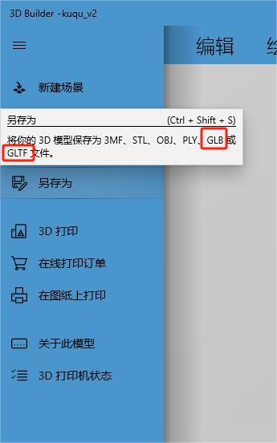

# 描述

使用 `3D Builder` 和 `three.js` 建设某库区3d完整场景，实时显示罐中的液位、温度、重量，泵阀的开关状态。  
- `3D Builder` 是一款简单易用的建模软件  
- `three.js` 是一个 3D js 库

建模的软件有很多如 `3D MAX`  `Maya`  `Blender` 等...,，这些软件都比较重，学习起来也比较费时（主业做前端，没必要专门搞建模），所以我选择了一款简单易用的建模软件 `3D Builder` 。

先用 `3D Builder` 创建场景中不变的部分当做 3D 背景的模型（如上的地、房屋、罐、墙体...）；创建完成后，另存为 `.glb` 格式提供给 `three.js` 进行加载，然后在代码中调整可变的部分（如上的液位进度、温度展示、重量展示、泵阀状态...）。

结果如下：

# 建模

## 3D Builder 下载

在微软商店中搜索： `3D Builder` 下载

## 3D Builder 使用

打开软件后，点击，“新建场景” 创建3d场景；创建好后，通过插入“立方体”、“圆柱体”、“球体”、“棱锥形”、“六边形”......等图形进行创作；可以将插入的形状进行“拆分”、“平滑”、“浮雕”、“拉伸”、“合并”、“相交”、“减去”、“挖洞”、“绘制颜色”、“绘制纹理”......等一系列操作；总之发挥想象力创作出能够还原需求需要的3d场景。

也可以将一部分（比如房子）创建成单独的一个文件，建模完成后可以直接导入添加到场景文件中。

上图的房子就是利用八个立方体创作出来的，门窗可以找合适的图片贴上去（会ps更好，图片不合适的话稍微p一下）。

# 建模完成

3D Builder 默认的源文件后缀为 `.3mf` ；创建好模型后为了在 `threejs` 中使用，需要另存为 `threejs` 支持的格式 `.glb` 或者 `.gltf` （我一般储存为 `.glb` ）。

# 创建Threejs
