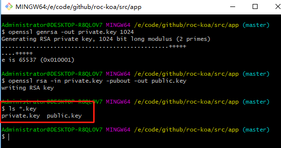

使用JWT的时候用RS256进行签名；RS256 是使用 RSA 私钥进行签名，使用 RSA 公钥进行验证，公钥即使泄漏了也毫无影响，只要确保私钥的安全就行。
使用openssl生成RS256

- mac/linux 直接使用终端即可
- windows推荐在git bash终端中操作

```bash
# 生成1024位 RSA密钥
openssl genrsa -out private.key 1024
# 通过密钥生成公钥
openssl rsa -in private.key -pubout -out public.key
```

会在终端当前目录下生成公私钥。


