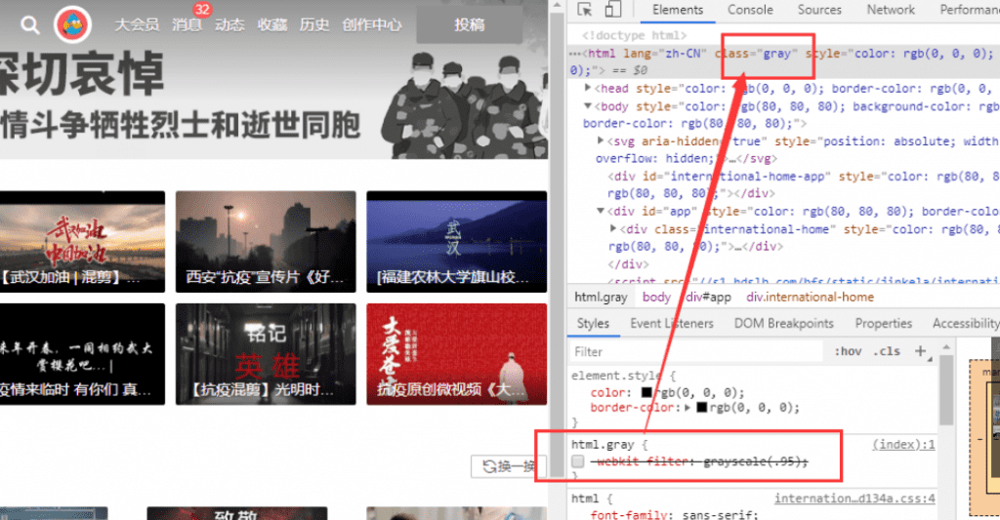
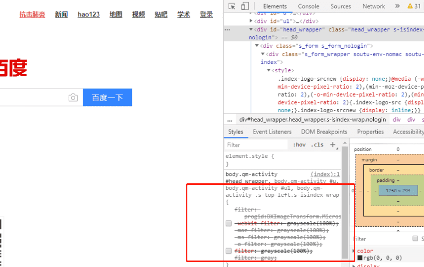

为表达全国各族人民对抗击新冠肺炎疫情斗争牺牲烈士和逝世同胞的深切哀悼，2020年4月4日举行全国性哀悼活动，某li某li，某宝，某东…等网站于2020年4月4日凌晨00:00网页全部以灰色显示。
一夜之间，
网站全灰，
一行代码，
即可搞定。
### bilibili：
```css
-webkit-filter: grayscale(.95);
```

可能会有人说，哎~，头部图还是灰色的啊，其实呀他就是一张灰色的图片！

### 百度：
```css
filter: progid:DXImageTransform.Microsoft.BasicImage(grayscale=1);
-webkit-filter: grayscale(100%); 
-moz-filter: grayscale(100%);
-ms-filter: grayscale(100%);
-o-filter: grayscale(100%);
filter: grayscale(100%); 
filter: gray;
```

在下看的比较知名的网站，bilibili ，百度，4399，luojing.top[手动狗头，嘿嘿]….等网站发现实现方法其实就是css3中滤镜的应用，就不往出贴了。
但是这个属性的兼容性并不是很好，google了下还是有解决方法的：
兼容大部分浏览器写法：
```css
html{
    filter: grayscale(100%);
    -webkit-filter:grayscale(100%);
    -moz-filter: grayscale(100%);
    -ms-filter: grayscale(100%);
    -o-filter: grayscale(100%);
    filter: url("data:image/svg+xml;utf8,<svg xmlns=\'http://www.w3.org/2000/svg\'><filter id=\'grayscale\'><feColorMatrix type=\'matrix\' values=\'0.3333 0.3333 0.3333 0 0 0.3333 0.3333 0.3333 0 0 0.3333 0.3333 0.3333 0 0 0 0 0 1 0\'/></filter></svg>#grayscale");
    filter:progid:DXImageTransform.Microsoft.BasicImage(grayscale=1);
    filter: grayscale(1);
}
<script src="https://luojing.top/js/grayscale.js"></script>
<script>
  window.onload=function(){
    grayscale(document.body)
  }
</script>
```
### css3filter(滤镜)：
接下来咱们就来看下filter，它有以下这些：
```css
blur(0px)：模糊值 | 默认值为0(正常图像)
brightness(100%)：亮度 | 默认值为100%(正常图像) 0%全黑
contrast(100%)：对比度 | 默认值为100%(正常图像) 0%全黑
drop-shadow(x偏移, y偏移, 模糊大小, 色值)：投影
grayscale(100%)：灰度 | 默认值为100%(灰度图像)
hue-rotate(0deg)：色相旋转 | 默认值为：0deg
invert(0%)：反色 | 默认值为0(正常图像) 100%完全反转颜色
opacity(100%)：透明度 默认值为100%(正常图像) 0%完全透明
saturate(100%)：饱和度 默认值为100% 0%不饱和
sepia(0%):褐色 默认值为0%(正常图像) 100%转深褐色

【以上各个滤镜效果可以结合使用】
```
