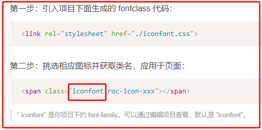
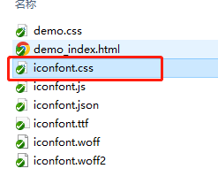
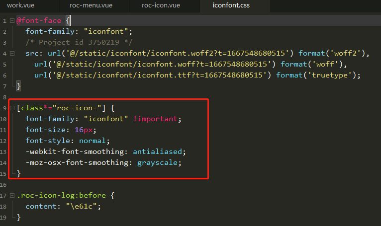

自己在iconfont上下载的图标需要先加上iconfont（或者自己定义的）类名，再加上图标名才能显示图标。

修改iconfont.css中的css选择器即可


```javascript
// 之前是".iconfont"; 修改为class包含"roc-icon-"字符的元素
[class*="roc-icon-"] {
  font-family: "iconfont" !important;
  font-size: 16px;
  font-style: normal;
  -webkit-font-smoothing: antialiased;
  -moz-osx-font-smoothing: grayscale;
}
```
