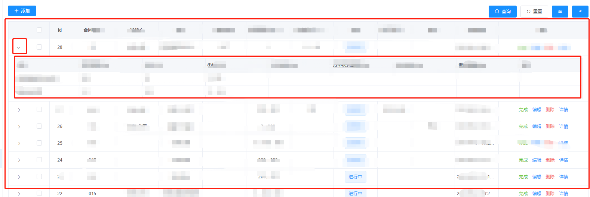

# 表格展开嵌套表格hover错位问题

嵌套如下：



解决方案：

```vue
<el-table
  :row-class-name="rowClassName"
  @cell-mouse-enter="handleMouseEnter"
  @cell-mouse-leave="handleMouseLeave"
></el-table>
```
```javascript
/**
 * mixin
 * 动态给表格添加hover
 */
export default {
  data() {
    return {
      cellIndex: -1,
    }
  },
  methods: {
    // 鼠标进入单元格
    handleMouseEnter(row) {
      this.tableList.forEach((item) => {
        if (row.id === item.id) {
          this.cellIndex = row.id
        }
      })
    },
    // 给相应的rowIndex添加类名
    rowClassName({ row, rowIndex }) {
      let r = -1
      this.tableList.forEach(() => {
        if (this.cellIndex === row.id) {
          r = rowIndex
        }
      })
      if (rowIndex === r) {
        return 'roc-hover-row'
      }
    },
    // 鼠标离开
    handleMouseLeave() {
      this.cellIndex = -1
    },
  },
}

```
```css
/* 表格嵌套 hover错乱bug   配合mixin tableHover.js使用 */
.hover-row {
  background: #fff !important;
  td {
    background: #fff !important;
  }
}
.roc-hover-row {
  background: #f5f7fa !important;
  td {
    background: #f5f7fa !important;
  }
}
```
