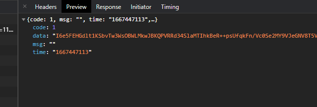

我的应用场景后端对接口数据进行DES加密，前端需要解密，前后端需统一key值，加密方式，填充方式以及返回数据编码（我这是base64）；于是使用到了crypto-js库，使用这个库时候。需要将数据转换成它内部的数据类型wordArray，解密出来的数据也是wordArray需要转换，crypto-js库内部提供转换方法。
加密的数据：



# 安装crypto-js

```bash
npm install crypto-js
```

# DES加密解密

```javascript
import CryptoJS from "crypto-js";

const key = 'yuanpeng'

// DES 加密
function encryptByDES (message) {
  const keyHex = CryptoJS.enc.Utf8.parse("约定的key");
  const encrypted = CryptoJS.DES.encrypt(message, keyHex, {
    // 约定的方式与填充
    mode: CryptoJS.mode.ECB,
    padding: CryptoJS.pad.Pkcs7
  });
  // 返回约定的编码数据（base64）
  return encrypted.ciphertext.toString(CryptoJS.enc.Base64);
}

// DES 解密
function decryptByDES (ciphertext) {
  const keyHex = CryptoJS.enc.Utf8.parse("约定的key");
  const decrypted = CryptoJS.DES.decrypt({
    // 约定的编码数据（base64）转为wordArray
    ciphertext: CryptoJS.enc.Base64.parse(ciphertext)
  }, keyHex, {
    // 约定的方式与填充
    mode: CryptoJS.mode.ECB,
    padding: CryptoJS.pad.Pkcs7
  });
  return decrypted.toString(CryptoJS.enc.Utf8);
}

```
