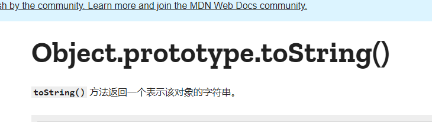
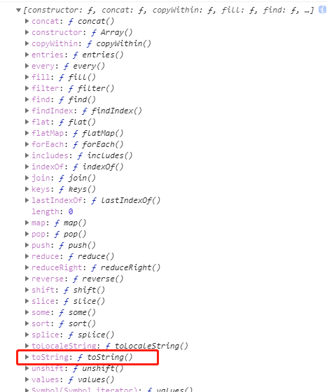
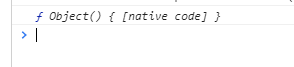
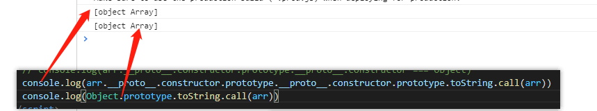
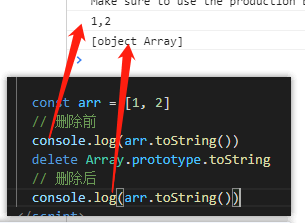

准确的说他是通过Object.prototype.toString.call(xxx)来检测对象类型的。
## 如何进行检测
先看下MDN上的概念，当然MDN下面也有说到使用它来检测对象类型。mdn地址：[https://developer.mozilla.org/zh-CN/docs/Web/JavaScript/Reference/Global_Objects/Object/toString](https://developer.mozilla.org/zh-CN/docs/Web/JavaScript/Reference/Global_Objects/Object/toString)

也就是说它返回的是字符串，如下：
```javascript
const roc = []
console.log(Object.prototype.toString.call(roc))
// 打印 [object Array]  Array对象（字符串）

/*
其实定义不同的类型它会返回: 
[object Object]
[object String]
[object Date]
[object Function]
[object Number]
......
*/
```
通过上面的打印判断字符串的方式就可以检测对象类型。
而且很多人都是这么做的，包括一些工具库里，在里面它会用Object.prototype.toString.call(xxx)的返回值与上面的字符串做对比判断，从而返回true或false。
注意：只能用Object.prototype.toString，因为Array、Number……中的toString都是经过处理后绑定到他们的原型上的。所以不同实例化不同类型的对象会通过原型拿到不同的toString。
## 验证它们的toString是不同的方法
要搞清楚这个问题，必须要了解**原型**、**原型链**、**this指向**与**call方法的使用**
因为Object的原型对象是原型链的最顶端，通过它的原型对象再去拿对象原型会是null。Array、Number……的toString方法是处理过的toString方法，与Object上的不一样。
看下面的代码（用数组举例，其他的同理）：
```javascript
const arr = [1, 2]
console.log(arr.toString()) // 打印 1,2   不能判断对象类型

/*
arr上并没有toString()方法
它会去实例化arr的构造方法（Array）的原型上去，
也就是arr.__proto__.constructor.prototype 同等于 Array.prototype；
所以这里用到的toString方法，Array.prototype.toString()
知道call方法的朋友们肯定能想到，它也可以这么调用
Array.prototype.toString.call(arr),打印与arr.toString()一样

简单提下call：它可以调用某个方法并改变这个方法内部的this指向。
用法：functionName.call(thisArg)
*/
console.log(Array.prototype) // 打印如下图
```
代码第二行中是用的这个toString方法

那如果我们从 arr数组对象 根据原型链的思路找下去找到Object，使用它原型里的toString试试看
```javascript
const arr = [1, 2]
// 等价于这样写：const arr = new Array(1, 2)
// 打印出 通过原型链思路找到Object构造方法
console.log(arr.__proto__.constructor.prototype.__proto__.constructor)

/*
下来仔细给大家分析下这条链子（了解原型链的朋友们应该很容易明白）
1. arr.__proto__.constructor：arr对象通过原型知道自己是哪个构造函数实例化出来的，就是Array，到第二步我们用Array替换arr.__proto__.constructor
2. Array.prototype: Array的原型，但它也是一个对象，它是对象那我们就要考虑一个问题，它是谁实例化出来的呢？是的，通过它的原型Array.prototype.__proto__就能知道它是Object实例化出来的。
3.Array.prototype.__proto__.constructor: 它就是顺着原型链找过来的Object
*/
```
如图打印通过原型链找到的 Object构造方法

上面我们已经从 arr对象 通过原型链一路追杀到了Object，那么我们就可以使用开头提到的Object.proptotype.toString了，还是看代码
```javascript
/*
arr.__proto__.constructor.prototype.__proto__.constructor 等于 Object
那意味着我们可以有如下操作
*/
console.log(arr.__proto__.constructor.prototype.__proto__.constructor.prototype.toString.call(arr))
console.log(Object.prototype.toString.call(arr))
```

## 验证删除Array原型上的toString方法后直接使用
在原型链的理论上我们把Array原型上的toString方法删除后就可以检测对象类型（因为这时候使用的就是Object原型上的toString）上代码：
```javascript
const arr = [1, 2]
// 删除前
console.log(arr.toString())
delete Array.prototype.toString
// 删除后
console.log(arr.toString())
```

