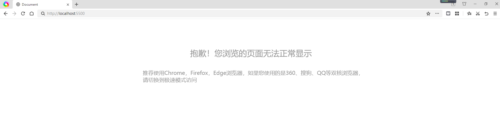

```javascript
(function (window) {
  var userAgent = navigator.userAgent;
  var isIE = userAgent.indexOf("compatible") > -1 && userAgent.indexOf("MSIE") > -1;
  var isIE11 = userAgent.indexOf("Trident") > -1 && userAgent.indexOf("rv:11.0") > -1;
  var compatibilityMode = window.navigator.userAgent.indexOf("compatible") != -1;
  if (isIE || isIE11 || compatibilityMode) {
    var str = "抱歉！您浏览的页面无法正常显示";
    var str2 = "推荐使用Chrome，Firefox，Edge浏览器，如果您使用的是360、搜狗、QQ等双核浏览器，";
    var str1 = "请切换到极速模式访问";
    var str3 = "./img/jiantou.png";
    var str4 = "./img/logo.png";
    document.write(
      "<div><div style='width:900px;margin:0 auto;font-family:Microsoft YaHei'>" +
        "<p style='padding-top:100px;margin:0;text-align:center;margin-bottom:40px;color:#999;font-size:30px;'>" +
        str +
        "<br/></p><p style='color:#999;font-size:20px;margin-left:50px;'>" +
        str2 +
        "</br>" +
        str1 +
        "</p>" +
        "<div style='text-align:center;'></div>" +
        "</div></div>"
    );
  }
})(window);
```
