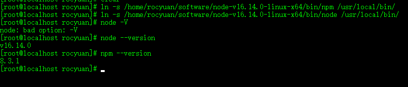

# 下载
```
wget https://nodejs.org/dist/v16.14.0/node-v16.14.0-linux-x64.tar.xz
```
# 解压
```
tar xzvf node-v16.14.0-linux-x64.tar.xz
```
# 软连接命令
这种方式会存在npm全局安装指令无法使用，建议使用**配置环境变量**
```
ln -s /home/rocyuan/software/node-v16.14.0-linux-x64/bin/npm /usr/local/bin/
ln -s /home/rocyuan/software/node-v16.14.0-linux-x64/bin/node /usr/local/bin/
```

# 配置环境变量
修改配置文件（配置PATH环境变量）
```
vi /etc/profile
```
末尾加上`export PATH="$PATH:/home/rocyuan/software/node-v16.14.0-linux-x64/bin/"`
# 更新配置文件
```
source /etc/profile
```
