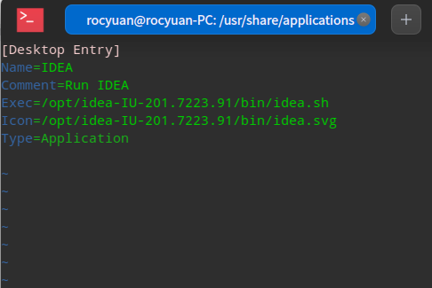

在 `/usr/share/applications/` 目录创建 `xxx.desktop ` 

```bash
[Desktop Entry]
Name=IDEA
Comment=Run IDEA
Exec=/opt/idea-IU-201.7223.91/bin/idea.sh
Icon=/opt/idea-IU-201.7223.91/bin/idea.svg
Type=Application
```


