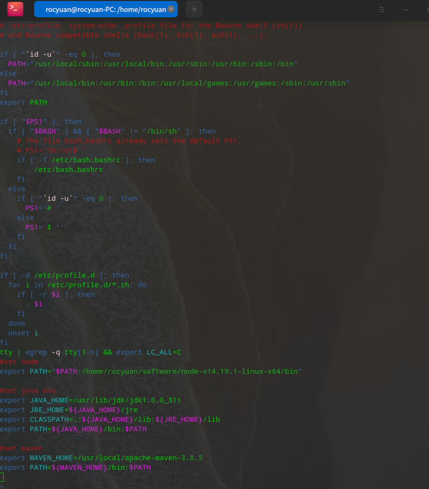

## profile文件环境变量配置
位置：/etc/profile
```bash
# /etc/profile: system-wide .profile file for the Bourne shell (sh(1))
# and Bourne compatible shells (bash(1), ksh(1), ash(1), ...).

if [ "`id -u`" -eq 0 ]; then
  PATH="/usr/local/sbin:/usr/local/bin:/usr/sbin:/usr/bin:/sbin:/bin"
else
  PATH="/usr/local/bin:/usr/bin:/bin:/usr/local/games:/usr/games:/sbin:/usr/sbin"
fi
export PATH

if [ "$PS1" ]; then
  if [ "$BASH" ] && [ "$BASH" != "/bin/sh" ]; then
    # The file bash.bashrc already sets the default PS1.
    # PS1='\h:\w\$ '
    if [ -f /etc/bash.bashrc ]; then
      . /etc/bash.bashrc
    fi
  else
    if [ "`id -u`" -eq 0 ]; then
      PS1='# '
    else
      PS1='$ '
    fi
  fi
fi

if [ -d /etc/profile.d ]; then
  for i in /etc/profile.d/*.sh; do
    if [ -r $i ]; then
      . $i
    fi
  done
  unset i
fi
tty | egrep -q tty[1-6] && export LC_ALL=C
#set node
export PATH="$PATH:/home/rocyuan/software/node-v14.19.1-linux-x64/bin"

#set java env
export JAVA_HOME=/usr/lib/jdk/jdk1.8.0_311
export JRE_HOME=${JAVA_HOME}/jre 
export CLASSPATH=.:${JAVA_HOME}/lib:${JRE_HOME}/lib 
export PATH=${JAVA_HOME}/bin:$PATH

#set maven
export MAVEN_HOME=/usr/local/apache-maven-3.8.5
export PATH=${MAVEN_HOME}/bin:$PATH


```

## .bashrc文件配置
位置：/home/(username)/.bashrc
解决每次需要source /etc/profile配置才生效
.baserc文件添加 source /etc/profile
```bash
#解决每次需要source /etc/profile配置才生效
source /etc/profile
# ~/.bashrc: executed by bash(1) for non-login shells.
# see /usr/share/doc/bash/examples/startup-files (in the package bash-doc)
# for examples

# If not running interactively, don't do anything
case $- in
    *i*) ;;
      *) return;;
esac

# don't put duplicate lines or lines starting with space in the history.
# See bash(1) for more options
HISTCONTROL=ignoreboth

# append to the history file, don't overwrite it
shopt -s histappend

# for setting history length see HISTSIZE and HISTFILESIZE in bash(1)
HISTSIZE=1000
HISTFILESIZE=2000

# check the window size after each command and, if necessary,
# update the values of LINES and COLUMNS.
shopt -s checkwinsize

# If set, the pattern "**" used in a pathname expansion context will
# match all files and zero or more directories and subdirectories.
#shopt -s globstar

# make less more friendly for non-text input files, see lesspipe(1)
#[ -x /usr/bin/lesspipe ] && eval "$(SHELL=/bin/sh lesspipe)"

# set variable identifying the chroot you work in (used in the prompt below)
if [ -z "${debian_chroot:-}" ] && [ -r /etc/debian_chroot ]; then
    debian_chroot=$(cat /etc/debian_chroot)
fi

# set a fancy prompt (non-color, unless we know we "want" color)
case "$TERM" in
    xterm-color|*-256color) color_prompt=yes;;
esac

# uncomment for a colored prompt, if the terminal has the capability; turned
# off by default to not distract the user: the focus in a terminal window
# should be on the output of commands, not on the prompt
# source /etc/profile 后bash颜色变化
force_color_prompt=yes

if [ -n "$force_color_prompt" ]; then
    if [ -x /usr/bin/tput ] && tput setaf 1 >&/dev/null; then
	# We have color support; assume it's compliant with Ecma-48
	# (ISO/IEC-6429). (Lack of such support is extremely rare, and such
	# a case would tend to support setf rather than setaf.)
	color_prompt=yes
    else
	color_prompt=
    fi
fi

if [ "$color_prompt" = yes ]; then
    PS1='${debian_chroot:+($debian_chroot)}\[\033[01;32m\]\u@\h\[\033[00m\]:\[\033[01;34m\]\w\[\033[00m\]\$ '
else
    PS1='${debian_chroot:+($debian_chroot)}\u@\h:\w\$ '
fi
unset color_prompt force_color_prompt

# If this is an xterm set the title to user@host:dir
case "$TERM" in
xterm*|rxvt*)
    PS1="\[\e]0;${debian_chroot:+($debian_chroot)}\u@\h: \w\a\]$PS1"
    ;;
*)
    ;;
esac

# enable color support of ls and also add handy aliases
if [ -x /usr/bin/dircolors ]; then
    test -r ~/.dircolors && eval "$(dircolors -b ~/.dircolors)" || eval "$(dircolors -b)"
    alias ls='ls --color=auto'
    #alias dir='dir --color=auto'
    #alias vdir='vdir --color=auto'

    #alias grep='grep --color=auto'
    #alias fgrep='fgrep --color=auto'
    #alias egrep='egrep --color=auto'
fi

# colored GCC warnings and errors
#export GCC_COLORS='error=01;31:warning=01;35:note=01;36:caret=01;32:locus=01:quote=01'

# some more ls aliases
#alias ll='ls -l'
#alias la='ls -A'
#alias l='ls -CF'

# Alias definitions.
# You may want to put all your additions into a separate file like
# ~/.bash_aliases, instead of adding them here directly.
# See /usr/share/doc/bash-doc/examples in the bash-doc package.

if [ -f ~/.bash_aliases ]; then
    . ~/.bash_aliases
fi

# enable programmable completion features (you don't need to enable
# this, if it's already enabled in /etc/bash.bashrc and /etc/profile
# sources /etc/bash.bashrc).
if ! shopt -oq posix; then
  if [ -f /usr/share/bash-completion/bash_completion ]; then
    . /usr/share/bash-completion/bash_completion
  elif [ -f /etc/bash_completion ]; then
    . /etc/bash_completion
  fi
fi
# Set LS_COLORS environment by Deepin
if [[ ("$TERM" = *256color || "$TERM" = screen* || "$TERM" = xterm* ) && -f /etc/lscolor-256color ]]; then
    eval $(dircolors -b /etc/lscolor-256color)
else
    eval $(dircolors)
fi

```
