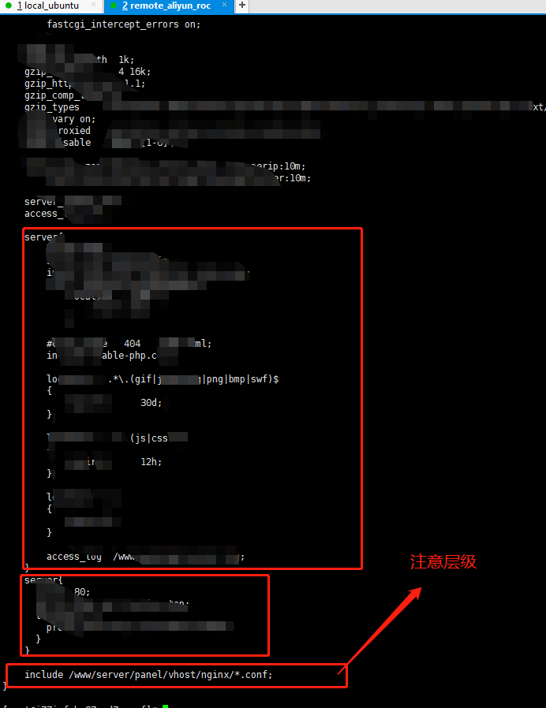

站点服务单独的配置文件；一般不会把所有站点服务全部配置到nginx.conf下，会将每个站点服务配置一个单独的配置文件（*.conf）。
nginx.conf是整个nginx全局下的配置，在全局配置下引入单独站点的配置文件，如:
```
# 指定 单独站点配置文件（域名.conf） 如luojing.top站点 luojing.top.conf
# 这个目录是宝塔默认的目录
include /www/server/panel/vhost/nginx/*.conf;
```
配置时候注意层级

权限全是600（rw-------）

*.conf文件示例
```
server
{
    listen 80;
    server_name rms.luojing.top;
    index index.php index.html index.htm default.php default.htm default.html;
    root /www/wwwroot/rms.luojing.top;

    #SSL-START SSL相关配置，请勿删除或修改下一行带注释的404规则
    #error_page 404/404.html;
    #SSL-END

    #ERROR-PAGE-START  错误页配置，可以注释、删除或修改
    #error_page 404 /404.html;
    #error_page 502 /502.html;
    #ERROR-PAGE-END

    #PHP-INFO-START  PHP引用配置，可以注释或修改
    include enable-php-56.conf;
    #PHP-INFO-END

    #REWRITE-START URL重写规则引用,修改后将导致面板设置的伪静态规则失效
    include /www/server/panel/vhost/rewrite/rms.luojing.top.conf;
    #REWRITE-END

    #禁止访问的文件或目录
    location ~ ^/(\.user.ini|\.htaccess|\.git|\.svn|\.project|LICENSE|README.md)
    {
        return 404;
    }

    #一键申请SSL证书验证目录相关设置
    location ~ ^/.well-known/{
        allow all;
    }

    #禁止在证书验证目录放入敏感文件
    if ( $uri ~ "^/\.well-known/.*\.(php|jsp|py|js|css|lua|ts|go|zip|tar\.gz|rar|7z|sql|bak)$" ) {
        return 403;
    }

    location ~ .*\.(gif|jpg|jpeg|png|bmp|swf)$
    {
        expires      30d;
        error_log /dev/null;
        access_log /dev/null;
    }

    location ~ .*\.(js|css)?$
    {
        expires      12h;
        error_log /dev/null;
        access_log /dev/null;
    }
    
    location / {
      try_files $uri $uri/ /index.html;
    }
    
    access_log  /www/wwwlogs/rms.luojing.top.log;
    error_log  /www/wwwlogs/rms.luojing.top.error.log;
}
```
