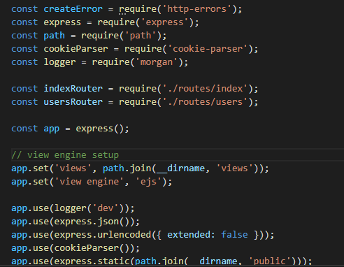
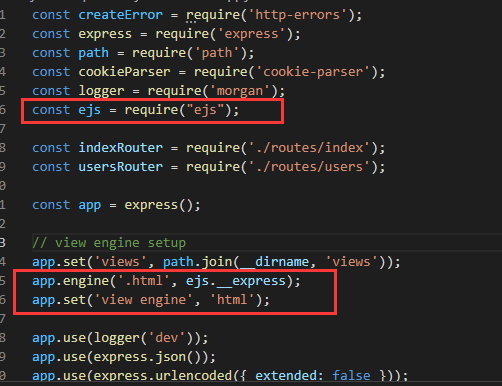

使用express脚手架生成项目时，视图引擎支持的有：
ejs|hbs|hjs|jade|pug|twig|vash
默认情况下是jade
我们要使用html模板则需要自行配置。

## 创建ejs视图引擎的项目

先安装express脚手架：npm i -g express-generator（装过的跳过）
使用express脚手架生成ejs项目express <ejs-demo> --view=ejs，因为我们配置html视图模板是要使用ejs，我们直接创建ejs视图模板则不需要再次安装ejs。

## 修改根目录app.js

1. 导入ejs：const ejs = require("ejs");
2. 更改视图引擎加载的后缀：app.engine('.html', ejs.__express);
3. 设置试图引擎为html：app.set('view engine', 'html');

**修改前：**

**修改后：**

然后在根目录的views目录（不一定是views，看自己的设置）创建对应的html文件即可。
