# 下载nexus

官网下载：[https://help.sonatype.com/repomanager3/product-information/download/download-archives---repository-manager-3](https://help.sonatype.com/repomanager3/product-information/download/download-archives---repository-manager-3)

百度网盘下载：[https://pan.baidu.com/s/1INXWe37DJTtcHTTTFPedsQ](https://pan.baidu.com/s/1INXWe37DJTtcHTTTFPedsQ) 提取码：1qwi

# 安装

下载完后进行解压 `tar -zxvf nexus-3.21.2-03-unix.tar.gz`
进入解压后目录 nexus-3.21.2-03/bin 运行`./nexus`，会提示nexus的命令`Usage: ./nexus {start|stop|run|run-redirect|status|restart|force-reload}`
启动运行`./nexus start`
查看状态`./nexus status`

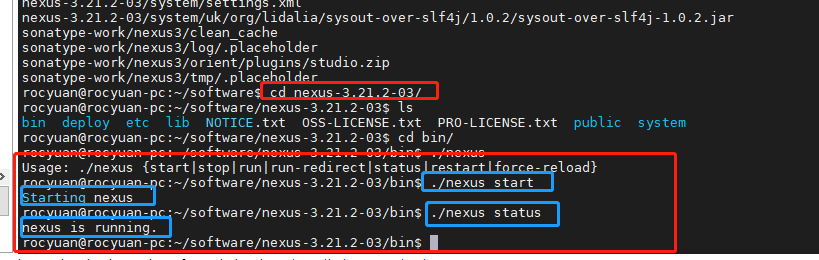

`./nexus status`是看不到打印日志的；使用`./nexus run`可以看到打印日志。

# 配置文件

配置文件是`nexus-3.21.2-03/etc/nexus-default.properties` 可以看到默认配置端口是8081

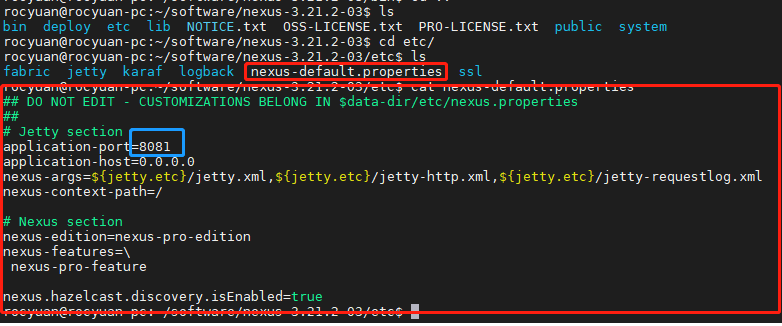

# 访问

访问`ip:8081`即可访问，打不开的请检查端口是否开放，服务器配置安全组。

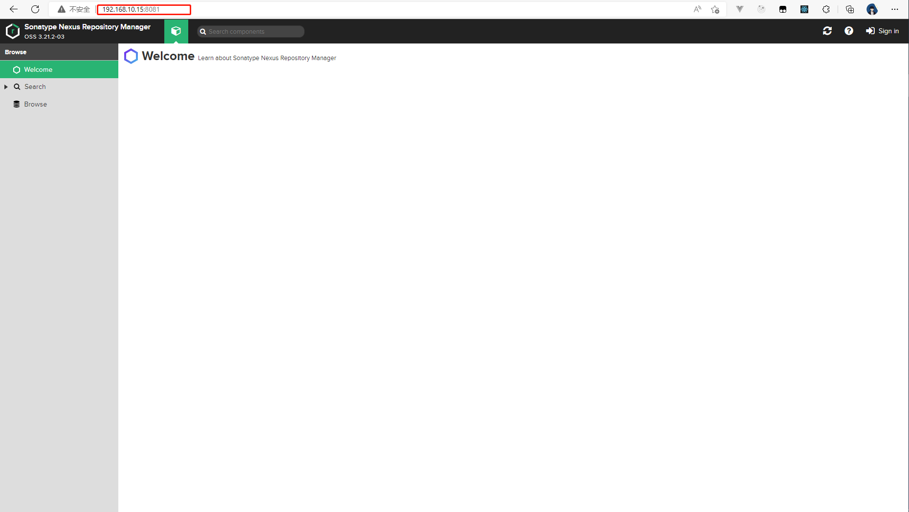

# 登录

登录管理员，用户名为：admin密码存放在`sonatype-work/nexus3/admin.password`；登录后根据提示设置新密码。


# 创建npm仓库

创建顺序：

1. npm(proxy) 代理仓库 可以设置官方源或者镜像源
2. npm(hosted) 本地仓库
3. npm(group) 组仓库

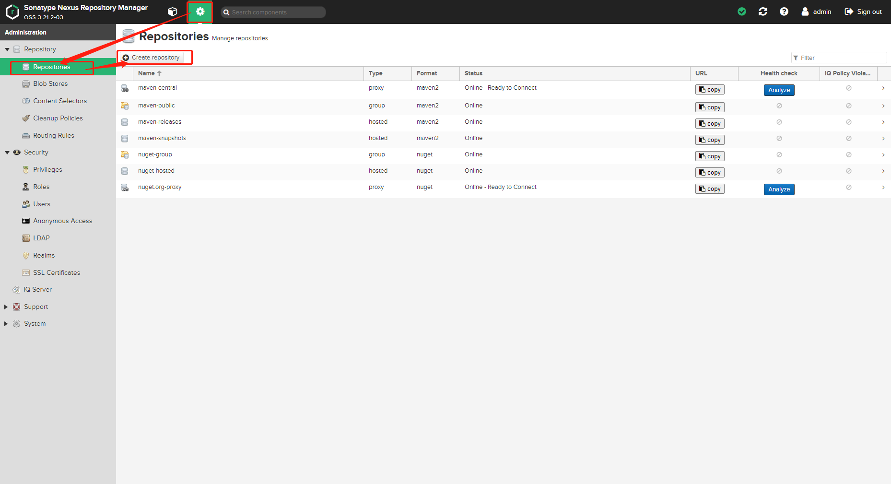

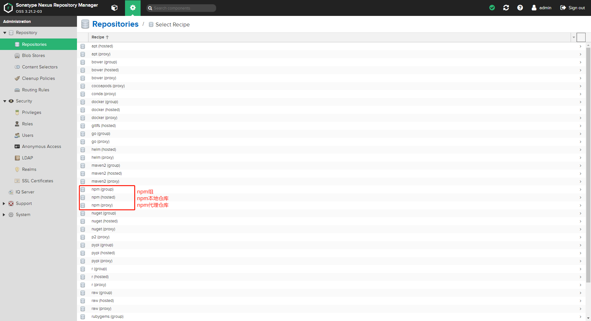

# 创建npm代理仓库

填写仓库唯一标识（名称）和源地址，其他默认，点击创建仓库(Create repository)

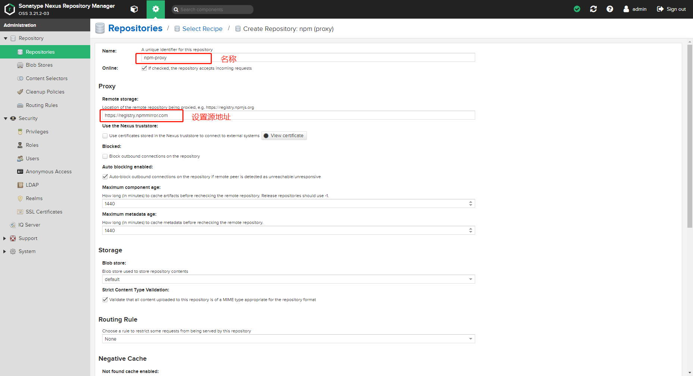

# 创建npm本地仓库

填写仓库唯一标识（名称）和设置允许重新部署，其他默认，点击创建仓库(Create repository)

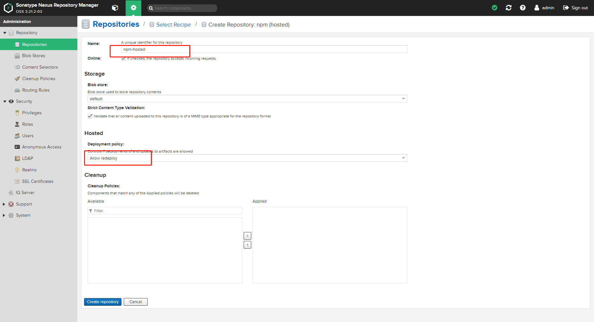

# 创建npm组仓库

填写仓库唯一标识（名称）和设置之前创建的本地仓库和代理仓库（注意优先级，优先本地仓库，其次代理仓库），其他默认，点击创建仓库(Create repository)

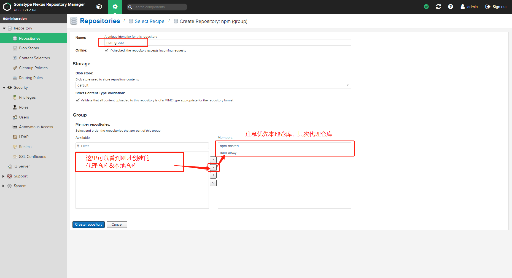

# 创建完成

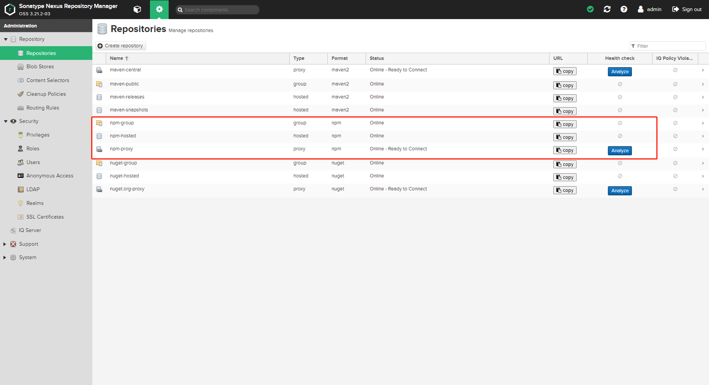

# 设置npm使用创建的npm-group源

```bash
# 设置源
npm config set registry=http://192.168.10.15:8081/repository/npm-group/
#查看源
npm config get registry
```

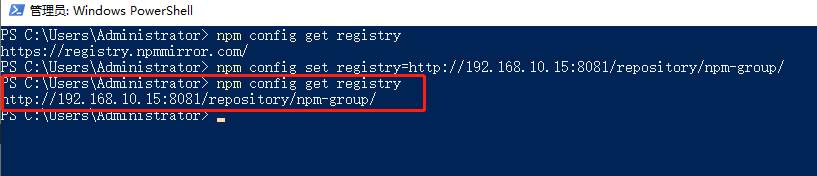

# npm安装

以安装vue为例，安装完成后会被拉取到自己服务器上，下次安装就会优先使用本地仓库。

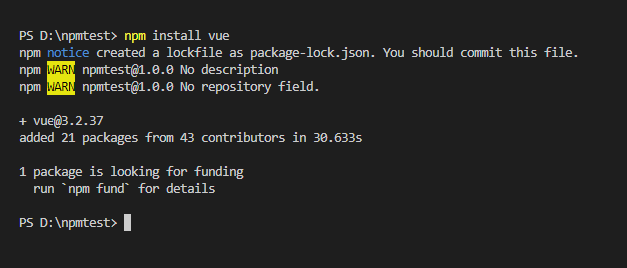

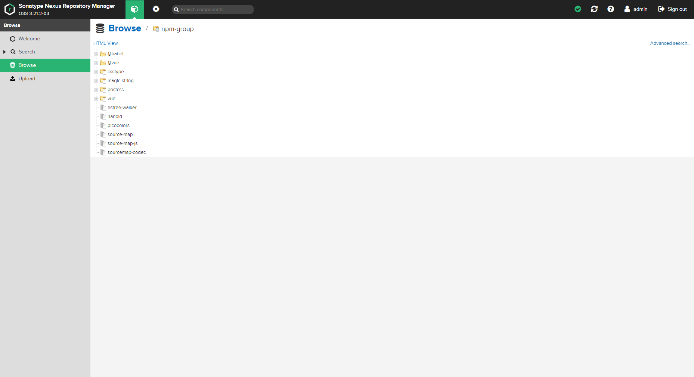

# 发布npm私有包

## 注册用户

发布前需要在命令行登录（建议新建用户登录），可以创建角色（我这块使用admin角色）

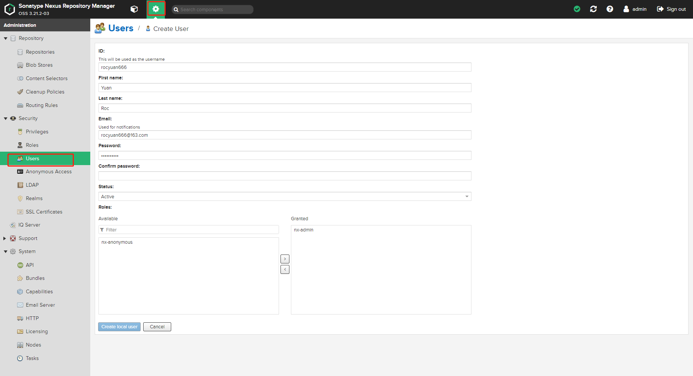

## 命令行登录

注意：登录的时候需要指定本地仓库源

```bash
npm login --registry=http://192.168.10.15:8081/repository/npm-hosted/
```

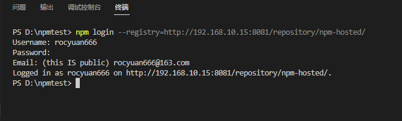

## 发布包

发布前需要添加`npm Bearer Token Realm`

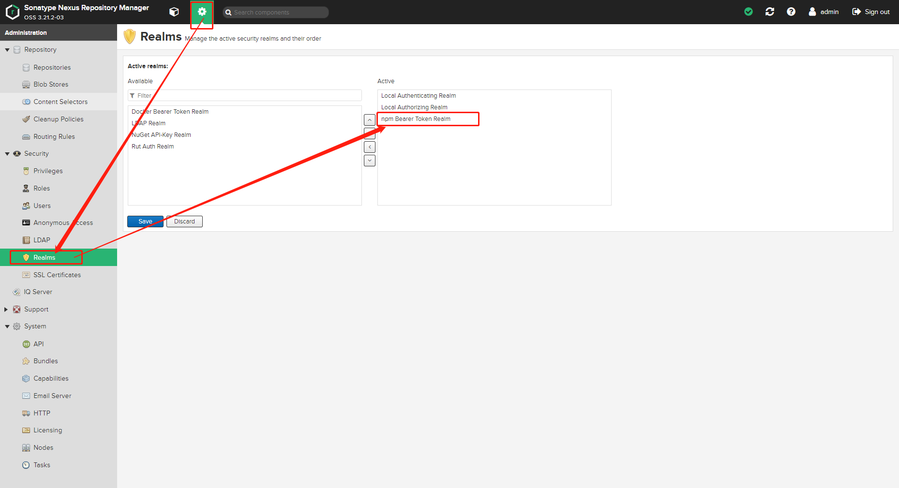

创建项目`npm init -y`随便写个测试包，我起的名字为：`npmtest`

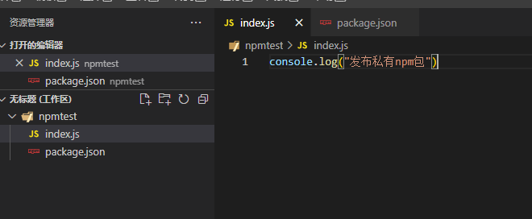

发布

```bash
npm publish --registry=http://192.168.10.15:8081/repository/npm-hosted/
```


# 测试引入刚才发布的私有包

创建一个项目（rocyuan666）`npm install npmtest`引入npmtest；打印出了npmtest包中的打印

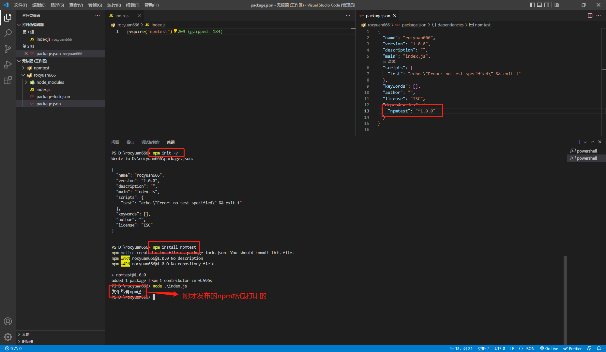
