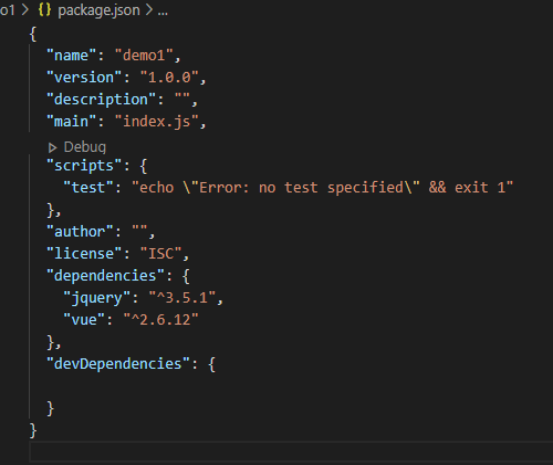
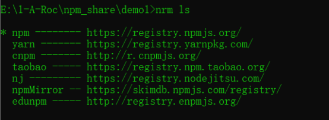
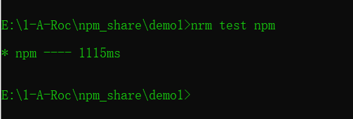
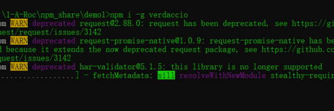
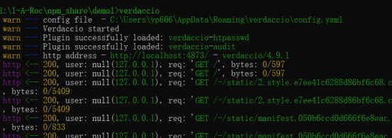
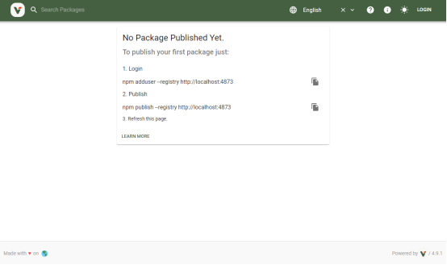

## 什么是npm

Npm（全称:Node Package Manager）是Node包管理工具。

## 为什么要使用npm

一个项目是成长的，可能规模越来越大或者越来越复杂，所以需要的包或依赖也会越来越多。每个包都有自己的生长方式，生长的快慢他们肯定是有不同的版本，每个包都有它们各自的版本。
如果一个包依赖另一个包。比如：有Jquery插件叫”A”依赖着Jquery，那这个插件”A”现在版本是2然后它依赖的Jquery版本是1，现在如果把Jquery版本升到2那插件”A”很有可能会停止工作表现出来是满页都报错。
这时就必须查看文档了解当前这个Jquery插件用的是哪个版本的Jquery,然后把Jquery也更新掉之后你发现插件”A”好像开始工作了(但是插件”B”也依赖着Jquery)插件”B”又挂掉了（同时插件”C”又依赖着插件”B”）插件”C”也跟着挂掉了。
基于上述糟糕的情况，Npm应运而生。它不但可以把代码从网上download下来最重要的是它可以帮我们管理不同包之间的关系（比如:这个包依赖着哪个包并且依赖那个版本号是多少当前版本号是多少）。

## 没有npm之前我们的操作

当前项目需依赖哪个包就到”bootcdn.cn”官网找到相应包拷贝链接cdn引入，或者下载代码到本地引用。

## Npm安装和更新

npm不需要单独安装。在安装Node的时候，会连带一起安装npm。但是，Node附带的npm可能不是最新版本。
查看版本：`npm -v`
更新版本：`npm install -g npm@latest`

## 查看配置

`npm config list`
查看基本配置npm仓库地址，根目录等配置信息
`npm config list -l`
查看全部npm默认配置

## 配置源

`npm config get registry`
查看当前配置的源地址
`npm config set registry=https://registry.npmmirror.com`
配置源地址

## 初始化

`npm init`
`npm init` 用来初始化生成一个新的package.json文件。它会向用户提问一系列问题，如果你觉得不用修改默认配置，一路回车就可以了。

## Package.json文件详解



```json
{
	"name": "demo1",  // 包名
	"version": "1.0.0",  // 包版本号
	"description": "",  // 包描述
	"main": "index.js",  // 包入口文件
	"scripts": {  // 定义执行脚本
		"test": "echo \”Error: no test specified\” && exit 1"
	},
	"author": "rocyuan",  // 作者
	"license": "ISC",  // 开源许可证
	"dependencies": {},  // 生产时依赖的包
	"devDependencies": {}  // 开发时依赖的包
}
```

## npm安装包

`npm install`
此命令会将项目所依赖的包安装到项目的node_modules中，但是不会修改package.json

`npm install <PackageName>@<version> -g`
此命令会将包及对应的版本安装到全局目录中(npm config list prefix所对应的目录)，不修改package.json，执行npm install不会自动安装。

`npm install <PackageName>@<version> –save`
此命令会将包及对应的版本安装到node_modules中，同时修改package.json文件，添加到dependencies节点。执行npm install 时会自动安装这个包到node_modules中。

`npm install <PackageName>@<version> –save-dev`
此命令会将包及对应的版本安装到node_modules中，同时修改packgage.json,将包添加到devDependencies节中，执行npm install 会自动安装这个包到node_modules中。

## npm卸载包

`npm uninstall <PackageName>`
此命令会将node_modules中的 包卸载，同时修改packgage.json。

## npm更新包

`npm update <PackageName>`
此命令会将node_modules中的包进行更新，但是此更新是按照package.json中指定的版本进行更新的（一般默认只会更新当前大版本的最新版本），只会更新到当前大版本的最新版本，同时修改packgage.json。

## npm查看包

`npm list`
此命令会以树形结构打印出当前项目所依赖的包结构，-depth代表深度，0代表一级

## npm查看全局安装的包

`npm list -g -depth 0`
此命令会以树形结构打印出全局安装的包结构，-depth代表深度，0代表一级

## npm执行脚本

`npm run <ScriptName>`
此命令会执行package.json文件中定义的脚本。

## npm创建用户

`npm adduser`
此命令会在npm指向的镜像源注册一个账户，会让输入用户名密码以及邮箱

## npm登录

`npm login`
此命令会在npm指向的镜像源进行登录（前提是注册过的账号），会让输入用户名密码以及邮箱。

`npm login --registry=http://192.168.0.106:8081/repository/npm-hosted/`
登陆到指定的源

## npm当前登录的用户

`npm whoami`
此命令会打印当前登录的npm用户名

`npm whoami --registry=http://192.168.0.106:8081/repository/npm-hosted/`
查看当前命令行 指定源登陆的账号

## npm发布包
`npm publish`
此命令会在npm指向的镜像源上传当前的包，提供install。

## npm删除发布包

`npm unpublish <PackageName>`
此命令会在npm指向的镜像源上删除发布的包

## cnpm安装

npm由于镜像源在国外，在国内使用可能会比较慢，使用以下命令可安装cnpm包并指向taobao镜像源。
`npm install cnpm -g --registry=https://registry.npm.taobao.org`

## npm私服介绍

如果公司或团队处于隐私保护的需要，不想将自己封的包推到npm社区，但又需要一套完整的包管理工具来管理越来越多的组件、模块等等，那么搭建私服实际上就是我们搭建本地镜像源服务（私有源），切换npm镜像源到我们本地的私有源，这里介绍两个工具：nrm与verdaccio。

## nrm工具介绍
nrm(npm registry manager )是npm的镜像源管理工具，使用这个就可以快速地在 npm 所有配置的镜像源之间切换

## nrm安装

`npm install -g nrm`
此命令会全局安装nrm工具

## nrm增加源

`nrm add <RegistryName> <RegistryUrl>`
此命令会在添加镜像源，RegistryName：镜像源的名称；RegistryUrl：镜像源的地址

## nrm删除源
`nrm del <RegistryName>`
此命令会删除镜像源。

## nrm切换源

`nrm use <RegistryName>`
此命令会切换到对应名称的镜像源

## nrm查看源

`nrm ls`
此命令会查看当前的npm的所有镜像源名称及地址，带*号的是当前所用的镜像源



## nrm测试当前npm源的响应速度

`nrm test npm`
此命令会打印出响应的毫秒数



## verdaccio工具介绍

[Verdaccio](https://verdaccio.org/)是一个比较简单的配置本地私有npm镜像源的工具。

## verdaccio的安装

`npm install -g verdaccio`
此命令会全局安装verdaccio



## verdaccio运行

`verdaccio`
此命令会运行verdaccio，运行完成后打开浏览器进入本地服务：

http://localhost:4873/




