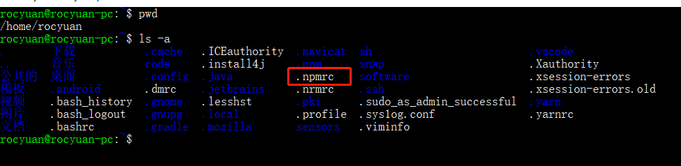
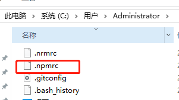

npm配置都在`~/.npmrc`，修改`~/.npmrc`文件即可。
也可使用命令：

```bash
npm config set xxx 源地址
```

# 介绍

```
# npm源地址
registry=https://registry.npmmirror.com/
# node-sass依赖
sass_binary_site=https://npmmirror.com/mirrors/node-sass/
# weex项目依赖phantomjs-prebuilt
phantomjs_cdnurl=https://npmmirror.com/mirrors/phantomjs/
# electron依赖
electron_mirror=https://npmmirror.com/mirrors/electron/
# sqlite3轻量级数据库依赖
sqlite3_binary_host_mirror=http://npmmirror.com/mirrors/
# node-inspector依赖
profiler_binary_host_mirror=http://npmmirror.com/mirrors/node-inspector/
# chromedriver安装失败
chromedriver_cdnurl=https://npmmirror.com/mirrors/chromedriver
# sentry-cli依赖
sentrycli_cdnurl=https://npmmirror.com/mirrors/sentry-cli/
```

# 配置

`.npmrc`文件
linux位置：/home/rocyuan(自己的用户)/.npmrc  （~/.npmrc）



windows位置：C:\Users\Administrator(自己的用户)\.npmrc



```
registry=https://registry.npmmirror.com/
sass_binary_site=https://npmmirror.com/mirrors/node-sass/
phantomjs_cdnurl=https://npmmirror.com/mirrors/phantomjs/
electron_mirror=https://npmmirror.com/mirrors/electron/
sqlite3_binary_host_mirror=http://npmmirror.com/mirrors/
profiler_binary_host_mirror=http://npmmirror.com/mirrors/node-inspector/
chromedriver_cdnurl=https://npmmirror.com/mirrors/chromedriver
sentrycli_cdnurl=https://npmmirror.com/mirrors/sentry-cli/
```
