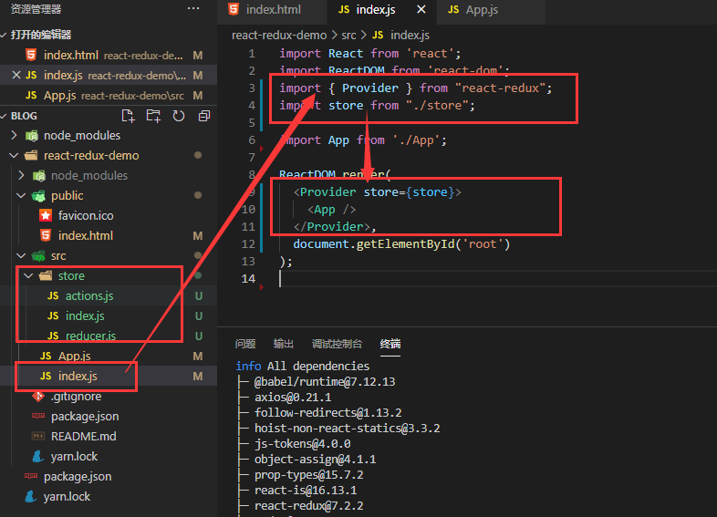
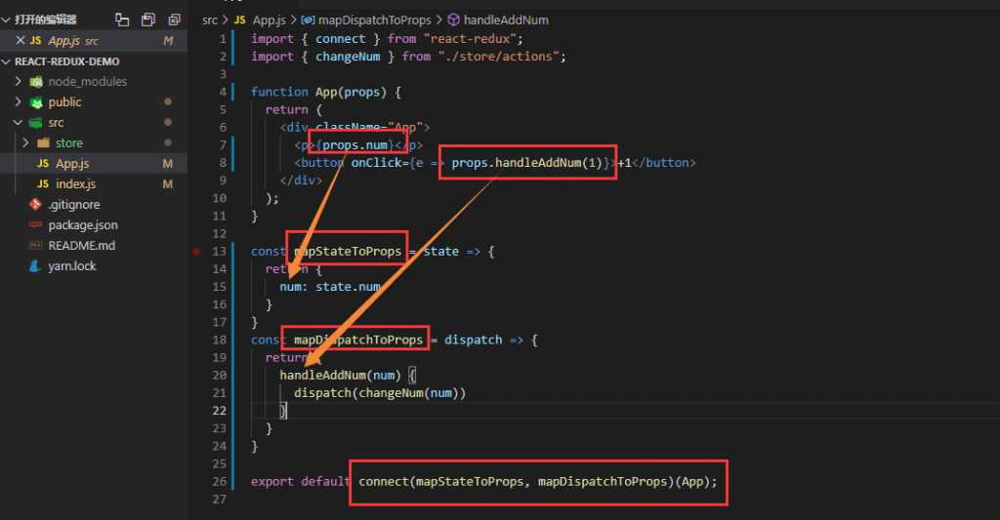
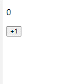

react-redux可以不用我们手动的联系react与redux，它提供的：

- Provider组件：需要告知它我们创建的store
- connect方法：它接收两个参数，这俩参数分别是函数，函数参数返回一个对象，而connect方法返回的是高阶组件可传入一个组件返回一个增强后的组件。
- mapStateToProps：它提供一个参数 state，就是我们发生变化的store中的state
- mapDispatchToProps：它也提供一个参数dispatch，就是我们store的dispatch
而它们返回的对象都会放到组件的props中。

## 示例

拿到react-redux中的Provider组件传入我们创建的store

使用connect方法将定义的mapStateToProps，mapDispatchToProps传入并且将App组件传入它返回的高阶组件，将参数中的对象放入App组件的props中
所以我们才可以在App组件的props中拿到num数据与handleAddNum方法。

## 示例结果

