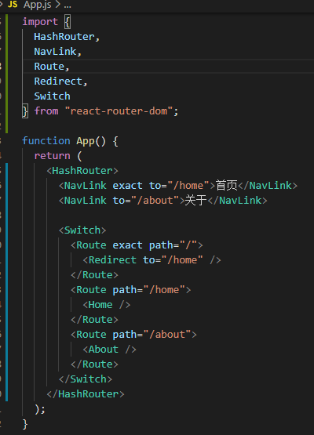
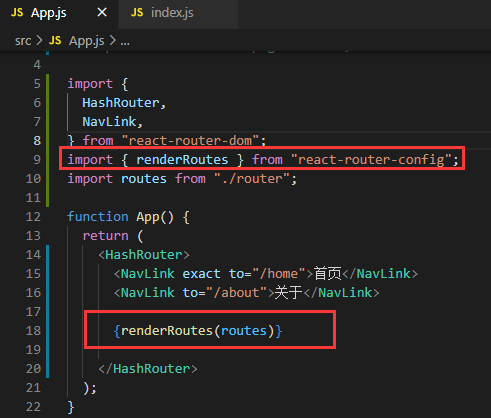
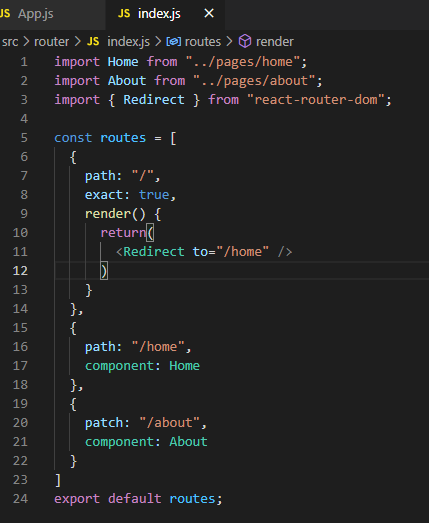
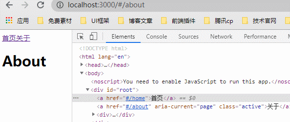

## react-router-dom使用
HashRouter：路由的类型，哈希模式
BrowserRouter：路由的类型，HTML5 history模式
NavLink：路由按钮默认转成a标签，选中的路由对应的a标签带有active的class名；Link不带active的class名。
Route：匹配路由显示对应的组件
Redirect：重定向
Switch：匹配到对应路由时不会向下匹配
……更多api及属性查看react-router官网
[https://reactrouter.com/web/guides/quick-start](https://reactrouter.com/web/guides/quick-start)

这样写路由在项目中路由不利于管理（以上还只是简单的单层路由，还没有路由业务），于是我们会用 react-router-config统一管理路由。
## react-router-config使用
用react-router-config提供的renderRoutes方法渲染显示的组件，renderRouter接收一个参数，这个参数可定义路由及重定向等…
更多使用方式参考
[https://www.npmjs.com/package/react-router-config](https://www.npmjs.com/package/react-router-config)

## 结果演示

