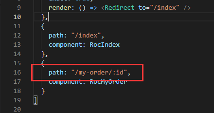
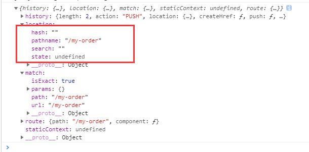
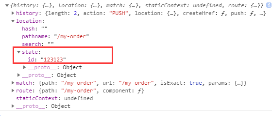
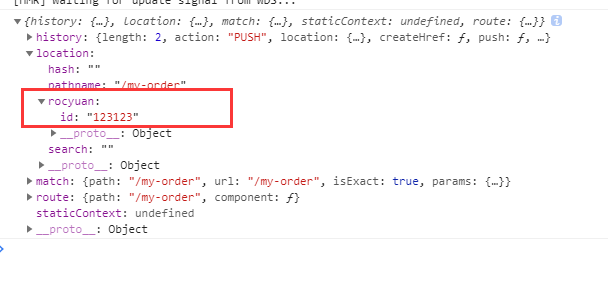
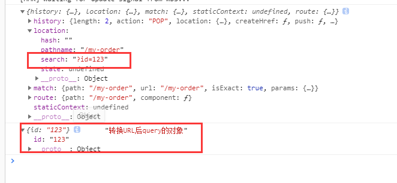

在react-router4.x以上，将router分为react-router-dom与react-router-native，开发web我们只需要安装react-router-dom就可以。其实它的一些传参、取参和原生的方法是非常类似的。

## 一、params传参
params传参 刷新页面 数据存在；但是路由路径后面需要加上/:paramsName
我这里使用了react-router-config分离了路由配置

跳转：
```javascript
this.props.history.push("/my-order/123")
```
取参：
```javascript
this.props.match.params.id
```
## 二、state传参
state传参 刷新页面 数据会丢失
首先我们不传参直接this.props.history.push("/my-order")跳转打印下props：

以上并没有传任何参数，打印出来的都是原始数据，可以看出原始提供的参数并没有query，何谈query传参（网上各种没有实践就说query传参，刷新数据依然存在的不攻自破，当然了仅限于react-router-dom）
传参：
```javascript
this.props.history.push({
  pathname: "/my-order",
  state: {
    id: "123123"
  }
})
```
取参：
```javascript
this.props.location.state.id
```

但是，实际测试我传参时，无论传什么字段的参数过来都能拿到，下来将state更换为任意的字段比如传参用rocyuan替换state
```javascript
this.props.history.push({
  pathname: "/my-order",
  rocyuan: {
    id: "123123"
  }
})
```

取参也就自然变成this.props.location.rocyuan.id
那在将rocyuan更换为query呢？那肯定和最开始的state是一模一样的。。。再次验证网上误导人的说react-router-dom中的query传参。刷新页面数据依然是会成为undefined
## 三、search传参
search就是query传参；刷新页面数据依旧存在
传参（1）：
```javascript
this.props.history.push({
  pathname: "/my-order",
  search: "?id=123"
})
```
传参（2）：
```javascript
this.props.history.push("/my-order?id=" + 123)
```
取参：
```javascript
this.props.location.search
```
其实它取到的是search就是url后面的query，还需要处理：
```javascript
// 封装的取url的query方法，返回的对象就是转换query的对象
getUrlQuery(search) {
  const theRequest = new Object()
  if (search.indexOf("?") != -1) {
    const str = search.substr(1)
    const strs = str.split("&")
    for(let i = 0; i < strs.length; i ++) {
      theRequest[strs[i].split("=")[0]]=decodeURI(strs[i].split("=")[1])
    }
  }
  return theRequest;
}

// 使用
const  search = this.props.location.search;
const query = this.getUrlQuery(search);
```

