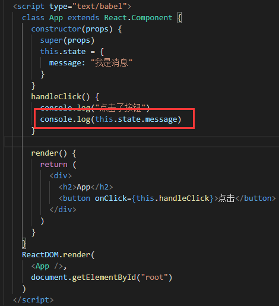
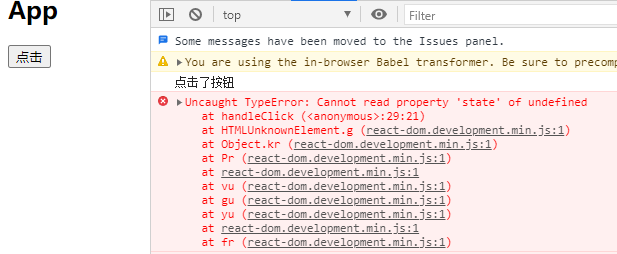
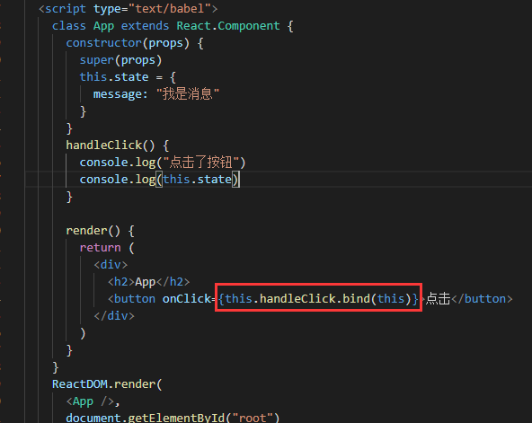
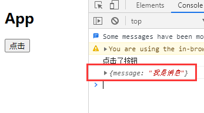
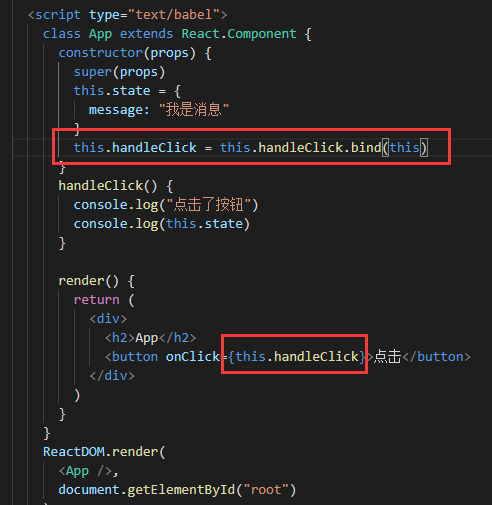
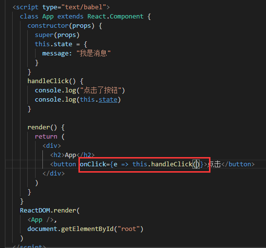

在class组件中我们触发事件，比如点击事件后想拿到state，第一反应肯定是点击后用this.state拿数据

但是，很遗憾react中这样是拿不到的，直接报错，打印this竟然是undefined

react官方:
在JSX回调中你必须注意 this 的指向。 在 JavaScript 中，类方法默认没有绑定的。如果你忘记绑定 this.handleClick 并将其传递给onClick，那么在直接调用该函数时，this 会是 undefined 。

## 解决的方法

我这里列举常见的两种解决的方法，一种是用bind方法解决，一种是箭头函数；而bind方法写法有两种方案。

### bind—直接在事件赋值的函数处绑定this

用bind方法为事件处理函数绑定this指向

### bind—在构造函数处将bind后的返回值再次赋值给事件处理函数

### 箭头函数

这种写法个人还是比较喜欢的，它是点击后执行一个箭头函数（而箭头函数是不会绑定this的），再在箭头函数里执行事件处理函数并且传递参数也很方便。

