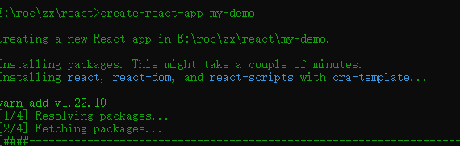

vue中有vue-cli，同样react中也有react的cli：create-react-app
## 安装
```javascript
npm install -g create-react-app
```
## 创建项目
```javascript
create-react-app <项目名>
```

创建成功，我这里是用yarn来管理的

## 启动项目
```javascript
yarn start  npm对应 npm run start
```
## 打包项目
```javascript
yarn build  npm对应 npm run build
```
## 测试
```javascript
yarn test  npm对应 npm run test
```
## 暴露webpack等配置文件
```javascript
yarn eject  npm对应 npm run eject
```
此操作是不可逆的！！！一般不会使用，要想配置webpack配置可使用craco
## 脚手架创建的项目

