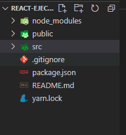
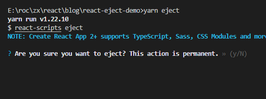
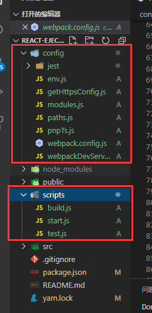
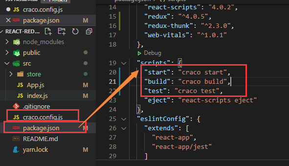

在vue脚手架中我们需要配置webpack，可在根目录创建vue.config.js文件进行配置，但是在react脚手架中并不支持react.config.js进行配置。

## yarn eject 弹出配置文件（慎操！！！不推荐）

react中要配置webpack我们可以运行 yarn eject 暴露所有配置
`yarn eject` 之前的目录

yarn eject时它会提示你：您确定要弹出吗？此动作是永久性的。
意思就是执行 yarn eject 弹出配置后，是不可逆的。

yarn eject 之后的目录
暴露出来配置文件后即可进行配置（谨慎操作！！！不推荐）

## craco使用（推荐）

使用craco进行配置，我们并不需要 `yarn eject` 弹出配置文件
安装craco：`yarn add @craco/craco`
在根目录创建：`craco.config.js`
`package.json` 文件中启动项目的脚本更改：`react-scripts` 更改为 `craco`

然后在craco.config.js文件中进行webpack配置即可。

参考：[https://www.npmjs.com/package/@craco/craco](https://www.npmjs.com/package/@craco/craco)
