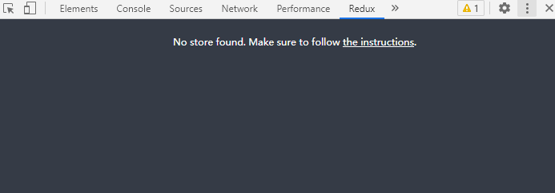
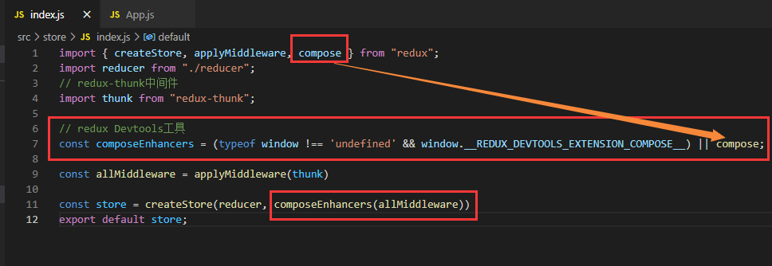
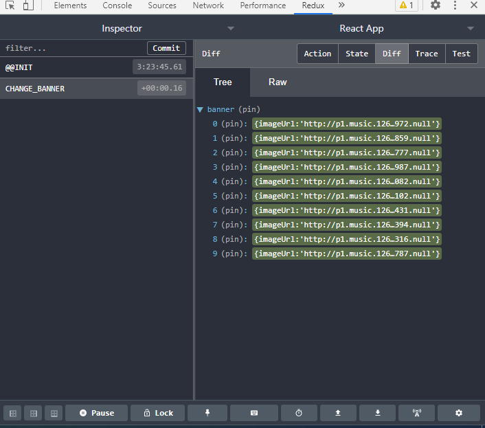

redux中的状态都是公共的，我们可通过reduxDevtools工具查看改变状态的每一步操作，及状态的变化情况。

reduxDevtools工具需要安装到浏览器扩展（google商店安装自备梯子），安装成功后console面板中会多出一个redux选项



## 使用

参考：[https://github.com/yuanpeng666/redux-devtools-extension](https://github.com/yuanpeng666/redux-devtools-extension)

```javascript
const composeEnhancers = (typeof window !== 'undefined' && window.__REDUX_DEVTOOLS_EXTENSION_COMPOSE__) || compose;

composeEnhancers方法将中间件包裹起来
```



## 示例

每一步的action及state改变都可看到。


