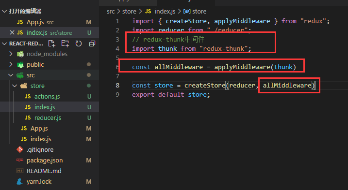
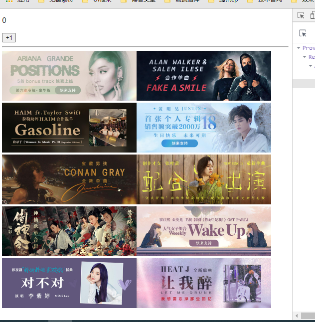
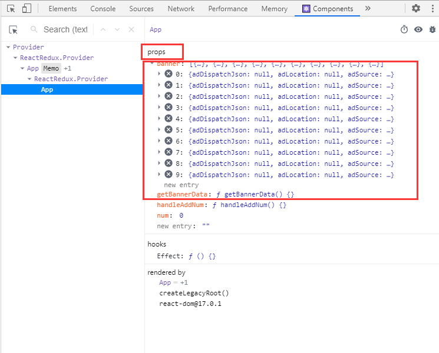

redux使用dispatch派发action会触发reducer，但是有时候我们需要dispatch一个action之后，到达reducer之前，进行一些额外的操作（一般请求异步数据），就需要用到中间件（middleware）。中间件就是对dispatch()的增强。

## redux-thunk原理

redux-thunk让store.dispatch方法不只接受一个对象，也可以接受一个函数，它内部做了处理，如果这个接收到的是一个函数，就执行它（可在这个函数里做异步操作），如果不是，就按照原来的dispatch执行。

## redux-thunk使用

安装: `yarn add redux-thunk`

使用redux中提供的applyMiddleware方法可以将所有中间件组成一个数组，依次执行（这里只用redux-thunk中间件）。现在就已经完成了dispatch()的功能增强。

不管我们使用不使用中间件需要更改store中的state都要经过action，定义好action；再定义dispatch接收的那个函数（也就是redux-thunk帮我们执行的函数，函数接收一个dispatch），在此函数中进行我们的异步操作，操作完成后再去dispatch派发action改变state（此时派发，接收的是一个action对象，所以与原生dispatch运行一致）。

此时我们还没有dispatch派发getBannerData函数
在组件中配合react-redux派发getBannerData函数。

整个redux-thunk流程就是这样。

## 示例结果

