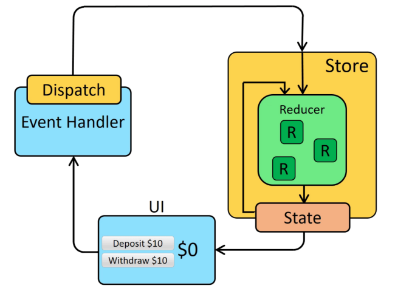
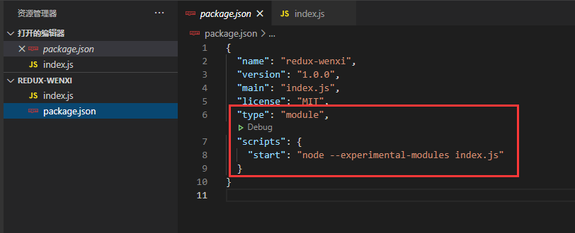
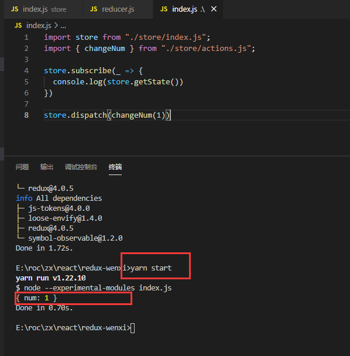
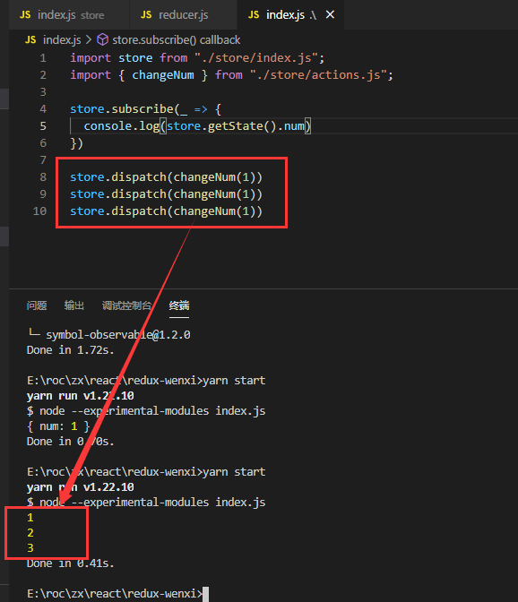

redux是一个管理公共数据状态的库，项目中我们各个组件中需要大量的共用一些状态时，可以使用redux来管理公共状态；
它与react没有任何关系，是一个独立的库，理论上在vue中也可以使用它的。
redux主要有三大核心：store、action、reducer

## redux三大原则

**单一数据源**
整个应用程序的state被存储在一个对象中，Redux并没有强制让我们不能创建多个Store，但是不建议那样做，因为那样并不利于数据的维护。

**State是只读的**
要确保state的唯一修改方法是通过触发action，来改变的。

**使用纯函数来执行修改**
通过reducer（reducer必须为一个纯函数，纯函数概念这里不介绍）将旧state和actions联系在一起，并且返回一个新的State。

## redux流程图



## redux的使用

先不结合react，单独使用redux

yarn管理示例项目，为了让node支持es6模块化，package.json中添加以下代码，scripts定义start，使我们能够yarn start运行示例项目；并且创建入口文件。



首先我们 `yarn add redux`
创建redux的三大核心放在store文件夹中
> index.js => store
> actions.js => action
> reducer.js => reducer

到这一步就准备好了。

## 创建store

用redux提供的createStore方法创建store；createStore方法支持两个参数，第一个传入reducer，第二个传入中间件（暂时不谈中间件，只传一个reducer）

```javascript
// /store/index.js

import { createStore } from "redux";
import reducer from "./reducer.js";

const store = createStore(reducer);
export default store;
```

我们传入了reducer但是导入的reducer并没有创建并导出

## 创建reducer

reducer必须是一个纯函数，它会根据我们派发不同的action去执行返回不同的对象，reducer函数传入两个参数，一个是公共储存的state，一个是action；

state需要有默认值，我们得创建一个默认state对象

最终返回一个新的对象（为了保证reducer是一个纯函数，保持state的不可变性，可以用immutable库）

```javascript
// /store/reducer.js
const defaultState = {
  num: 0
}
function reducer(state = defaultState, action) {
  switch(action.type) {
    case "CHANGE_NUM":
      return {...state, num: state.num + action.num}
    default:
      return state
  }
}
export default reducer;
```

reducer中用到了action，我们暂时还没有创建action\

## 创建action

action也是一个对象，但是我们一般情况下会定义成方法返回一个对象，这样可操作空间就比较大。action的type需要得和reducer里action的type一致（这里一般抽成常量统一管理会比较好）

```javascript
// /store/actions.js
export function changeNum(num) {
  return {
    type: "CHANGE_NUM",
    num
  }
}
```

现在我们redux三个核心都已经创建完成，但是reducer与action还没有半点关系，这时候我们可以在使用的地方用 store的dispatch将他们联系起来。

但是我们怎么知道它确实改变了 store中state的num的值了呢？

可以使用store.subscribe监听，store.getState方法获取store中的state。

```javascript
// /index.js  //注意这里已经不是redux的文件了
import store from "./store/index.js";
import { changeNum } from "./store/actions.js";

store.subscribe(_ => {
  console.log(store.getState())
})

store.dispatch(changeNum(1))
```

执行 `yarn start` 也就是定义的脚本 node index.js，打印出来我们dispatch派发action后改变的store中的state对象



我们多次派发action，每次将num+1（+2的时候只需要往action的函数中传入2就可以，这就是action定义为函数的好处及灵活性），打印num试试：



以上就是单独使用redux的基本操作

可以看出来，我们如果把根目录下的index.js看做react组件的话，它与react结合使用时，就需要我们手动的派发action，手动的监听改变，手动的关闭监听等操作，于是我们可以使用react-redux库。
