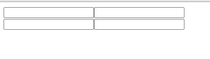

做判断的办法这里就不说了，地球人都知道。
有一种比较简单的方案，看代码：
```javascript
class App extends React.Component {
  constructor(props) {
    super(props)
    this.state = {
      userName1: "",
      userName2: ""
    }
  }

  _changeInput(e) {
    this.setState({
      [e.target.name]: e.target.value
    })
  }

  render() {
    return (
      <div>
        <input type="text" onChange={e => { this._changeInput(e) }} name="userName1" value={this.state.userName1} />
        <input type="text" onChange={e => { this._changeInput(e) }} name="userName1" value={this.state.userName1} />
        

        <input type="text" onChange={e => { this._changeInput(e) }} name="userName2" value={this.state.userName2} />
        <input type="text" onChange={e => { this._changeInput(e) }} name="userName2" value={this.state.userName2} />
      </div>
    )
  }
}
```
利用e.target.name作为data的key，改变data数据，这样写_changeInput方法就不用改动。
**注意：元素的name属性必须与data的key一致**。
看效果：

