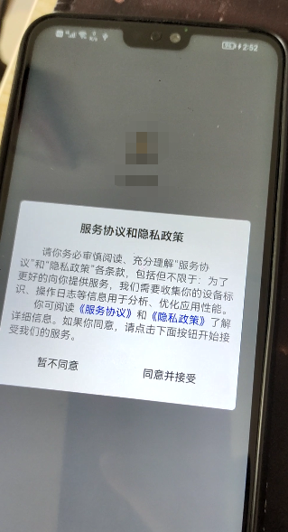
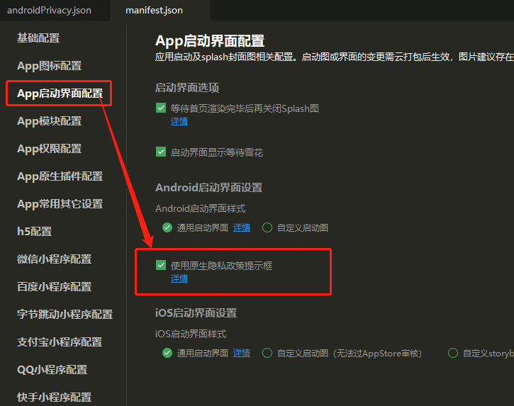
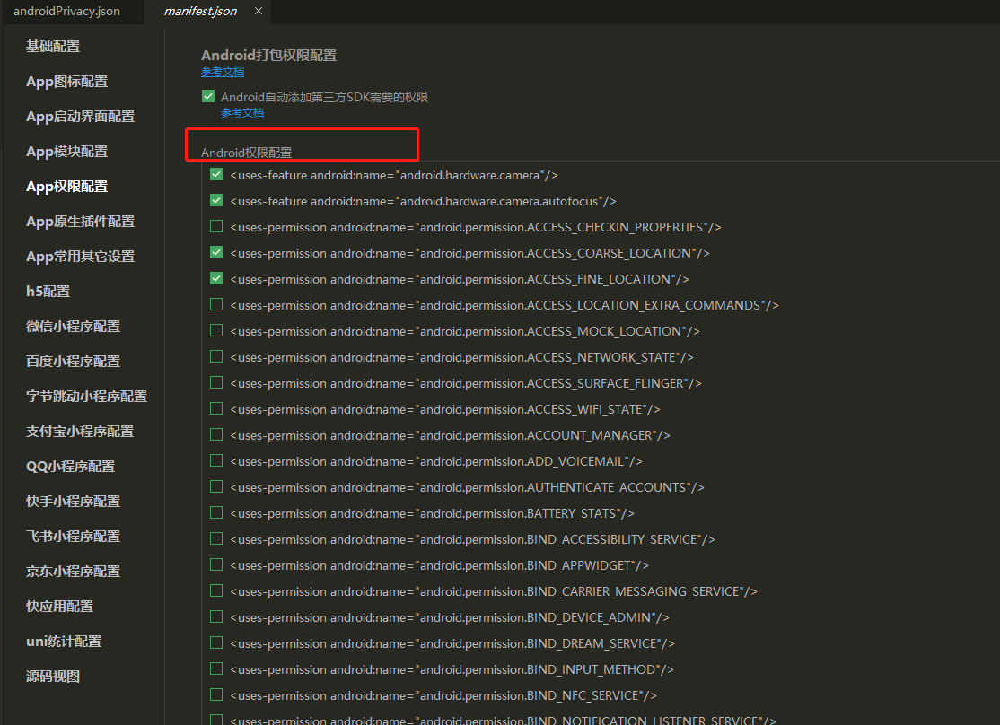
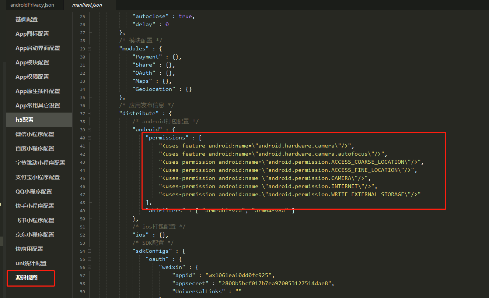
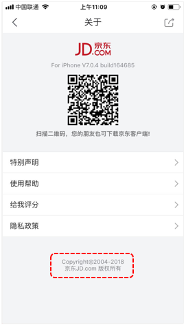
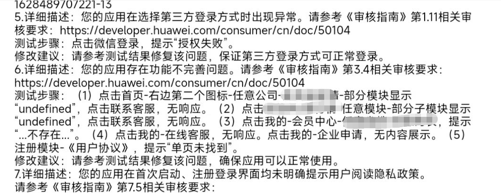

# 安卓

## 隐私政策服务协议

根据工业和信息化部关于开展APP侵害用户权益专项整治要求，应用启动运行时需弹出隐私政策协议，说明应用采集用户数据，这里将详细介绍如何配置弹出“服务协议和隐私政策”提示框。



服务协议内容参考：

[app-服务协议-示例](【uniapp】app-服务协议-示例)

隐私政策内容参考：

[app-隐私政策-示例](【uniapp】app-隐私政策-示例)

### 添加

1. 开启“使用原生隐私政策提示框”



2. 项目根目录添加`androidPrivacy.json`文件

message中的链接地址需要更换

```json
{
    "version" : "1",
    "prompt" : "template",
    "title" : "服务协议和隐私政策",
    "message" : "　　请你务必审慎阅读、充分理解“服务协议”和“隐私政策”各条款，包括但不限于：为了更好的向你提供服务，我们需要收集你的设备标识、操作日志等信息用于分析、优化应用性能。<br/>　　你可阅读<a href=\"https://www.xxx.com/fuwuxieyi.html\">《服务协议》</a>和<a href=\"https://www.xxx.com/yinsizhengce.html\">《隐私政策》</a>了解详细信息。如果你同意，请点击下面按钮开始接受我们的服务。",
    "buttonAccept" : "同意并接受",
    "buttonRefuse" : "暂不同意",
    "second" : {
        "title" : "确认提示",
        "message" : "　　进入应用前，你需先同意<a href=\"https://www.xxx.com/fuwuxieyi.html\">《服务协议》</a>和<a href=\"https://www.xxx.com/yinsizhengce.html\">《隐私政策》</a>，否则将退出应用。",
        "buttonAccept" : "同意并继续",
        "buttonRefuse" : "退出应用"
    },
    "styles" : {
        "backgroundColor" : "#f8f8fb",
        "borderRadius" : "5px",
        "title" : {
            "color" : "#333333"
        },
        "buttonAccept" : {
            "color" : "#333333"
        },
        "buttonRefuse" : {
            "color" : "#333333"
        }
    }
}

```

## 应用权限说明

上架应用市场需要说明应用每项权限的用处，可能每个平台存在差异，上架华为应用市场时官方会提供填写说明权限的文档模板。

### 应用权限

可以在manifest.json文件中安卓权限配置中勾选，也可在源码试图中找到。
安卓权限有很多，可自行查询意思，如下：

```
android.permission.ACCESS_COARSE_LOCATION      网络定位的权限（比较粗略）
android.permission.ACCESS_FINE_LOCATION      GPS定位的权限（比较精准）
android.permission.CAMERA      使用相机的权限
android.permission.INTERNET      使用网络的权限
android.permission.WRITE_EXTERNAL_STORAGE      写入储存卡的权限
android.permission.READ_EXTERNAL_STORAGE      读取储存卡的权限
......
```

uniapp云端打包后会自动添加权限：[https://ask.dcloud.net.cn/article/36982](https://ask.dcloud.net.cn/article/36982)，可在app上架前检查是否有多余的app权限，进行简化。





## 注销账号

上架应用市场要求app有注销账号功能，使用户可以自行注销自己的账号，从而在服务器删除自己的信息。

## 版权信息

需要添加版权信息



## 资质证书

开发app的功能不同，所需要的资质证书也就不同，但是软著必须得有；比如app内有发布资讯新闻功能，还得提供新闻信息服务资质许可证...，可根据自己app功能查询需要的证书。

## 应用完整度

app功能不完善的情况下，不要抱着，先上架后期更新的心理去上架，会被打回来的审核不过；未完善的功能可以先隐藏掉。


