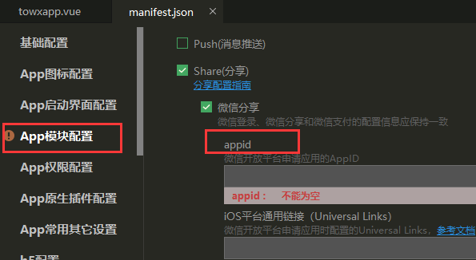
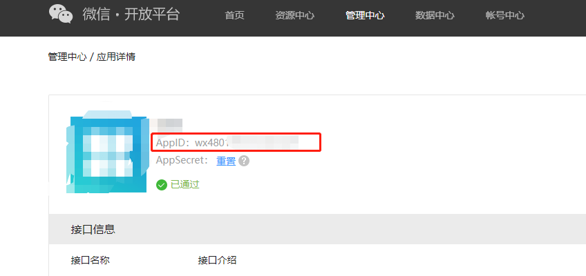
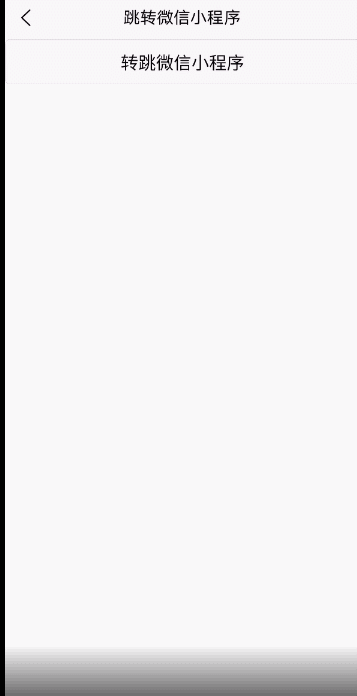

uniapp中app转跳打开微信小程序需要使用`plus.share`模块，打包时必须勾选share模块，选择微信分享填入appid（此处的appid是微信开放平台申请应用的appid）。
**注意：没有认证的开放平台账号，只能跳转同主体下的小程序**





需要使用plus.share.getServices，获取微信分享服务对象，再使用launchMiniProgram调用微信小程序。
示例代码：

```vue
towxapp() {
  // #ifdef APP-PLUS
  plus.share.getServices(function(res) {
    var sweixin = null;
    for (var i = 0; i < res.length; i++) {
      var t = res[i];
      if (t.id == 'weixin') {
        sweixin = t;
      }
    }
    if (sweixin) {
      sweixin.launchMiniProgram({
        id: 'gh_24624714f0f9',  // 小程序原始id
        type: 0,  // 0-正式版； 1-测试版； 2-体验版。 默认值为0
      });
    } else {
      plus.nativeUI.alert('当前环境不支持微信操作!');
    }
  }, function(res) {
    console.log(JSON.stringify(res));
  });
  // #endif
},
```

launchMiniProgram的属性值：

- id: (String 类型 )微信小程序ID；注意：是微信小程序的原始ID（”g_”开头的字符串）。
- path: (String 类型 )微信小程序打开的页面路径
- type: (Number 类型 )微信小程序版本类型；可取值： 0-正式版； 1-测试版； 2-体验版。 默认值为0。
- webUrl: (String 类型 )兼容低版本的网页链接

示例：


