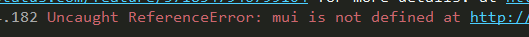

uniapp中的web-view组件引入页面后，返回失效问题


返回后发现报错：Uncaught ReferenceError: mui is not defined at



有些网页使用MUI框架开发的，所以需要将 mui 的返回关闭

## 解决

```javascript
onReady() {
  this.clearMuiBack();
},
methods: {
  // 关闭mui返回
  clearMuiBack() {
    // #ifdef APP-PLUS
    var currentWebview = this.$scope.$getAppWebview().children()[0];
    //监听注入的js
    currentWebview.addEventListener("loaded", function() {
      currentWebview.evalJS("mui.init({keyEventBind: {backbutton: false }});");
    });
    // #endif
  },
}
```
