一般在开发小程序的时候，一不小心就会造成包大小超过2m无法上传，一般处理方法就是图片方面的优化（放在服务器，图片压缩…），删除无用代码（uniapp打包后会分析依赖的代码，删除无用代码），再就是分包加载处理。

常开发的是微信小程序，以下都以微信小程序为例

## 分包加载介绍

在构建小程序分包项目时，则会输出一个或多个分包。每个有分包的小程序必定含有一个**主包（也就是在/pages下）**。通常在主包下放置默认启动页面及tabBar 页面，以及一些所有分包都需用到公共资源（自定义组件、js工具代码、图片等）；而**分包**则是根据开发者的配置进行划分。

小程序启动时，默认会下载主包并启动主包内页面，当用户点击进入分包内某个页面时，客户端会把对应的分包下载下来，下载完成后再进行展示。

## 开启分包

在uniapp中开启分包时需要在对应的平台开启分包，开启分包的配置在manifest.json文件中，打开文件后HBuilderX会显示视图界面，但是选择**微信小程序配置**是没有开启分包的配置。

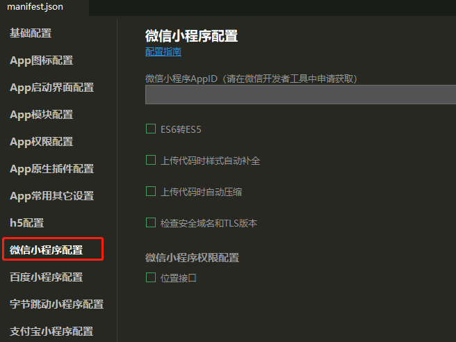

无分包配置
需要点击最下面的源码试图，在json中配置，打开后找到mp-weixin选项（/* 小程序特有相关 */）添加"optimization":{"subPackages":true}，至此已经在微信小程序平台打开了分包配置。

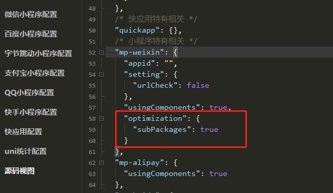

添加分包配置

## 配置分包

目前为止（2021-09-09），uniapp只支持mp-weixin、mp-qq、mp-baidu、mp-toutiao开启分包加载。多平台编译的话需要写条件编译进行判断环境。
在pages.json文件中根层级（与”pages”选项同级）添加：
`"subPackages": [{     "root": "rocA",     "pages": [{         "path": "roc/roc"     }] }]`

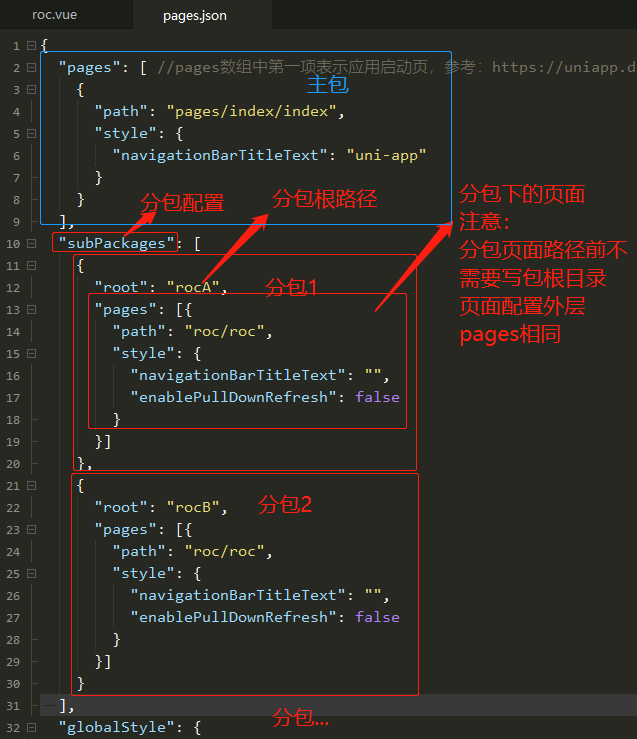

分包配置对应的目录

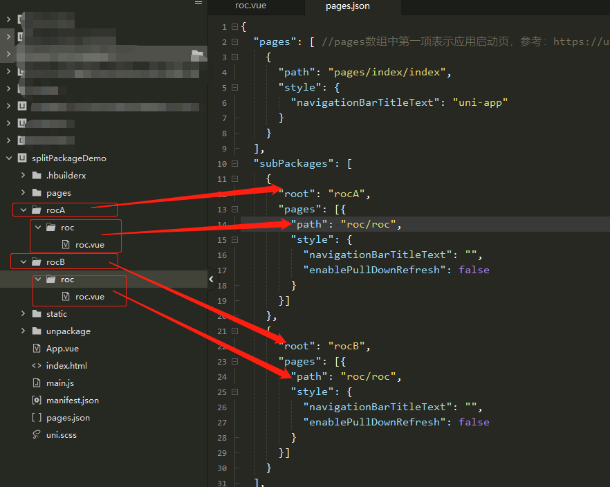

如上图可以有多个分包，但是微信小程序规定：

- 整个小程序所有分包大小不超过 20M
- 单个分包/主包大小不能超过 2M

## 分包效果

在微信开发工具中打开代码依赖分析视图可看到，已经分有一个主包和两个分包（rocA、rocB）

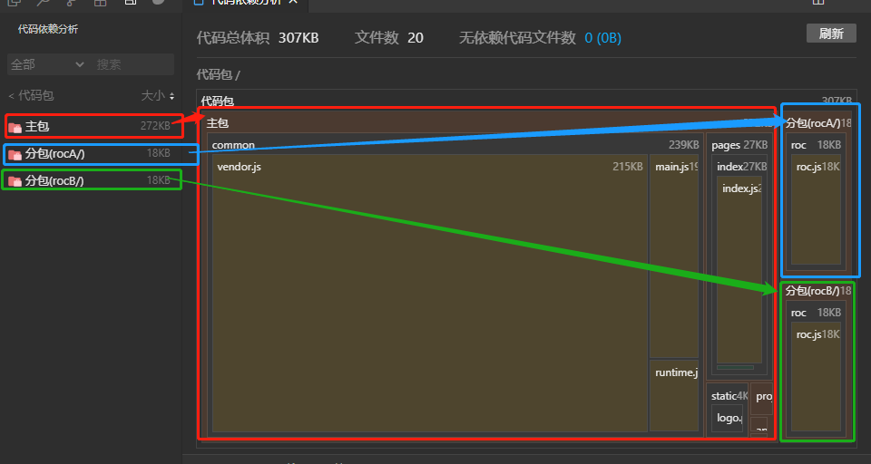

## 主包分包页面之间转跳

转跳与平时一样写路径转跳就行，个人推荐第一种，如下：

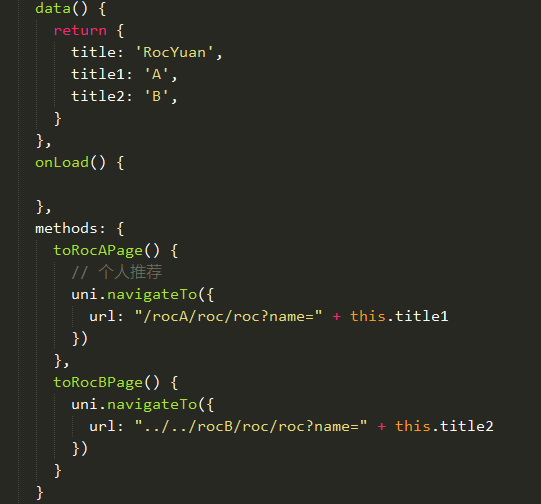

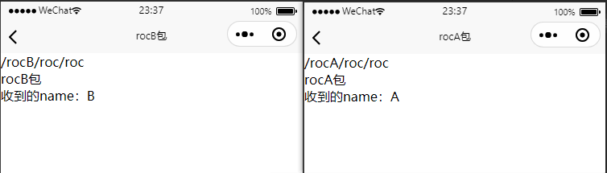

## 分包资源

资源（图片、自定义组件、js工具代码）构建在分包中时，只能在分包使用不能在主包中使用；在主包里的资源主包分包都能使用，相当于公共资源。**我这里只列举图片资源**，其他的同理。

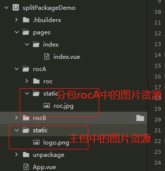

### 在分包中应用的图片资源

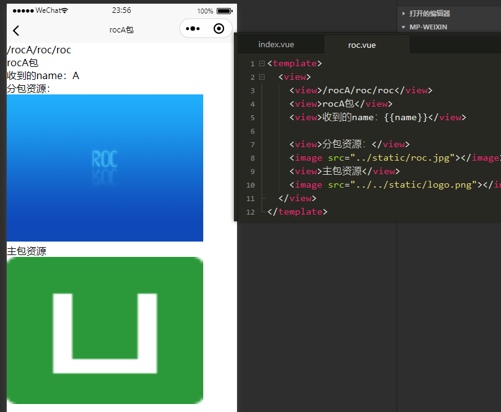

### 在主包中应用的图片资源

roc.jpg是在rocA分包下，所以主包不能使用，报错提示：

**项目资源 rocA/static/roc.jpg 与页面不在同一个分包中导致无法正常加载**

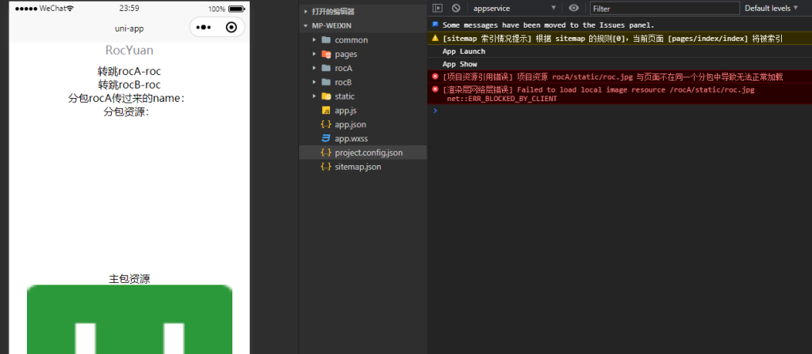

## 查看资源所在的包

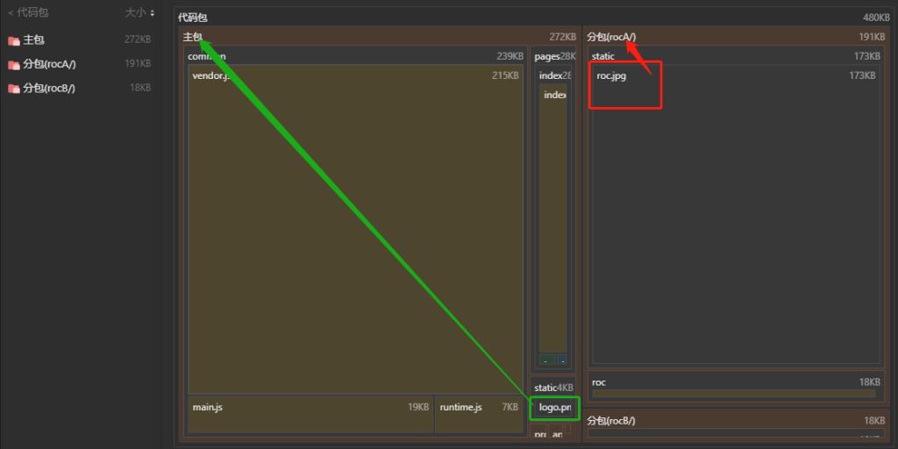

一般建议项目初期就规划好分包构建，通常启动页与tabbar页面及公共组件、js工具、图片等公用的资源在主包，其他的可按照功能模块划分分包。
