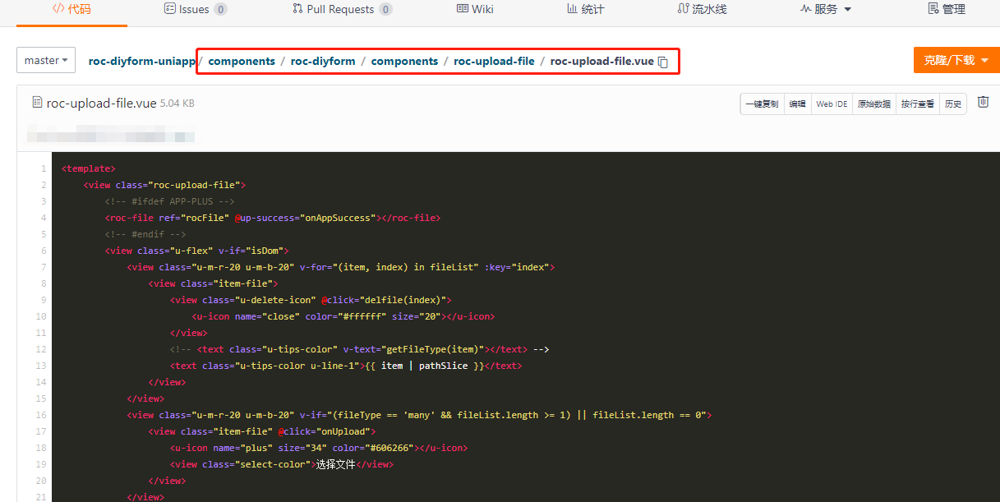
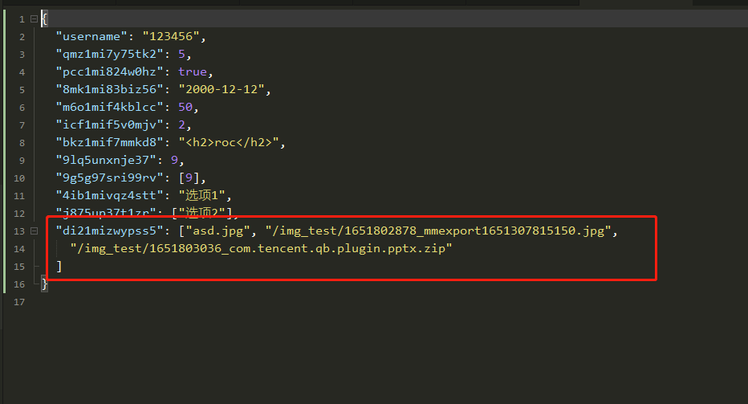
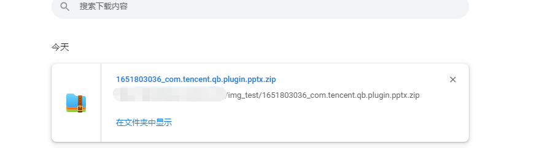

使用uniapp开发，需要上传word文档、pdf、压缩包等文件（需支持app / h5 / 微信小程序）；官方支持不完善，采用以下解决方案。
项目代码仓库：[https://gitee.com/rocyuan666/roc-diyform-uniapp](https://gitee.com/rocyuan666/roc-diyform-uniapp)

效果如下：

上传完成，下载最后一个zip文件：

