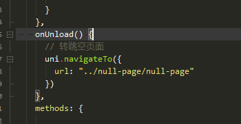
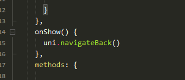

## 场景：
本人是在做安卓app需求时遇到的，当时uniapp官网也有几个贴子提到了BUG，官方出面了只是说单位问题，但也没有解决。
a页面：列表页
b页面：列表详情页（有视频）
c页面：代表所有页面
a进入b，b中将视频全屏播放（横屏），返回a，a进入b或c，样式放大错乱
## 分析问题：
最终分析的结果是假设屏幕是 750*1334（假设app是全占屏幕），写应用时候用的单位是动态单位rpx，动态单位原理就是按照屏幕宽度进行计算的，进入b页面时视频不横屏的情况下问题是不会出现的，动态单位是按照750进行计算的是正常的；视频全屏（横屏）导致设配强行横屏，动态单位又以1334进行计算了，当我们在b页面返回后在进入任何一个页面问题就会浮现：页面整体放大（偶尔会正常也就是偶尔会正确计算）。
## 解决方案
a转跳b，b返回后（页面会卸载）onUnload时转跳到一个空页面（空白的不存在放大），在空白页面onShow时返回（navigateBack）就会回到a页面（因为b页面返回时已经销毁，空页面返回时，页面栈里已经没有b页面了，空页面返回也会销毁）
在电脑上h5体验是感觉不到有空页面进行中转，但是在安卓app中是可以看出来空页面的中转的，这个暂时无法解决，但是可以使用“障眼法”，在空页面用px单位写上“加载中…”等提示（用px写不存在动态计算单位问题），让用户以为是在加载数据。这样比空白页体验能稍好一些。

视频页

空页面
仅分享思路，当时的需求还有，切换，传参等一系列状态，可用公共数据（globalData）记录getApp()更改完成的。
