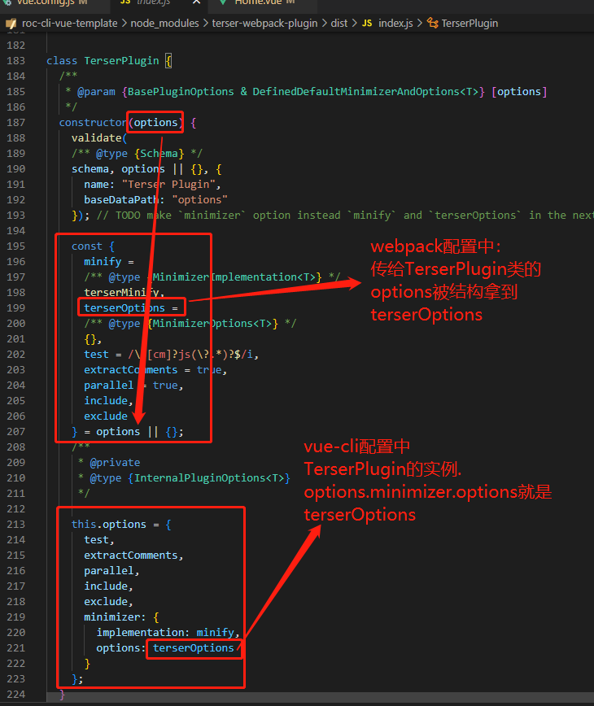

去掉console有两种配法，一种是webpack、一种是chainWebpack
# webpack配置
## optimization选项文档
[https://webpack.docschina.org/configuration/optimization/#optimizationminimizer](https://webpack.docschina.org/configuration/optimization/#optimizationminimizer)
webpack内置了 `terser-webpack-plugin` 插件，可在 `optimization(优化)` 配置项中配置 `terser-webpack-plugin` 的配置项。
## terser-webpack-plugin 插件文档
### terserOptions配置项文档
[https://github.com/webpack-contrib/terser-webpack-plugin#terseroptions](https://github.com/webpack-contrib/terser-webpack-plugin#terseroptions)
### compress配置项文档
[https://github.com/terser/terser#compress-options](https://github.com/terser/terser#compress-options)
## 按照文档的webpack配置
```javascript
const TerserPlugin = require('terser-webpack-plugin');

module.exports = {
  optimization: {
    minimizer: [
      new TerserPlugin({
        terserOptions: {
          compress: {
            drop_console: true,
            drop_debugger: true
          }
        },
      }),
    ],
  },
};
```
## 最终vue-cli配置
在vue-cli中webpack配置可通过 `configureWebpack` 配置项配置具体参考 [vue-cli文档](https://cli.vuejs.org/zh/guide/webpack.html) 。
```javascript
configureWebpack: (config) => {
  if (process.env.NODE_ENV === "production") {
    // 关闭所有console.*
    config.optimization.minimizer[0].options.minimizer.options.compress.drop_console = true;
    // 关闭指定的console.*
    // config.optimization.minimizer[0].options.minimizer.options.compress.pure_funcs =
    //   ["console.log", "console.error"];
  }
},
```
## 为什么最终vue-cli配置是这样？
按照上方 **按照文档的webpack配置** `config.optimization.minimizer[0]` 是 `TerserPlugin` 插件实例，实例对象属性文档暂未体现，只能查看源码

# chainWebpack配置
参考chainWebpack文档：[https://github.com/Yatoo2018/webpack-chain/tree/zh-cmn-Hans](https://github.com/Yatoo2018/webpack-chain/tree/zh-cmn-Hans)
```javascript
chainWebpack: (config) => {
  config.optimization.minimizer("terser").tap((args) => {
    // 关闭所有console.*
    args[0].terserOptions.compress.drop_console = true;
    // 关闭指定的console.*
    // args[0].terserOptions.compress.pure_funcs = ["console.log", "console.error"];
    return args;
  });
},
```
