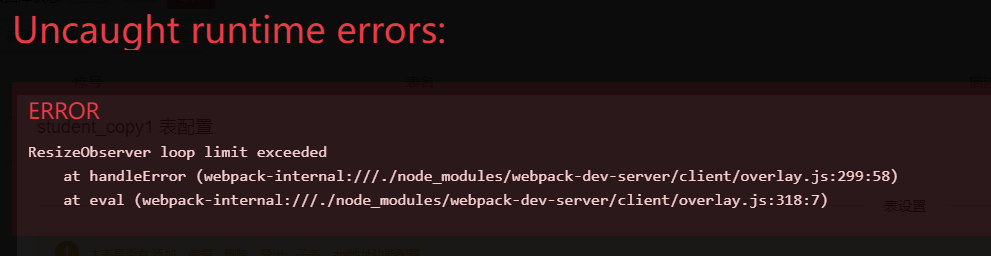

## 错误信息



## 解决

ResizeObserver 调用太频繁，导致循环限制错误，加上防抖处理  
以下代码放到 vue 项目中的 main.js 中：

```javascript
const debounce = (fn, delay) => {
  let timer = null
  return function () {
    let context = this
    let args = arguments
    clearTimeout(timer)
    timer = setTimeout(function () {
      fn.apply(context, args)
    }, delay)
  }
}
const _ResizeObserver = window.ResizeObserver
window.ResizeObserver = class ResizeObserver extends _ResizeObserver {
  constructor(callback) {
    callback = debounce(callback, 16)
    super(callback)
  }
}
```
