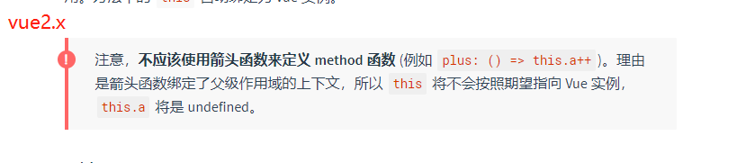
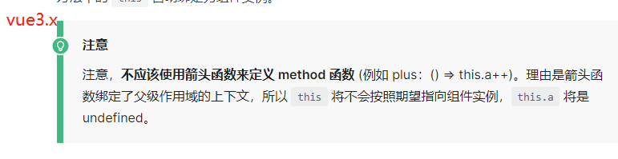
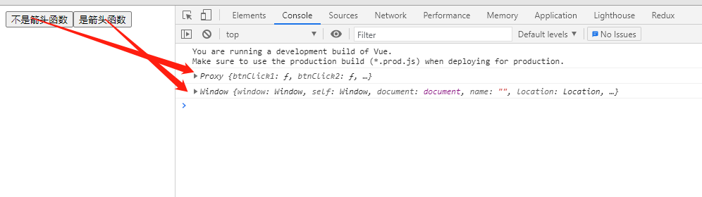
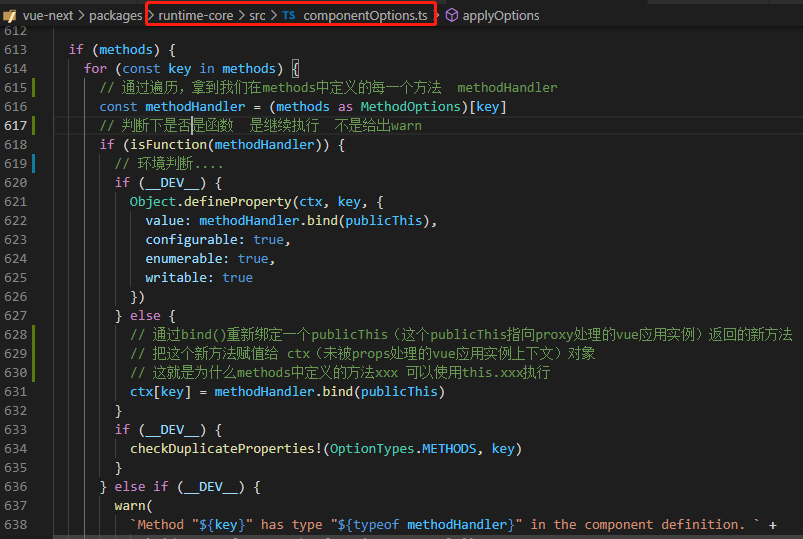

不管是vue2.x还是vue3.x，官网都有说明 **不应该使用箭头函数来定义 method 函数**

## 为什么不能是箭头函数？

箭头函数作用域中不会绑定this，则不会指向实例**（讲道理它本来也不会指向实例，为什么会指向实例？为什么实例上会有methods下定义的方法呢？下面会探讨）**。

## 如果是箭头函数this指向哪？

我们在methods定义一个非箭头函数的方法，再强行定义一个箭头函数方法，打印出this，发现：
1、箭头函数的方法中this指向的是window
2、非箭头函数的方法指向一个代理对象Proxy（这是vue3的，下面会探讨2与3的指向）

其实这里的箭头函数指向window，应该是能够理解的，箭头函数不会绑定this，则这里的this会找它上层作用域的this指向，而它上层作用域便是script便签内作用域（window）

注意：中间的很多花括号并非作用域！

## 为什么不是箭头函数指向的是一个Proxy对象？

不是箭头函数的时候vue2.x与vue3.x是有区别的，区别在于它们的监听原理，vue2使用的Object.defineProperty()，vue3.x使用的Proxy代理。
1、vue2.x中this指向的是经过Object.defineProperty()监听处理的vue应用实例。
2、vue3.x中this指向的是经过Proxy代理监听处理的vue应用实例。

## 为什么会指向实例？为什么可以使用this.xxx执行方法？

这里就要看源码了，源码里我标了注释。

之所以会指向实例，是vue内部使用bind方法为我们定义的每一个methods都重新绑定了一个publicThis，并将返回的新方法赋值给了vue实例，实际上我们在使用this.xxx的时候用的就是vue内部处理过后放到实例上的xxx方法。

