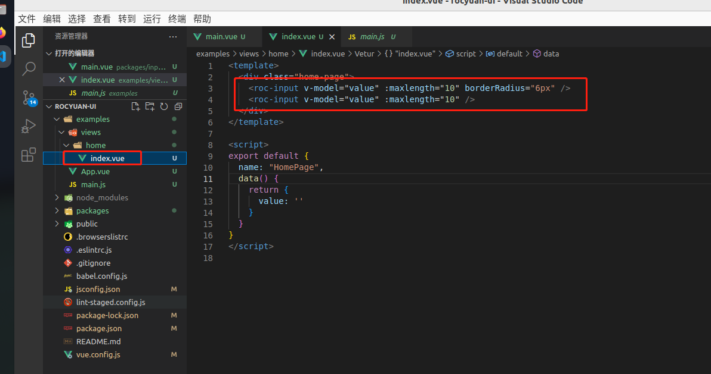
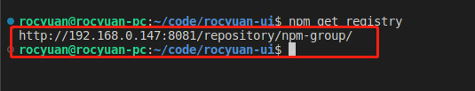
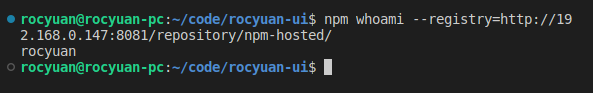

# 前言

文章中的演示上传的并非npm官网仓库，只是npm源不同而已。

# 准备ui库项目

## 创建项目

使用vue-cli准备一个vue项目进行改造，创建项目过程不在演示 `vue create xxx`

## 修改依赖

创建完成后，我们将`package.json`生产时依赖改到开发时依赖（因为我们是开发库文件，不应该将vue等打包到库项目中），然后重新安装依赖，重新安装依赖前，个人删除了`node_modules文件夹`与npm锁定文件`package.lock.json`。


## 目录修改与vue脚手架配置

默认情况下vue-cli创建项目入口目录是`src`，我们参考`element-ui`目录结构，将`src`更改为`examples`作为项目演示目录。再新建目录`packages`作为库文件组件存放目录。


```javascript
module.exports = defineConfig({
  transpileDependencies: true,
  productionSourceMap: false,
  // 配置参考：https://cli.vuejs.org/zh/config/#pages
  pages: {
    index: {
      // 入口
      entry: "examples/main.js",
      // 模板
      template: "public/index.html",
      // 打包输出的html
      filename: "index.html",
    },
  },
  // 配置参考：https://cli.vuejs.org/zh/config/#chainwebpack
  chainWebpack: (config) => {
    config.module
      .rule("js")
      .include.add("/packages")
      .end()
      .use("babel")
      .loader("babel-loader");
  },
});

```

## 配置脚本构建目标

参考：[https://cli.vuejs.org/zh/guide/build-targets.html](https://cli.vuejs.org/zh/guide/build-targets.html)

vue-cli默认构建目标是应用，需要修改为库，`--target lib`指定为构建为库，`--name rocyuan-ui`指定名字，`--dest lib`指定构建完的目录，`packages/index.js`指定构建入口，稍后开发完组件运行这个脚本


```json
{
	"lib": "vue-cli-service build --target lib --name rocyuan-ui --dest lib packages/index.js"
}
```

# 开始写组件

## 组件目录划分

例如写一个input组件，目录结构及写法借鉴element-ui
在`packages`目录创建`index.js`入口，创建`input`目录，其他组件则创建其他组件的目录，组件目录分`index.js`入口文件与`src`目录组件封装源文件目录


## 组件代码

packages/index.js

```javascript
import RocInput from "./input";

const components = [RocInput];
// 定义 install 方法，使用use方法注册需要暴露 install 方法（参考vue官网 use方法）
const install = (Vue) => {
  if (install.installed) return;
  install.installed = true
  components.map((component) => Vue.component(component.name, component));
};
// 判断是否是直接引入文件
if (typeof window !== "undefined" && window.Vue) {
  install(window.Vue);
}
export default {
  install,
  ...components,
};


```

packages/input/index.js

```javascript
import Button from "./src/main";

Button.install = (Vue) => {
  Vue.component(Button.name, Button);
};

export default Button;
```

packages/input/src/main.vue

```javascript
<template>
  <div class="roc-input">
    <input type="text"
      :maxlength="maxlength"
      :value="value"
      @input="handleInput"
      :style="{
        borderColor: borderColor,
        borderRadius: borderRadius
      }"
    >
  </div>
</template>

<script>
export default {
  name: "RocInput",
  props: {
    value: {
      type: String
    },
    maxlength: {
      type: Number,
    },
    borderColor: {
      type: String,
      default: '#ddd'
    },
    borderRadius: {
      type: String,
      default: '20px'
    }
  },
  methods: {
    handleInput(e) {
      this.$emit("input", e.target.value)
    }
  }
}
</script>

<style lang="scss" scoped>
.roc-input {
  input {
    outline: none;
    padding: 5px 10px;
    margin: 4px 0;
  }
}
</style>

```

## 库项目中调试效果

引入packages/index.js，在examples/main.js中引入并注册，然后使用（与平时在项目中使用一致），启动项目后查看效果（必须修改上面提到的脚手架配置）`npm run serve`





# 上传npm

## 上传前配置

### 设置package.json

运行`npm run lib`后 会收件生成ui库，在lib目录，设置`package.json`中设置描述、关键字、及入口文件：

```json
{
	"description": "roc-ui",
	"main": "lib/rocyuan-ui.umd.min.js",
	"keyword": "rocyuan roc-ui vue",
}
```


### 设置上传npm忽略的文件

项目根目录下创建`.npmignore`


```

# 忽略目录
examples/
packages/
public/
node_modules/
 
# 忽略指定文件
vue.config.js
babel.config.js
*.map

```

## npm设置

上传前需要在命令行登陆npm（注意确保你的npm当前源是你想上传的源）查看当前源：`npm get registry`



我是要上传私有仓库，官方仓库源应该为：`https://registry.npmjs.org/`
注意：如果需要登陆、提交的源本身就是当前npm设置的源，不需要指定源 `--registry http://xxxxxxxxxx`
确定源后使用`npm login`登陆登陆成功后，可使用`npm whoami`查看当前登陆的账号



登陆成功后使用`npm publish`发布到npm，发布完成后如下：


# 使用我们上传的ui库

创建vue项目不做演示，已创建好


安装使用


