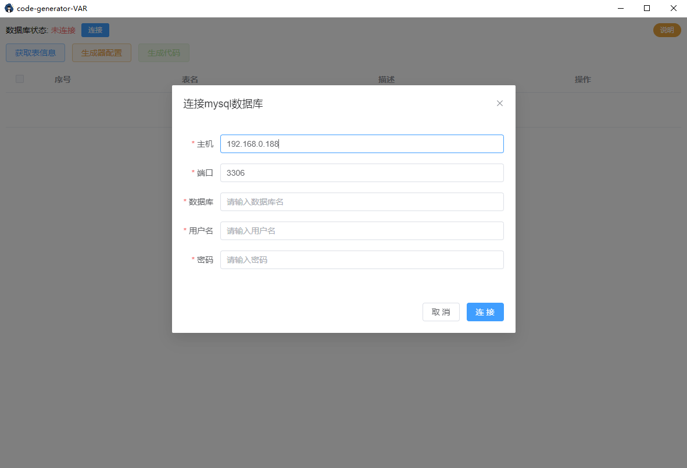
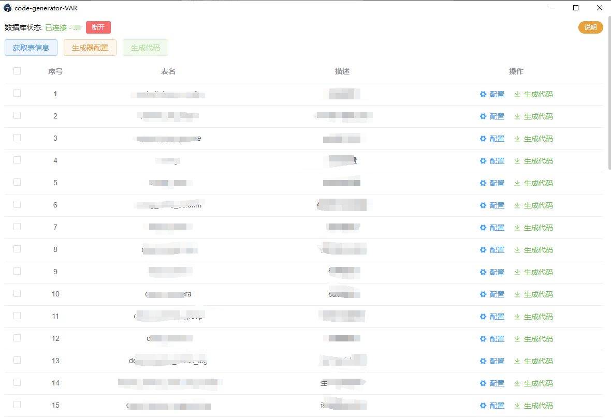
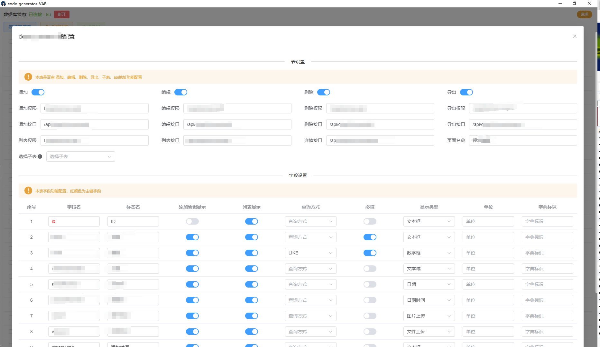
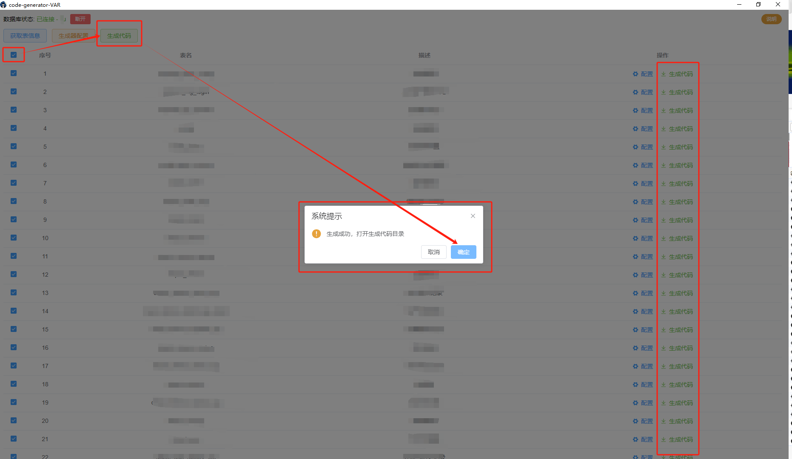
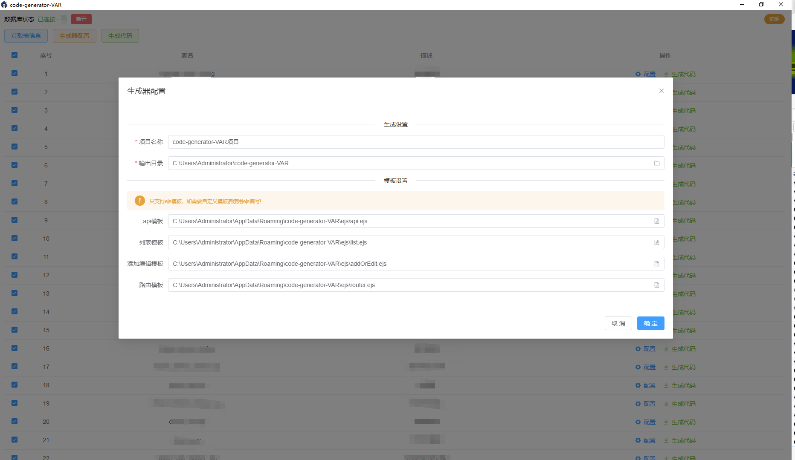

# 介绍
code-generator-VAR 是一款纯前端使用的代码生成器客户端，快速生成前端页面CURD代码，享受更多摸鱼时间；可通过配置对接任意后端，支持自定义模版，不依赖任何后端程序，使用简单，支持 windows、mac、linux 三大平台。  
github地址：[https://github.com/rocyuan666/code-generator-var](https://github.com/rocyuan666/code-generator-var)  
下载地址：[https://github.com/rocyuan666/code-generator-var/releases](https://github.com/rocyuan666/code-generator-var/releases)  
# 使用
## 连接数据库
下载安装好生成器后，生成器需要连接数据库。



## 获取表数据
点击 `获取表数据` 将会获取所连接数据库中所有表与字段信息.



## 配置信息
点击每一行后 `配置` 开始填写生成代码所需要的配置信息；它会将读取数据库的表、字典的信息填充到配置信息中，方便配置。
配置分为 `表配置` 与 `字段配置`  
### 表配置
表配置中可以配置 该表是否有 添加、编辑、删除、导出功能和与后端对接的api地址及权限标识；列表、详情与后端对接的api地址及权限标识、子表的配置等。
### 字段配置
#### 字段名
与后端对接的字段名
#### 标签名
列表、表单显示的文字
#### 添加编辑显示
添加编辑表单需要显示提交的字段
#### 列表显示
列表中需要显示的字段
#### 查询方式
列表中顶部查询的字段，单值查询与范围查询
#### 必填
表单中需要必填的字段
#### 显示类型
表单显示的表单组件类型
#### 单位
文本框、数字框后面显示的单位值，填写什么就显示什么
#### 字典标识
由于生成器与后端完全解耦，不能获取字典下拉选择字典，需要手动填写自己系统中的字典标识（填写上后修改 VAR 项目模板中的根据字典标识查询字典数据的接口）即可在项目中正常访问字典。



## 生成代码

生成代码分为 `批量生成` 与 `单个表生成` ；生成成功后会提示打开生成代码的目录，点击确定就可以看到生成的代码了。



## 生成器配置

可以配置 `项目名称` 、 `输出目录` 、`自定义模板路径` 。  
最终生成代码的目录为：`输出目录/项目名称/vue/*`



# 配合vue-admin-roc（VAR）使用
## VAR介绍
vue-admin-roc（VAR）是一个基于 `vue3` 技术栈（vite + vue3.x + vue-router4.x + pinia + element-plus......）的纯前端后台管理系统模板；code-generator-VAR 默认生成模板生成的代码只能在本项目模板使用，如果没有使用 VAR 项目模板，则需要自行编写生成模板。  
项目中 mock 的 api 需自行根据业务实现对接。
## VAR创建
使用以下命令创建：

```bash
npx roc-cli create 项目名
```

选择 `vue-admin-roc(vue3.x)` 选项，回车。

```bash
Please select the project type to create:
  vue2.x
  vue3.x
  uniapp(uview1.x)
  uniapp(uview2.x)
> vue-admin-roc(vue3.x)
  electron(vue3.x)
  koa
```

## 生成代码的使用
将生成的代码（目录： `输出目录/项目名称/vue/*` ）复制到创建的项目中的 `src/*` 目录下，启动项目 `npm run dev` 可以看到效果；然后基于生成的代码进行二次开发即可。
