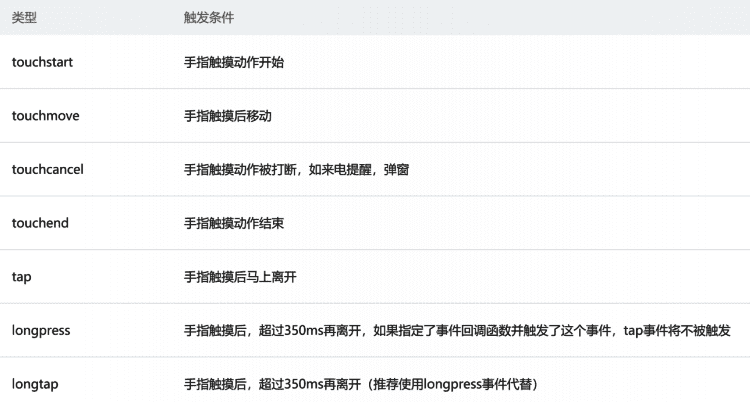
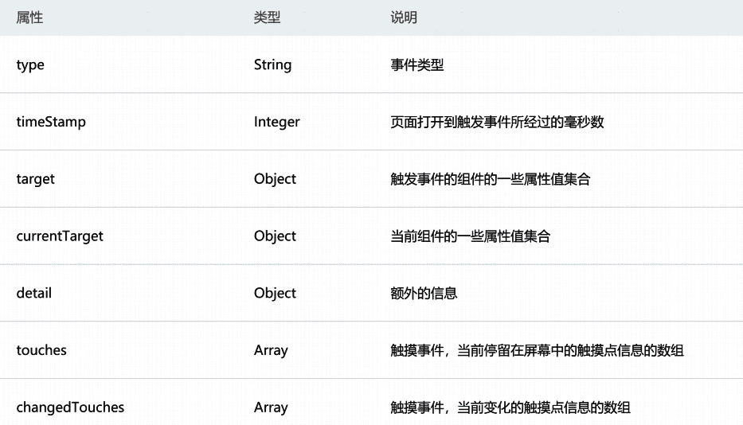
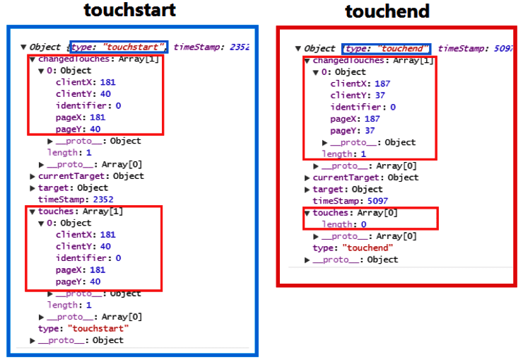
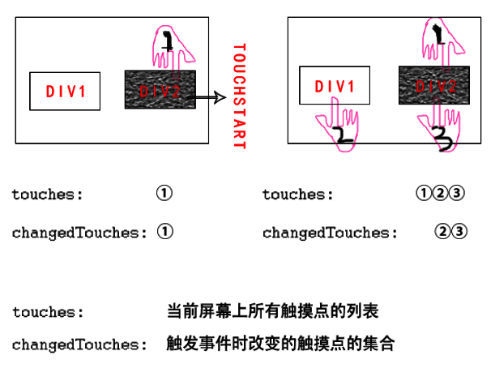
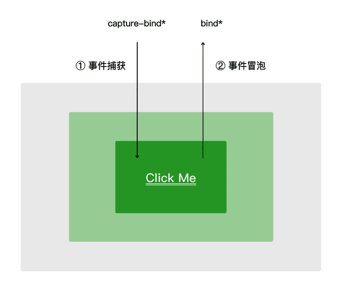

### **常见事件类型：**

某些组件会有自己特性的事件类型
比如input有bindinput/bindblur/bindfocus等
比如scroll-view有bindscrolltowpper/bindscrolltolower等
组件共同都有的事件, 并且比较常见：

```vue
<!--
  事件处理
-->
<!-- 绑定点击事件 -->
<button bindtap="clickName"></button>
<button bind:tap="clickName"></button>
<!-- bind与catch区别：下面事件冒泡和捕获有记录 -->
<button catch:tap="clickName"></button>

<!-- 常见的事件 所有组件都有事件 -->
<!-- 手指开始触摸 -->
<view bind:touchstart="onTouchstart"></view>
<!-- 手指移动 -->
<view bind:touchmove="onTouchmove"></view>
<!-- 手指离开 -->
<view bind:touchend="onTouchend"></view>
<!-- 点击 -->
<view bind:tap="onTap"></view>
<!--  longpress 与 tap 只会执行其中一个 -->
<view bind:longpress="onLongpress"></view>
```



### 事件对象event

当某个事件触发时, 会产生一个事件对象, 并且这个对象被传入到回调函数中

**常见的事件对象属性**



```text
type：事件类型
timeStamp：打开网页经过多长时间（毫秒）触发了点击
target：当前button的信息
currentTarget：当前button的信息（有时候与target相同）
detail：点击的位置坐标（x,y）
touches: 记录几根手指触摸了按钮的信息[{},{}]
changedTouches: 记录几根手指触摸了按钮的信息[{},{}]（有时候与touches相同）
```

**事件对象中touches，changedTouches区别**

```text
1.touchend事件中不同；
2.多手指触摸不同
  touches：当前几根手指按屏的信息
  changedTouches：只记录有变化的手指按屏信息
```





**事件对象中target，currentTarget区别**

```vue
target：当前产生事件的view信息（所按到的view）
currentTarget：当前触发事件的view（事件冒泡的view）
```

### 事件参数的传递

当视图层发生事件时，某些情况需要事件**携带一些参数到执行的函数**中, 这个时候就可以通过**data-属性**来完成
渲染层 传递：data-属性的名称
逻辑层 接收：event.target.dataset.属性的名称

```vue
 <view 
  bind:tap="itemClick"
  data-index="{{index}}"
  data-item="{{item}}"
  ></view>

itemClick(event){
  event.target.dataset.index
}
```

### 事件冒泡和事件捕获

```vue
先捕获，后冒泡
  事件捕获：从最外层开始往内传
    capture-bind:tap=""
  事件冒泡：从最内层开始往外传
    bind:tap=""

  bind： 会一层层进行传递
  catch： 阻止事件的下一步传递
```


