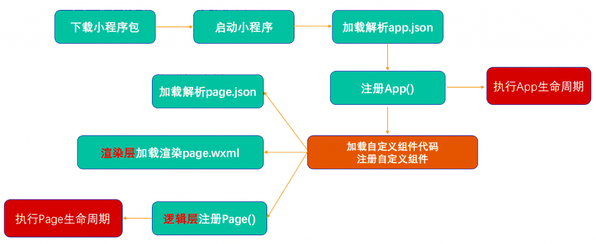

小程序的启动流程图



看懂了小程序的**双线程模型渲染机制**，很好理解上图
**双线程模型**参考： [https://luojing.top/rocyuan/?p=667](https://luojing.top/rocyuan/?p=667)

### 注册小程序App-参数

每个小程序都需要在 app.js 中调用 App 方法注册小程序示例 ； 在注册时, 可以绑定对应的生命周期函数, 在生命周期函数中, 执行对应的代码.

[https://developers.weixin.qq.com/miniprogram/dev/reference/api/App.html](https://developers.weixin.qq.com/miniprogram/dev/reference/api/App.html)

| **属性** | **类型** | **必填** | **说明** |
| --- | --- | --- | --- |
| [onLaunch](https://developers.weixin.qq.com/miniprogram/dev/reference/api/App.html#onLaunch-Object-object) | function | 否 | 生命周期回调——监听小程序初始化。 |
| [onShow](https://developers.weixin.qq.com/miniprogram/dev/reference/api/App.html#onShow-Object-object) | function | 否 | 生命周期回调——监听小程序启动或切前台。 |
| [onHide](https://developers.weixin.qq.com/miniprogram/dev/reference/api/App.html#onHide) | function | 否 | 生命周期回调——监听小程序切后台。 |
| [onError](https://developers.weixin.qq.com/miniprogram/dev/reference/api/App.html#onError-String-error) | function | 否 | 错误监听函数。 |
| [onPageNotFound](https://developers.weixin.qq.com/miniprogram/dev/reference/api/App.html#onPageNotFound-Object-object) | function | 否 | 页面不存在监听函数。 |
| [onUnhandledRejection](https://developers.weixin.qq.com/miniprogram/dev/reference/api/App.html#onUnhandledRejection-Object-object) | function | 否 | 未处理的 Promise 拒绝事件监听函数。 |
| 其他 | any | 否 | 开发者可以添加任意的函数或数据变量到 Object 参数中，用 this 可以访问 |

### 注册App时一般会做什么

1. 判断小程序进入场景（扫码进入、小程序列表进入、朋友分享进入……）
[https://developers.weixin.qq.com/miniprogram/dev/reference/scene-list.html](https://developers.weixin.qq.com/miniprogram/dev/reference/scene-list.html)
**如何确定场景?**
在onLaunch和onShow生命周期回调函数中,会有options参数，其中有scene值

2. 监听生命周期（获取用户信息业务逻辑，…等）

```vue
全局app生命周期
初始化完成：onlaunch
小程序显示：onShow
小程序隐藏：onHide
小程序出错：onError
找不到页面：onPageNotFound

//onlaunch：
获取用户信息：
1）接口即将废弃
wx.getUserInfo({
	success: function (res) {
		//用户信息
		console.log(res)
	}
})

2）需要点击才获取用户信息(1.open-type, 2.bindgetuserinfo)
<button size="mini"
		open-type="getUserInfo"
		bindgetuserinfo="getUserInfo"
		>获取授权</button>

page({
	getUserInfo: (event) {
		console.log(event)
	}
})

3) open-data组件展示用户信息，只能展示
<open-data type="userNickName"></open-data>
```

3. App()实例只有一个，是全局共享的（单例对象），可以放一些共享数据

```vue
共享数据：
app.js
App({
	globalData: {
		name: rocyuan
		age: 18
	}
})

page.js
Page({
	//getApp() 获取App()产生的示例对象
	const app = getApp()
	const name = app.globalData.name
	const name = app.globalData.age
})
```

### 注册小程序Page-参数

小程序中的每个页面, 都有一个对应的js文件, 其中调用Page方法注册页面示例 ； 在注册时, 可以绑定初始化数据、生命周期回调、事件处理函数等。
[https://developers.weixin.qq.com/miniprogram/dev/reference/api/Page.html](https://developers.weixin.qq.com/miniprogram/dev/reference/api/Page.html)

| **属性** | **类型** | **说明** |
| --- | --- | --- |
| [data](https://developers.weixin.qq.com/miniprogram/dev/reference/api/Page.html#data) | Object | 页面的初始数据 |
| [onLoad](https://developers.weixin.qq.com/miniprogram/dev/reference/api/Page.html#onLoad-Object-query) | function | 生命周期回调—监听页面加载 |
| [onShow](https://developers.weixin.qq.com/miniprogram/dev/reference/api/Page.html#onShow) | function | 生命周期回调—监听页面显示 |
| [onReady](https://developers.weixin.qq.com/miniprogram/dev/reference/api/Page.html#onReady) | function | 生命周期回调—监听页面初次渲染完成 |
| [onHide](https://developers.weixin.qq.com/miniprogram/dev/reference/api/Page.html#onHide) | function | 生命周期回调—监听页面隐藏 |
| [onUnload](https://developers.weixin.qq.com/miniprogram/dev/reference/api/Page.html#onUnload) | function | 生命周期回调—监听页面卸载 |
| [onPullDownRefresh](https://developers.weixin.qq.com/miniprogram/dev/reference/api/Page.html#onPullDownRefresh) | function | 监听用户下拉动作 |
| [onReachBottom](https://developers.weixin.qq.com/miniprogram/dev/reference/api/Page.html#onReachBottom) | function | 页面上拉触底事件的处理函数 |
| [onShareAppMessage](https://developers.weixin.qq.com/miniprogram/dev/reference/api/Page.html#onShareAppMessage-Object-object) | function | 用户点击右上角转发 |
| [onPageScroll](https://developers.weixin.qq.com/miniprogram/dev/reference/api/Page.html#onPageScroll-Object-object) | function | 页面滚动触发事件的处理函数 |
| [onResize](https://developers.weixin.qq.com/miniprogram/dev/reference/api/Page.html#onResize-Object-object) | function | 页面尺寸改变时触发，详见 [响应显示区域变化](https://developers.weixin.qq.com/miniprogram/dev/framework/view/resizable.html#%E5%9C%A8%E6%89%8B%E6%9C%BA%E4%B8%8A%E5%90%AF%E7%94%A8%E5%B1%8F%E5%B9%95%E6%97%8B%E8%BD%AC%E6%94%AF%E6%8C%81) |
| [onTabItemTap](https://developers.weixin.qq.com/miniprogram/dev/reference/api/Page.html#onTabItemTap-Object-object) | function | 当前是 tab 页时，点击 tab 时触发 |
| 其他 | any | 开发者可以添加任意的函数或数据到 Object 参数中，在页面的函数中用 this 可以访问 |

### 注册Page时一般会干什么

1. 监听页面的生命周期函数

```vue
page声明周期
onLoad: 页面加载
onShow: 页面显示
onReady: 页面初次渲染完成
onHide: 页面隐藏
onUnload: 页面被卸载掉（关系到跳转）
```

2. 初始化数据 data:{}，用于被wxml展示

```vue
page({
  data: {
    message: "hello wx"
  }
})
```

3. 监听wxml中的事件，绑定对应的事件函数

```vue
<view bindtap="tapName"></view>
page({
  tapName(e){
    console.log(e)
    console.log("点击")
  }
})
```

4. 监听页面其他事件（滚动，上拉加载更多…页面滚动到底部，下拉刷新）

```vue
监听页面滚动事件： 
onPageScroll (obj) {
	console.log(obj)
}

监听页面滚动到底部：
onReachBottom () {
	console.log("滚动到底部")
}

下拉刷新：
onPullDownRefresh () {
	console.log("下拉刷新中")
}
```
