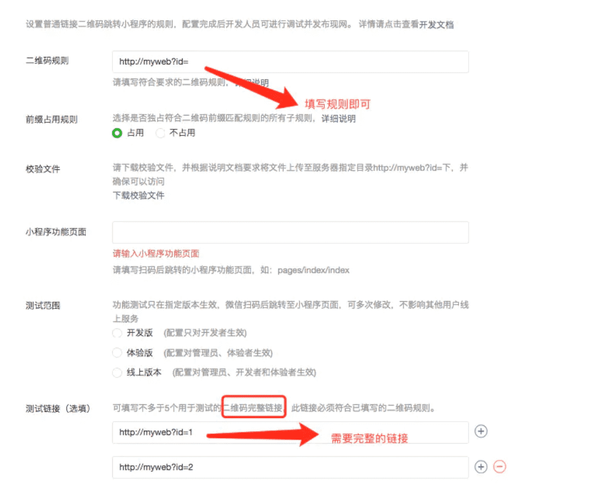

### 一：https部署以及设置合法域名。
**1.**小程序向后台请求接口必须使用https，包括web-view里的网页，如果项目中有用到web socket，那么也必须使用wss协议。https证书一般会用第三方的。比如阿里云的。
**2.**在微信小程序管理后台，还需要配置合法域名。当然，在后台还没有部署https之前，我们也可以进行开发调试，只需要设置不校验合法域名，https证书等即可。
### 二：post请求，json数据格式转换
当我们向后台进行post请求的时候，当我们的传输数据的格式为json的时候，需要设置
```javascript
'content-type': 'application/x-www-form-urlencoded' 
```
### 三：微信小程序谁是首页的问题
当我们在开发原生应用的时候，我们一般会在程序的入口，设置我们程序的第一个页面，但是反观小程序，并没有找到类似的方法，原来在小程序中，app.json文件中的pages数据的第一个元素，就是首页。但是，我们有时候会有这样的需求，微信扫码直接跳转小程序内部的指定页面，那么，这时，只需要在小程序管理后台，设置扫码打开的页面路径填好即可。
### 四：微信小程序开发单位问题
我们再开发iOS的时候默认使用pt；在开发Android的时候，我们使用dp,sp等单位；在开发web的时候使用em,rem等单位。但是在我们的小程序里我们只要记住rpx这一个单位就好了，这样我们开发出来的小程序就完美的运行在各式各样屏幕的手机上了。no!no!no，也是有特殊情况的，有时候我们就不能使用rpx，比如使用到**canvas**的时候，那么就只能使用**px**为单位，那么，如何做到屏幕适配呢？我的做法是使用**wx.getSystemInfo**这个api来获取到运行手机的屏幕的宽度和高度，那么根据UI的标注图的屏幕宽高，就可以换算出一个比例来了。如果大家有更好的做法欢迎交流指正。
### 五：wxss文件中不支持本地图片
如果我们有一个需求：添加一张背景图，根据web开发思维，肯定是在background-image:中设置本地图片的路径，但是在微信小程序上这是行不通的。微信小程序的background-image只支持网络图片。
### 六：wxml文件中可以使用三目运算符
如果我们要在wxml文件中做逻辑判断，那么我们可以使用三目运算符，列如：class=” {{type==1?’style_one’:’style_two’}}”。这里的意思是通过type的不同，渲染不同的wxss文件。注意！这里要分清单引号与双引号，不能弄混淆。
### 七：this.setData和直接赋值的区别
这两者都可以造成data里数据的改变，但是this.setData赋值才会造成wxml里面数据的改变，也就是同步更新渲染界面，而直接赋值只会让data里数据发生变化，但是界面并不会改变。看代码：
```javascript
//wxml文件
<text>我的名字是{{name}}</text>

//js文件
//数据源
data: {
    name:'',
  },

onLoad: function (options) {
    this.data.name='张三'//只会使data里数据发送改变，但是界面不会发生改变，界面仍显示”我的名字是“
    console.log(this.data.name)//打印出来的结果是”张三“

    this.setData({
      name: '张三'
    })
    //此时，界面数据才会发生改变，变成”我的名字是张三“
  },
```
### 八：cover-view组件
这是小程序上特有的组件，它其实是由客户端创建的原生组件。这些组件有：cavans，map，vedio等，如果想要在原生组件上覆盖组件的话，添加view,text,button都是行不通的，必须使用cover-view和cover-image组件，具体用法，可以参考微信小程序官方文档。下面我来说说cover-view中踩过的坑。**cover-view对css支持真的不太友好**，虽然我们设置背景色，字体大小，宽高等都没啥问题，但是，
**1.**在web开发中，如果我们想要给文字设置删除线，那么使用**text-decoration**即可实现，但是抱歉，**cover-view不支持**这个属性。
**2.**曾经我尝试**给cover-image添加旋转的动画**，但是发现怎么都实现不了，我猜测可能也是不支持，后来换了其他方法实现这个需求了。
**3.**cover-view是有**hidden**属性的，但是我奇葩的发现了，在**ios10系统**上，cover-view改变hidden属性的时候报错了，后来换成了**wx:if**，就这样神奇的解决了。
**4.**使用cover-view组件的时候，如果cover-view在模拟器上表现是好的，别忘了使用真机跑跑看，说不定会有意想不到的结果哦。
**5.**总之，使用cover-view的时候一定要小心谨慎。
这些是我遇到的关于cover-view坑，应该还有，欢迎大家补充。
### 九：微信小程序不能操作DOM树
web开发中，可以使用getElementById()访问documnent中的某一个元素，顾名思义，就是通过id来获取元素，但是微信小程序没有windows对象，所以小程序不能直接操作dom树，小程序采用的都是mvvm的设计模式，数据双向绑定。类似于vue.js的写法。
### 十：微信小程序分享功能如何实现
微信有庞大的流量，既然有这么得天独厚的平台，那么在小程序开发分享功能也是水到渠成的。比如，要开发一个类似外卖平台发红包的功能，照以前开发app逻辑，app客户端负责开发“发红包”的逻辑，集成分享的sdk，把红包发出去即可，再使用web开发“领红包”的逻辑，也就是领红包的页面是一个web页面。一开始，我也是打算这么设计这个架构的。但是在web页面重新登录，在打开小程序，中间涉及到的登录流程又会显得比较复杂。后来参考了其他小程序的分享功能，把分享页面也定义成一个小程序原生页面，而不是小程序内的web-view页面。这样设计，实际开发后，发现其实简单了许多。
### 十一：配置普通链接二维码规则需要注意的地方
这里有一个地方需要注意。开发小程序的时候，我们有一个使用微信扫码打开指定页面的需求。那么我们需要配置一个普通链接二维码规则，但是我们在开发测试的过程中，我们需要来测试我们的跳转功能是否好用。二维码规则需要发布才可以全网使用，测试链接也是只针对管理员开发者体验着等有效果。
个人小程序不支持设置

### 十二：地图导航等功能需要注意的地方
微信小程序集成地图功能非常简单，但是需要注意的是我们使用的是腾讯地图，也就是gcj02坐标系，如果后台使用的是其他坐标系，那么我们需要转换。如果需要实现导航功能，那么小程序内的map组件是没有这个能力的，我们需要调用**wx.openLocation**来实现，其实这个api是打开了微信内置的腾讯地图，这样，就是我们熟悉的微信导航服务了，可以在这里打开手机内的百度地图，高德地图，腾讯地图这些app来进行导航了。
### 十三：wx.showToast
```javascript
wx.showToast({
  title: '成功',
  icon: 'success',
  duration: 2000
})
```
微信提供的这个api，默认的提示图标是一个小勾勾，但是即使不设置icon，也会出现这个图标，这就很难受了。如果我想提示失败呢？你给我一个对勾的图标？我的解决办法就是自己写了一个toast-view，或者可以找ui设置一张空白的图片放上去吧，嘻嘻，我没试过，但是应该可行。
### 十四：添加点击事件
在wxml文件中，text,image,view,button等标签都可以添加点击事件。（ps:这点比移动开发中只有button才能添加点击事件，其他的只能添加手势方便了许多）使用button的时候有一点需要注意，那就是button有默认的样式，我们如果不需要这个样式，需要手动清除。
### 十五：new Date跨平台兼容性问题
在Andriod使用new Date(“2018-05-30 00:00:00”)木有问题，但是在ios下面识别不出来。
因为IOS下面不能识别这种格式，需要用2018/05/30 00:00:00格式。可以使用正则表达式对做字符串替换，将短横替换为斜杠。var iosDate= date.replace(/-/g, '/');。
