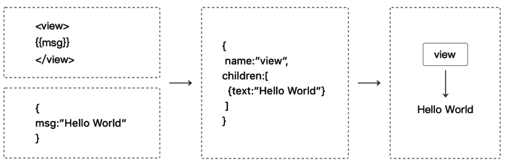

### 小程序的双线程模型
小程序运行在**微信客户端（宿主环境）； 宿主环境**为了执行小程序的各种文件：wxml文件、 wxss文件、js文件 ； 提供了小程序的双线程模型
WXML和WXSS运行于 渲染层；
js 运行于 逻辑层；
这两个线程都会由**微信客户端**进行中转交互。
### 界面渲染过程
**wxml**相当于一棵DOM树，可以使用一个JS对象来模拟（虚拟DOM）

**WXML**先转成JS对象 （虚拟DOM） ，再渲染出真正的DOM树

### 界面渲染过程 – 数据发生变化
通过setData把msg数据从“Hello World”变 成“Goodbye”

- **逻辑层js中的**msg发生变化后，产生的**JS对象（虚拟DOM）**对应的节点就会发生变化
- 对比发生变化前后的两个**JS对象（ 虚拟DOM ）**得到变化的部分，应用到Dom树上
- 从而达到更新UI的目的，这就是“数据驱动”的原理

### 总结渲染整体流程：

- **宿主环境（微信客户端）**会把WXML转化成对应的JS对象（虚拟DOM）；
- 将**JS对象（虚拟DOM）**再次转成真实DOM树，交由**渲染层线程**渲染 ；
- 数据变化时，**逻辑层**提供最新的变化数据，**JS对象（虚拟Dom）**发生变化比较进行diff算法对比；
- 将最新变化的内容反映到真实的DOM树中，更新UI；
