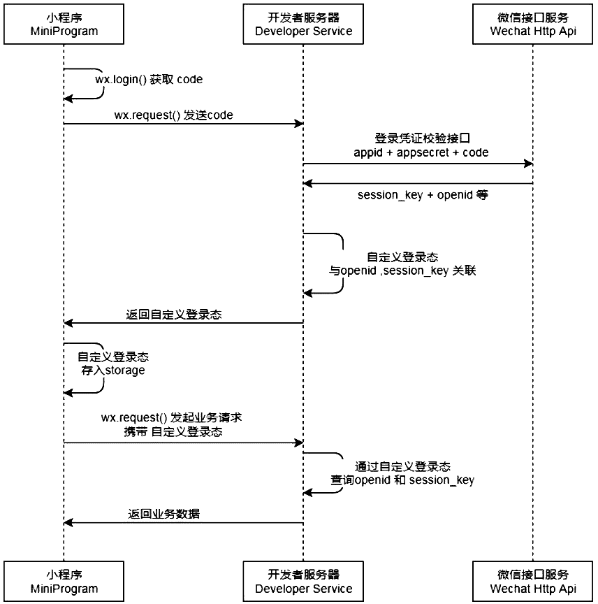

官方文档：
[https://developers.weixin.qq.com/miniprogram/dev/api/](https://developers.weixin.qq.com/miniprogram/dev/api/)
### 网络请求
微信提供了专属的API接口,用于网络请求: wx.request({})
```vue
//无参数GET
wx.request({
  url: "https://luojing.top/....",
  success(res){
    console.log(res)
  }
})
//有参数GET
wx.request({
  url: "https://luojing.top/...",
  data: {
    query: "rocyuan"
  },
  success(res){
    console.log(res)
  }
})
//POST请求
wx.request({
  url: "https://luojing.top/...",
  method: "post",
  data: {
    name: "rocyuan",
    age: 18,
    height: 2.00
  }
})
```
### 网络请求封装
通过promise封装wx.request()
```vue
network.js(也可对baseURL，timeout进行统一管理封装，这里不演示了):
export function request(option){
  return new Promise((resolve, reject) => {
    wx.request({
      url: option.url,
      timeout: option.timeout  || 5000,
      method: option.method || "get",
      data: option.data || {},
      success(res){
        resolve(res)
      },
      fail(err){
        reject(err)
      }
    })
  })
}

应用：
page.js
import { request } from "network"

request({
  url: "https://luojing.top/..."
}).then(res => {
  console.log(res)
}).catch(err => {
  console.log(err)
})
```
### 弹窗展示
小程序中展示弹窗有四种方式: showToast、showModal、showLoading、showActionSheet
```vue
wxml:
<button size="mini" bindtap="onToastClick">showToast</button>
<button size="mini" bindtap="onModalClick">showModal</button>
<button size="mini" bindtap="onLoadingClick">showLoading</button>
<button size="mini" bindtap="onActionSheetClick">showActionSheet</button>

js:
//Toast弹窗
onToastClick(){
  wx.showToast({
    title: "hello",
    duratioin: 3000,
    icon: "loading",
    mask: true,
    success(){
      console.log("展示成功")
    },
    fail(){
      console.log("展示失败")
    },
    complete(){
      console.log("展示完成")
    }
  })
}
//弹窗带内容及交互
onModalClic(){
  wx.showModal({
    title: "标题",
    content: "内容",
    showCancel: true, //是否显示取消按钮
    cancelText: "返回",
    cancelColor: "#f00",
    success(res){
      if(res.confirm){
        console.log("点击了确定")
      }
      if(res.cancel){
        console.log("点击了取消")
      }
    }
  })
}
//加载中动画，需要手动隐藏（多用于加载中 loading...）
onLoadingClick(){
  wx.showLoading({
    title: "标题",
    mask: true,
  })
  settimeout(_ => {
    wx.hideLoading()
  },3000)
}
//显示操作菜单
onActionSheelClick(){
  wx.showActionSheel({
    itemList: ["相册", "拍照"],
    itemColor: "#f00",
    success(res){
      console.log(res)
    }
  })
}
```
### 页面分享
分享是小程序扩散的一种重要方式，小程序中有两种分享方式：

- 点击右上角的菜单按钮，之后点击转发
- 点击某一个按钮，直接转发

当我们转发给好友一个小程序时，通常小程序中会显示一些信息； 通过 onShareAppMessage 设置展示信息
```vue
page.wxml:
<button size='mini' open-type='share'>分享</button>

page.js
onShareAppMessage(option){
  return {
    title: "分享标题",
    path: "/pages/index/index",
    imageUrl: "分享图片的路径"
  }
}
```
### 小程序的登录流程

- 调用wx.login获取code
- 调用wx.request发送code到我们自己的服务器（我 们自己的服务器会返回一个登录态的标识，比如 token）
- 将登录态的标识token进行存储，以便下次使用
- 请求需要登录态标识的接口时，携带token


### 界面转跳（路由）
界面的跳转有两种方式：**通过navigator组件 **和 **通过wx的API跳转**
**navigators**设置文档：
[https://developers.weixin.qq.com/miniprogram/dev/component/navigator.html](https://developers.weixin.qq.com/miniprogram/dev/component/navigator.html)
```vue
<!-- 1.navigator页面跳转 -->
<navigator url='/pages/detail/detail'>跳到详情页</navigator>

<!-- 2.navigator属性: open-type, 每一个open-type都有对应的API -->
<navigator url='/pages/detail/detail'
           open-type='redirect'>
  跳到详情页(redirect)
</navigator>

<!-- 3.跳转过程中数据的传递 -->
// 3.1 首页跳转到详情页携带数据：
首页：
<navigator url='/pages/detail/detail?name=why&age=18&height=1.88'>跳到详情页</navigator>
详情页js：
onLoad: function (options) {
  console.log(options)//potions中传过来的数据
},

// 3.2详情页返回首页携带数据（通过修改首页数据，从而达到效果）
首页js：
data: {
  title: "首页"
}
详情页js：
onUnload: function (){
  // 1.获取首页的页面对象
  // getCurrentPages当前所有活跃（栈中）的页面
  const pages = getCurrentPages()
  home home = pages[pages.length-2];
  home.setData({
    title: "返回的首页"
  })
}
```
**wx的路由API**
```vue
<!-- 4.通过代码进行页面跳转 返回 -->
<button size='mini' bind:tap="handlePushDetail">跳到详情页</button>
<button size='mini' bind:tap="handleBackDetail">跳到详情页</button>

//转跳
handlePushDetail(){
  wx.navigateTo({
    url: "https://luojing.top/detail?id=123456&type=news"
  })
}
//返回
handleBackDetai(){
  wx.navigateBack({
    delta: 1 //返回的层级
  })
}
```
