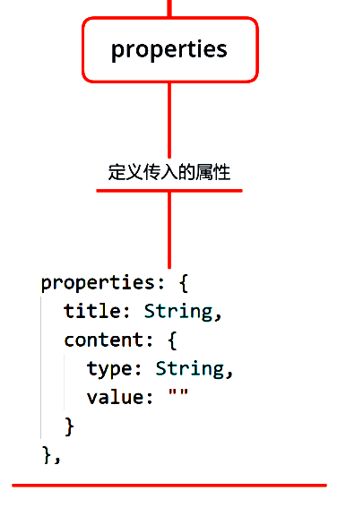
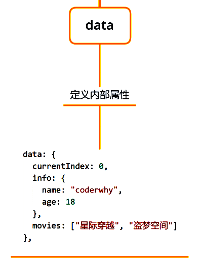
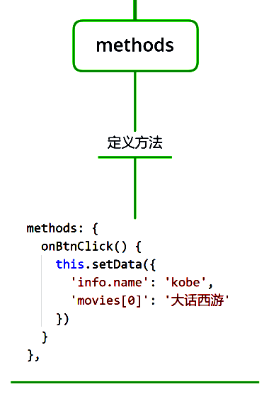
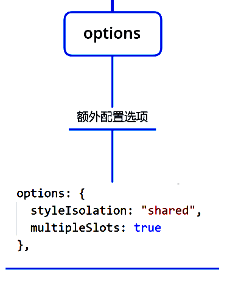
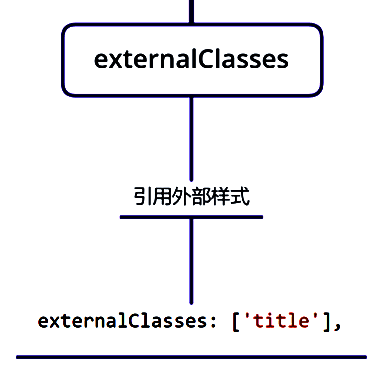
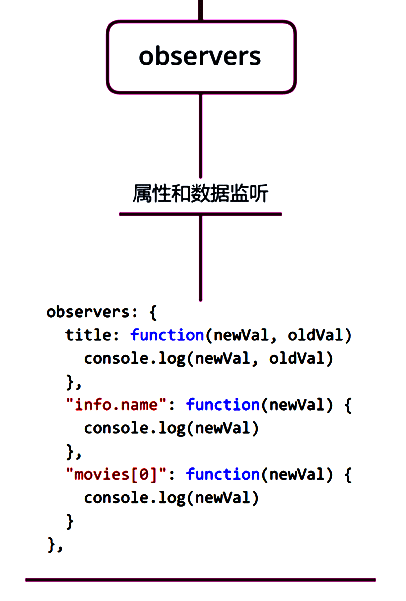
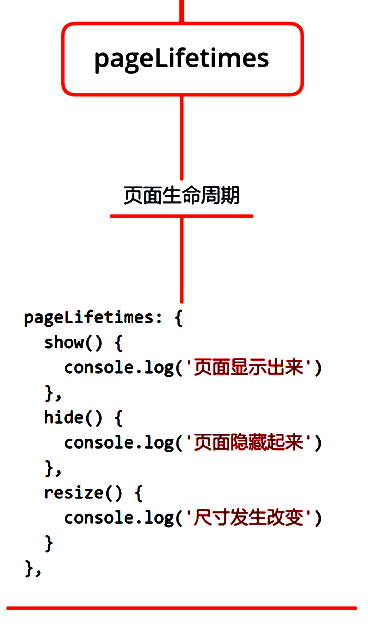
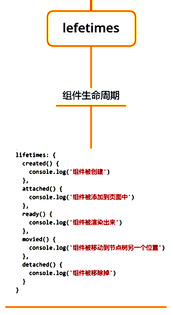

小程序在刚刚推出时是不支持组件化的 ， 从v1.6.3开始, 小程序开始支持自定义组件开发。
组件类似于页面自定义组件由 json wxml wxss js 4个文件组成
### 创建自定义组件
1）首先需要在 json 文件中进行自定义组件声明（将 component 字段设为 true 可将这一组文件设为自定义组件） **json**
```vue
{
  "component": true,
  "usingComponents": {},
  //组件中方法需要写到methods中
  methods: {},
}
```
2）在wxml中编写属于我们组件自己的模板 **wxml**
```vue
<view>
  <view class="my-cpn">我是组件</view>
</view>
```
3）在wxss中编写属于我们组件自己的相关样式 **wxss**
```vue
.my-cpn{
  color:#f00;
}
```
4）在js文件中, 可以定义数据或组件内部的相关逻辑 **js**
```vue
Component({
  data: {
    message: "我是组件"
  }
})
```
### 使用自定义组件
1）在需要引入组件的**页面（ 或者组件 ）**json文件的 usingComponents对象 中添加组件
```vue
{
  usingComponents: {
    "roc-tabber": "/components/roc-tabber/roc-tabber"
  }
}
```
2）在wxml中使用
```vue
<roc-tabber></roc-tabber>
```
#### 组件创建使用的细节：

- WXML 节点标签名只能是 **小写字母、中划线和下划线 的组合**，所以自定义组件的标签名也只能包含这些 字符。
- **自定义组件也是可以引用自定义组件**的，引用方法类似于页面引用自定义组件的方式（使用 usingComponents 对象）。
- 自定义组件和页面所在项目根目录名 **不能以“wx-”为前缀**，否则会报错。
- 如果在app.json的usingComponents声明某个组件，那么**所有页面和组件可以直接使用该组件**。
#### 组件样式的细节：
官方文档：
[https://developers.weixin.qq.com/miniprogram/dev/framework/custom-component/wxml-wxss.html](https://developers.weixin.qq.com/miniprogram/dev/framework/custom-component/wxml-wxss.html)
**1）组件内的样式 对 外部样式 的影响**

- 组件内的class样式，只对组件wxml内的节点生效, 对于引用组件的Page页面不生效。
- 组件内不能使用id选择器、属性选择器、标签选择器

**2）** **外部样式 对 组件内样式 的影响**

- 外部使用class的样式，只对外部wxml的class生效，对组件内是不生效的
- 外部使用了id选择器、属性选择器不会对组件内产生影响
- 外部使用了标签选择器，会对组件内产生影响

**组件内的class样式和组件外的class样式, 默认是有一个隔离效果的； 为了防止样式的错乱，官方不推荐使用id、属性、标签选择器；**
**3） 如何让class可以相互影响**
在Component对象中，可以传入一个options属性，其中options属性中有一个styleIsolation（隔离）属性。 styleIsolation有三个取值：

- isolated 表示启用样式隔离，在自定义组件内外，使用 class 指定的样式将不会相互影响（默认取值）
- apply-shared 表示页面 wxss 样式将影响到自定义组件，但自定义组件 wxss 中指定的样式不会影响页面；
- shared 表示页面 wxss 样式将影响到自定义组件，自定义组件 wxss 中指定的样式也会影响页面和其他设置
```vue
Component({
  options: {
    styleIsolation: "shared"
  }
})
```
### 页面向组件传递数据（父传子）
大部分情况下，组件只负责布局和样式，内容是由使用组件的对象决定的。 我们经常需要从外部传递数据给我们的组件，让我们的组件来进行展示。
**使用properties属性**
支持的类型：string、number、boolean、object、array、null（不限制类型）
```vue
page页面:
<roc-cpn title="标题" ></roc-cpn>


roc-cpn组件：
Component({
  properties: {
    title:{
      type: String,
      value: "",
      observer: function (newVal,oldVal){
        console.log(newVal, oldVal)
      }
    }
  }
})

<view>{{title}}</view>
```
### **页面向组件传递样式**
有时候，我们不希望将样式在组件内固定不变，而是外部可以决定样式。
我们可以使用externalClasses属性：

- 在Component对象中，定义externalClasses属性
- 在组件内的wxml中使用externalClasses属性中的class
- 在页面中传入对应的class，并且给这个class设置样式
```vue
roc-cpn组件中
Component({
  externalClasses: ['title']
})
<view class="title">我是标题</view>

page页面中wxss：
.title{
  color:#f00;
}
```
### 组件向页面传递事件-自定义事件（子传父）
有时候是自定义组件内部发生了事件，需要告知使用者，这个时候可以使用自定义事件
**使用triggerEvent方法**
```vue
roc-cpn组件中:
wxml
<view>
  <ul>
    <li wx:for="{{["rocyuan1", "rocyuan2", "rocyuan3"]}}" bind:tap="liClick" data-index="{{index}}"></li>
  </ul>
</view>
js
Component({
  methods: {
    liClick(e){
      //拿到页面传过来的index值
      const index = e.target.dataset.index
      this.triggerEvent('liClick', {index}, {})
    }
  }
})


page中:
wxml
<view bind:liClick="liClick"></view>
js
page({
  liClick(e){
    console.log(e.detail.index)
  }
})
```
### 页面直接调用组件的方法
**使用 this.selectComponent  类似Vue中 this.$refs**
```vue
page页面中:
wxml
<view bind:tap="viewClick"></view>
<roc-cpn id="roc-cpn" ></roc-cpn>

js
page({
  viewClick(){
    console.log("view被点击")
    this.selectComponent("#roc-cpn").isShow()
  }
})
```
### 插槽基本使用（单个）
除了内容和样式可能由外界决定之外，也可能外界想决定显示的方式 ； 比如我们有一个组件定义了头部和尾部，但是中间的内容可能是一段文字，也可能是一张图片，或者是一个进度条…等等。
在不确定外界想插入什么其他组件的前提下，我们可以在组件内预留**插槽**
```vue
roc-tabbar组件中：
<view>
  <view>我是左边部分</view>
  <slot></slot>
  <view>我是右边部分</view>
</view>

page页面中：
<roc-tabbar>
  <text>我是显示在中间的文字</text> <!-- 可以是其他元素 -->
</roc-tabbar>
```
### 多个插槽使用（具名插槽）
有时候为了让组件更加灵活, 我们需要定义多个插槽，因为是多个插槽，插入的内容怎么知道去替换哪一个插槽？这是我们可以给插槽起名字（具名插槽）
```vue
roc-tabbar组件中：
<view>
  <view><slot name="left"></slot></view>
  <view><slot name="center"></slot></view>
  <view><slot name="right"></slot></view>
</view>

Component({
  options: {
    multipleSlots: true
  }
})

page页面中：
<roc-tabber>
  <text slot="left">我是左边的</text>
  <text slot="center">我是中间的</text>
  <text slot="right">我是右边的</text>
</roc-tabber>
```
### Component构造器设置项
官方文档：
[https://developers.weixin.qq.com/miniprogram/dev/framework/custom-component/component.html](https://developers.weixin.qq.com/miniprogram/dev/framework/custom-component/component.html)
完整图（ 博客自动压缩图，大图看不清楚，附上链接 ）：
[https://luojing.top/%e5%b0%8f%e7%a8%8b%e5%ba%8f-Component%e6%9e%84%e9%80%a0%e5%99%a8-%e5%9b%be%e8%a7%a3.png](https://luojing.top/%e5%b0%8f%e7%a8%8b%e5%ba%8f-Component%e6%9e%84%e9%80%a0%e5%99%a8-%e5%9b%be%e8%a7%a3.png)
以下为拆分图：
#### **properties**

#### **data**

#### methods

#### options

#### externalClasses

#### observers

#### pageLifetimes

#### lefetimes

