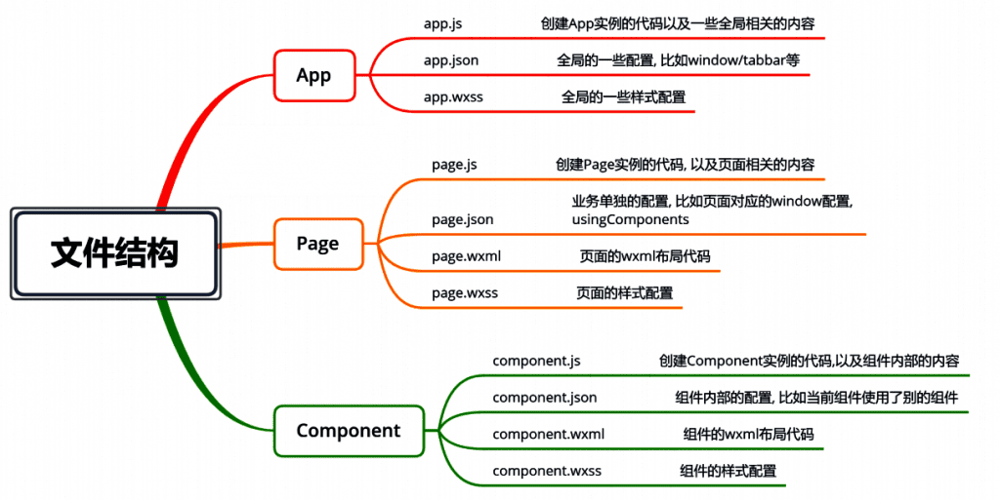

### 开发工具下载

[https://developers.weixin.qq.com/miniprogram/dev/devtools/download.html](https://developers.weixin.qq.com/miniprogram/dev/devtools/download.html)

### 文件结构

### 常见的配置文件

project.config.json：项目配置文件, 比如项目名称、appid等；

[https://developers.weixin.qq.com/miniprogram/dev/devtools/projectconfig.html](https://developers.weixin.qq.com/miniprogram/dev/devtools/projectconfig.html)

sitemap.json：小程序搜索相关的；

[https://developers.weixin.qq.com/miniprogram/dev/framework/sitemap.html](https://developers.weixin.qq.com/miniprogram/dev/framework/sitemap.html)

app.json：全局配置；

[https://developers.weixin.qq.com/miniprogram/dev/framework/config.html#%E5%85%A8%E5%B1%80%E9%85%8D%E7%BD%AE](https://developers.weixin.qq.com/miniprogram/dev/framework/config.html#%E5%85%A8%E5%B1%80%E9%85%8D%E7%BD%AE) [h](https://developers.weixin.qq.com/miniprogram/dev/framework/config.html)

page.json：页面配置； 

[https://developers.weixin.qq.com/miniprogram/dev/framework/config.html#%E5%85%A8%E5%B1%80%E9%85%8D%E7%BD%AE](https://developers.weixin.qq.com/miniprogram/dev/framework/config.html#%E5%85%A8%E5%B1%80%E9%85%8D%E7%BD%AE)

### 全局配置

[https://developers.weixin.qq.com/miniprogram/dev/reference/configuration/app.html](https://developers.weixin.qq.com/miniprogram/dev/reference/configuration/app.html)

| [pages](https://developers.weixin.qq.com/miniprogram/dev/reference/configuration/app.html#pages) | string[] | 页面路径列表 |
| --- | --- | --- |
| [window](https://developers.weixin.qq.com/miniprogram/dev/reference/configuration/app.html#window) | Object | 全局的默认窗口表现 |
| [tabBar](https://developers.weixin.qq.com/miniprogram/dev/reference/configuration/app.html#tabBar) | Object | 底部 tab 栏的表现 |

**更多配置点击上方链接**

### **页面配置**

每个小程序中的页面可以使用 .json 文件来对本页面的窗口进行配置；页面中配置项在当前页面会覆盖 app.json 的 window 中相同的配置项。

[https://developers.weixin.qq.com/miniprogram/dev/reference/configuration/page.html](https://developers.weixin.qq.com/miniprogram/dev/reference/configuration/page.html)

| **属性** | **类型** | **默认值** | **描述** |
| --- | --- | --- | --- |
| navigationBarBackgroundColor | HexColor | #000000 | 导航栏背景颜色，如 #000000 |
| navigationBarTextStyle | string | white | 导航栏标题颜色，仅支持 black / white |
| navigationBarTitleText | string |  | 导航栏标题文字内容 |
| usingComponents | Object | 否 | 页面[自定义组件](https://developers.weixin.qq.com/miniprogram/dev/framework/custom-component/)
配置 |

**更多配置点击上方链接 **
