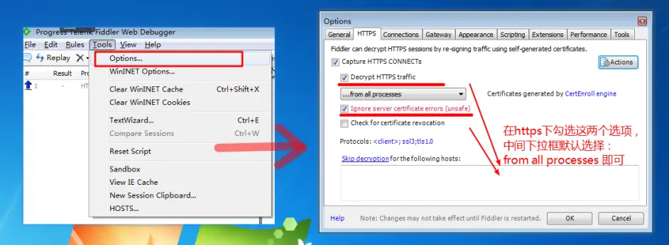
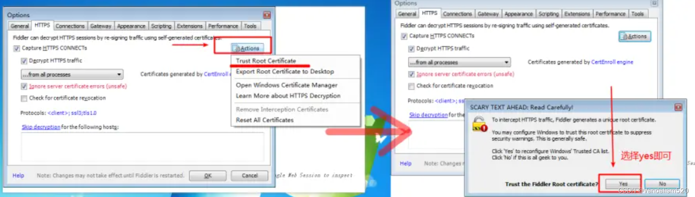
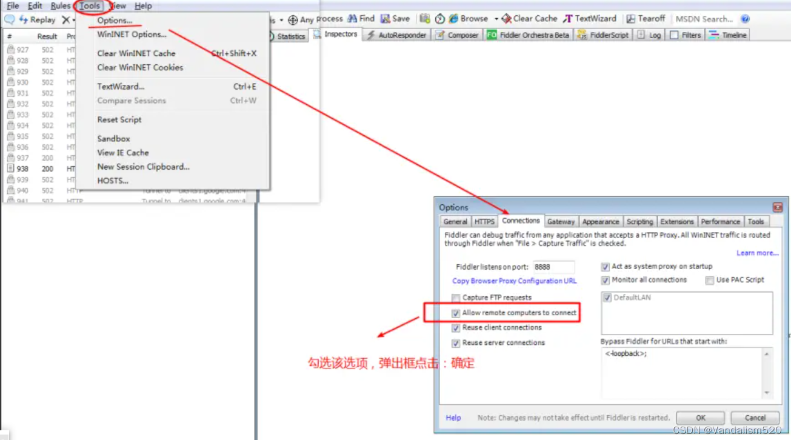
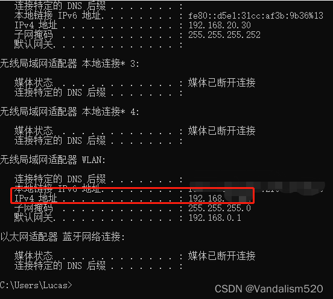
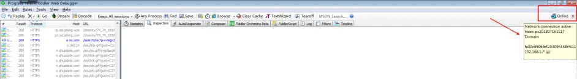
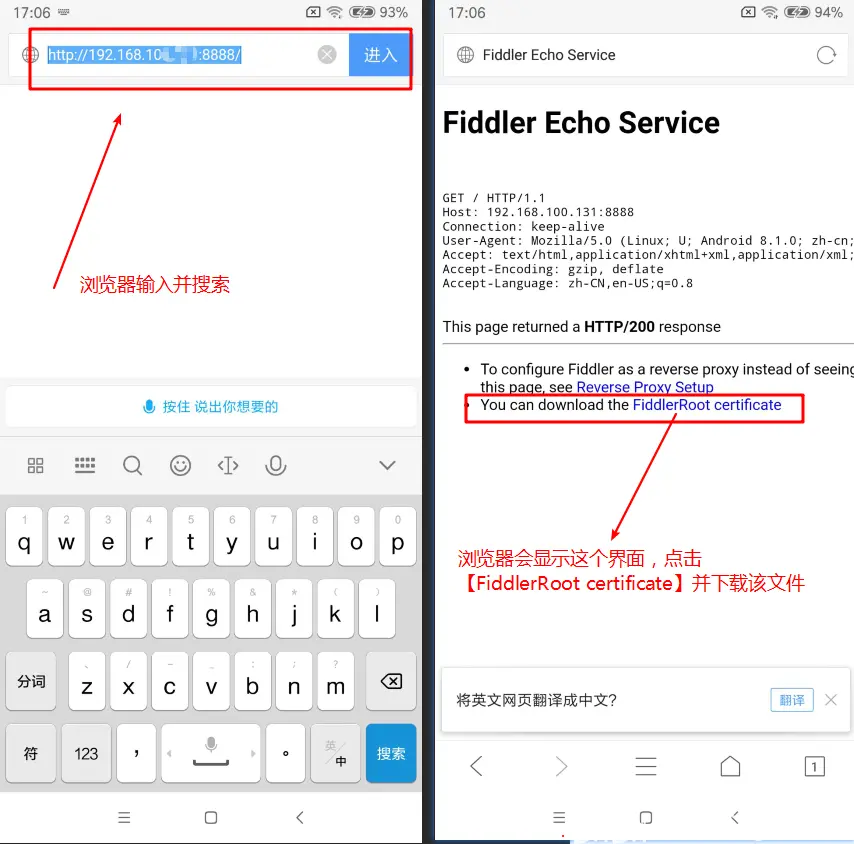
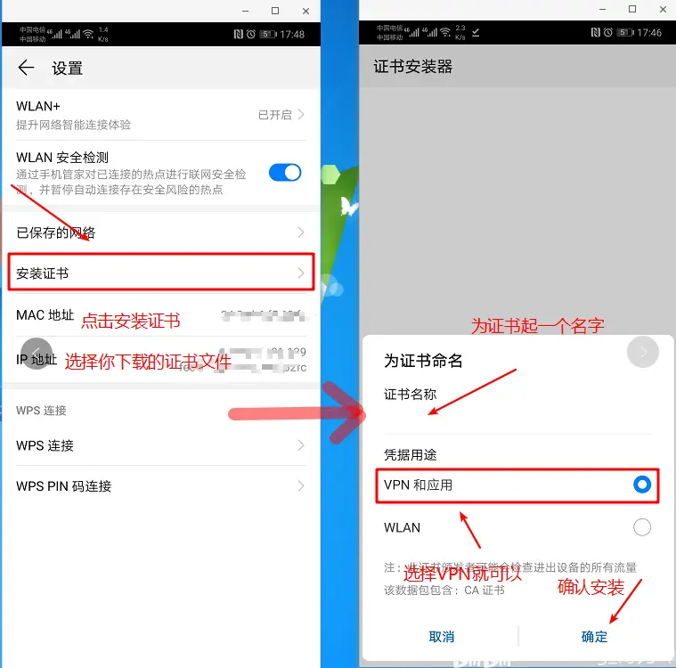
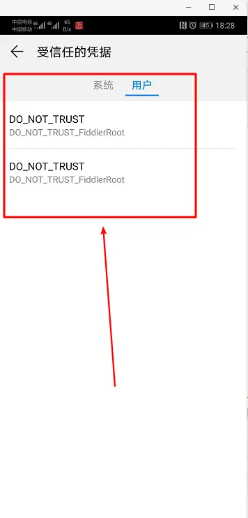
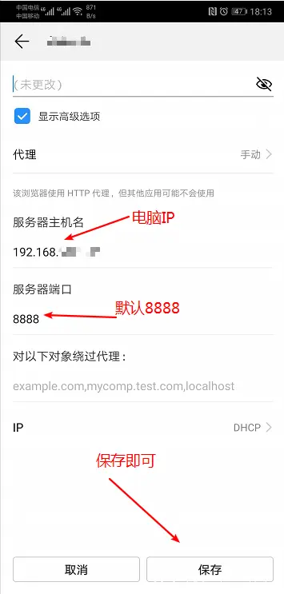
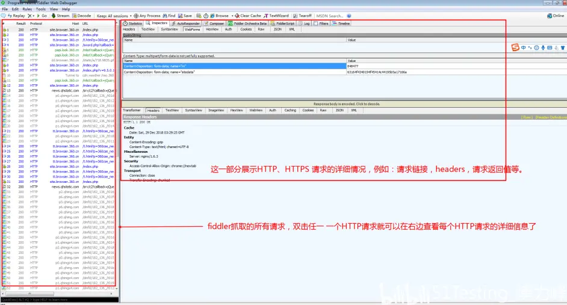

# 下载

官网下载：[https://www.telerik.com/fiddler/fiddler-classic](https://www.telerik.com/fiddler/fiddler-classic)

# 配置fiddler

一.由于fiddler只默认抓取HTTP的请求，若想抓取HTTPS的请求，则需要设置HTTPS的各项值：
第一步：在fiddler菜单项选择Tools -> Options -> HTTPS
第二步：勾选【Decrypt HTTPS traffic 】【Ignore server certificate errors】，下拉框默认：【from all processes】 即可
第三步：点击右边的【Actions】，选择【Trust Root Certificate】点击，弹出窗点击【Yes】按钮即可。
第四步：点击【OK】保存

二.设置fiddler connections的值，允许fiddler远程连接
第一步：在fiddler菜单项选择Tools  ->  Options -> connections
第二步：勾选【|Allow remote computers to connect】
第三步：点击【ok】

##重要事情说三遍
更改完设置一定要重启fiddler！！！
更改完设置一定要重启fiddler！！！
更改完设置一定要重启fiddler！！！
三.在手机上进行相应的设置，为手机抓包做准备
1.查看自己本机的IP
方法一：电脑——左下角点击Windows图标——输入cmd，打开cmd面板，输入：ipconfig ，查看本机IP地址

方法二：在fiddler主界面，将鼠标移到【online】上面，就可以查看本地的IP地址了，如果你的fiddler没有显示【online】，可以通过【fiddler菜单——View——Show Toolbar】将【Show Toolbar】勾选中，就会显示【Online】信息了。

2.手机安装证书。（ios设置和Android设置基本一样）
前提条件：
手机和电脑要处于同一网络条件下（可以理解为：使用同一个WiFi）
fiddler的默认端口是：8888，不需要进行修改，使用默认的就可以。
一个手机可以安装多个证书，但是每安装的一个证书里面都设置有IP地址，所以：安装的证书和电脑IP是一一对应的，当前的这个证书只能针对某一台电脑使用，更换电脑后，该证书将不能使用，只能重新安装与更换的电脑的IP相同的证书才能使用。
第一步：手机下载证书。打开手机的浏览器，输入：【IP:8888】下载证书。
例如：浏览器输入【[http://192.168.xxx.xxx:8888](http://192.168.xxx.xxx:8888)】或者【192.168.xxx.xxx:8888】（这个地方的IP就是你电脑的IP）

第二步：安装证书.
 有的手机可以直接点击已下载的文件进行安装，有的手机则不行。
如果不能直接安装证书，我们可以通过以下方法来安装证书。
1.Android：安装证书。由于安装系统众多，设置的方法不尽相同，下面几个方法以供参考。
方法一：手机——设置——搜索【证书】二字——选择：安装证书或者证书管理：点击安装证书，在你的众多文件里面去选择刚刚下载的fiddler的证书，点击安装
（注：选择安装的文件后，需要输入手机的锁屏密码。Android一定要有锁屏密码才能安装证书）

方法二：在浏览器里面，直接打开已经下载的文件，安装即可，安装步骤是：先输入手机锁屏密码——后到上图为证书命名界面。
证书安装好后，查看已信任证书：具体位置在【安全——更多安全设置——加密和凭据——受信任的凭据】

2.ios安装证书：直接点击已下载的文件安装即可，安装文件成功后，需要在【设置——通用——关于本机——证书信任设置】开启证书信任。
第三步：为手机设置代理.（ios和安卓差不多）
设置——无线网络（WLAN）——WLAN——长按已连接的WiFi 去修改网络——在高级选项里面——选择【手动代理】——出现以下界面，按图所示操作即可。
（或者长按通知栏WiFi按钮进入WiFi界面）
（有的机型需要先添加网络才能对网络进行修改，这个看个人手机情况）

第四步：访问手机浏览器或者任一应用就可以在fiddler里面查看到抓取的请求了
最后查看已经抓取到的https的请求：

【转载】[https://blog.csdn.net/Vandalism520/article/details/124930187](https://blog.csdn.net/Vandalism520/article/details/124930187)
