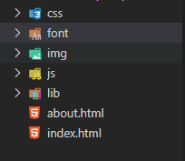

# 目的

为了使软件开发过程顺畅，保证软件质量，方便不同成员维护项目，于是编写这份开发规范文档。

# 概述

- 项目以功能模块划分分工
- 页面样式与逻辑分开
- 考虑代码复用性，提取封装通用工具方法
- 组件统一，不调用无关组件

# 常规开发规范

## 页面头部

### DOCTYPE 设置

文档类型统一使用html5的doctype：

```html
<!DOCTYPE html>
```

### 页面编码

在html中指定编码，默认UTF-8，如有特殊指定请更换。

```html
<meta charset="UTF-8">
```

### TDK

TDK指的是title（标题），description（描述），keywords（关键字）的首字母缩写。

```html
<title>页面标题</title>
<meta name="description" content="页面的描述内容，一般不超过150个字" />
<meta name="keywords" content="页面关键字,多个关键字用逗号分隔" />
```

### 页面Meta

**Pc端meta：**

```html
<meta charset="utf-8" />
<meta http-equiv="X-UA-Compatible" content="IE=edge,chrome=1">
<meta name="Description" content="页面的描述内容" />
<meta name="Keywords" content="页面关键字" />
```
 
**移动端meta：**

```html
<meta charset="utf-8" /> 
<meta name="viewport" content="width=device-width,initial-scale=1,minimum-scale=1,maximum-scale=1,user-scalable=no">
<!-- 为了防止页面数字被识别为电话号码，可根据实际需要添加： -->
<meta name="format-detection" content="telephone=no"> 
<!-- 让添加到主屏幕的网页再次打开时全屏展示，可添加：   -->
<meta content="yes" name="mobile-web-app-capable">
<meta content="yes" name="apple-mobile-web-app-capable">
<meta name="Description" content="页面的描述内容" />
<meta name="Keywords" content="页面关键字" />
```

## HTML

### HTML标签

- 标签必须合法且闭合、标签名需小写、嵌套正确(嵌套分为语义嵌套与严格嵌套，如a 不允许嵌套 div这种约束属于语义嵌套约束，与之区别的约束还有严格嵌套约束，比如a 不允许嵌套 a)
- 标签语法无错误，需要符合语义化
- 标签的自定义属性以data-开头，如：<a href="#" data-num='18'></a>
- 除非有特定的功能、组件要求等，禁止随意使用id来定义元素样式

### HTML注释

**模块注释**

```html
<!-- 文章列表模块 S -->
<ul class="article-list">
	<li>...</li>
</ul>
<!-- 文章列表模块 E -->
```

**区块注释**

```html
<!--
	@name: 模块名
	@description: 模块描述
	@author: 作者
-->
<div>...</div>
```

## CSS

### 选择器

**CSS类名命名**

class、id都需小写，命名使用英文，禁止使用特殊字符，名称间隔使用-符号命名词穷了！！！推荐命名神器：[https://unbug.github.io/codelf/](https://unbug.github.io/codelf/)
避免使用层级过深的选择器，尽量最多3级
错误示范：

```css
.without-animation .book-body .body-inner .book-header .dropdown .dropdown-menu .buttons{}
.without-animation .book-body .body-inner .book-header .dropdown .dropdown-right .buttons{}
.without-animation .book-body .body-inner .book-header .pull-left .dropdown-menu .buttons{}
```

- 除非有特定的功能、组件要求等，禁止随意使用id来定义元素样式
- 除非是样式reset需要，尽量避免对纯元素选择器设置特定样式，避免样式污染

### 样式定义标准

- 一般以逗号分隔的属性值，每个逗号后应添加一个空格
- 声明语句中的“:”后应添加一个空格
- rgb()、rgba()、hsl()、hsla() 或 rect() 括号内的值，逗号分隔，但逗号后不添加一个空格
- 对于属性值或颜色参数，省略小于 1 的小数前面的 0 （例如，.5 代替 0.5；-.5px 代替-0.5px）
- 十六进制值应该全部小写和尽量简写，例如，`#fff` 代替 `#ffffff`
- 避免为 0 值指定单位，例如，用 margin: 0; 代替 margin: 0px
- 相关属性应为一组，比如position与top、left、right、bottom、z-index等相关的写到一块。

### CSS注释

模块标注
每个css模块，标注对应模块的名称，便于维护。

```html
/* 头部导航 */
.header-nav{
}
```

## Javascript

### 命名

- 变量, 使用驼峰命名法
- 私有属性、变量和方法以下划线 _ 开头
- 函数名，使用驼峰命名法，参数也是用驼峰命名法
- boolean类型的变量使用 is 或 has 开头
- Promise 对象用动宾短语的进行时表达比如：const loadingData = new Promise()
- 
### Jsdoc & 注释

行级注释
标注说明某一行难理解的语句

```javascript
// 某一行的说明
```

方法jsdoc
标注说明方法的作用及所用参数

```javascript
/**
 * 方法作用...
 * @param {string} p1 参数说明
 * @param {number} p2 参数说明
 * @return {void}
*/
function handelAdd() {
}
```

文档注释

```javascript
/**
 * @Author: 作者
 * @Date: 创建编辑时间
 * @Version：版本
 * @LastEditTime: 最后编辑的时间
 * @Description: 描述
*/
```

### 性能优化

尽量减少不必要的 DOM 操作

浏览器重绘、重排dom元素的代价是非常昂贵的；频繁的dom操作会让浏览器不停的重绘、重排。简单的优化方案就是当循环创建出来的dom元素,不要把它在循环中插入dom中,应把它们储存到变量中，循环创建完毕后，一并插入dom中，这样就把多次操作dom优化为1次操作。

## 文件目录

- 图片文件夹：img
- css文件夹：css
- Js文件夹：js
- 三方库文件夹：lib
- 字体文件夹：font（一般很少用）

比如：



## 移动端注意

### Viewport

文档中“页面头部”部分也有提到。

```html
<meta name="viewport" content="width=device-width,initial-scale=1,minimum-scale=1,maximum-scale=1,user-scalable=no">
```

### 单位—rem布局

规范只列举了rem布局这一种适配方式，但不是说限制只能用这种布局方式。 无论用何种方式，需要保证在不同比例、不同尺寸的手机上，及主流浏览器无明显错位、变形。

#### 示例代码（rem配置）

示例代码中的配置是在750宽的设计稿上 100px == 1rem，使用时只需要将设计稿上px单位除100即可，比如：750px == 7.5rem

```javascript
//屏幕适应 
(function (win, doc) {
    if (!win.addEventListener) return;
    var html = document.documentElement;
    function setFont() {
        var html = document.documentElement;
        var k = 750;
        html.style.fontSize = html.clientWidth / k * 100 + "px";
    }
    setFont();
    setTimeout(function () {
        setFont();
    }, 300);
    doc.addEventListener('DOMContentLoaded', setFont, false);
    win.addEventListener('resize', setFont, false);
    win.addEventListener('load', setFont, false);
})(window, document);
```
 
#### 使用rem方式布局有以下几点需要注意：

1. 页面用不同尺寸的手机进行测试
2. 因为小于1px浏览器支持不够好为会导致计算会有误差，背景图使用雪碧图时，图标之间多留5px的空隙，同时图片的backgrornd-size属性最好写上图片的宽高(图片宽高对应的rem单位)，不写误差更大。　
3. 雪碧图，如图片宽高为346px*160px需要设置background-size属性设置为background-size: 3.46rem 1.6rem（1rem == 100px）;
4. 大小为1px的元素不要使用rem，直接用px

# UNI-APP开发规范

## 目录及结构

- common目录：项目通用配置文件及项目通用工具类目录
- components目录：引用组件目录
- pages目录：页面目录（主要开发用到的目录）
- static目录：项目资源文件目录（图片、图标、字体等）
- App.vue ：生成项目自带，一般不需要动
- main.js ：生成项目自带，一般不需要动
- manifest.json :打包配置文件（打包时候需要配置该文件）
- pages.json:页面索引，其中第一个标签是app进入后的第一个页面（通常是首页或登录页面）
- README.md:项目说明文件
- uni.scss:uni-app通用样式，一般不需要动
- 
### common目录

- common/config目录 项目相关配置文件放这里，如项目中网络地址配置，页面索引配置，版本内容配置等。
- common/utils目录 工具类目录，存放类似：获取日期、转码解码等方法。如有特定模块的公用方法，可创建子目录来存放。
- common/data目录 数据目录，可存放测试数据json文件，通用数据等。

### static目录

- font目录：字体文件夹
- img目录：图片图标资源目录，如有需求在该目录下创建子目录
- 
### pages目录

- 根据功能模块分子目录，尽量避免用HbuilderX创建新页面时自动创建目录。
- 子目录命名时首字母小写，尽量用能够直接关联到功能模块名称的英文来命名。如有多个英文单词，第二个单词开始首字母大写，如personalCenter
- 注意，如果是通过新建vue文件来创建页面的话，还需要在项目根目录的page.json中添加该页面的索引，否则会找不到页面
- 如果建立测试页面，在page.json中添加了该页面的索引，在删除该页面时应当同时删掉该页面的vue文件，css样式文件以及page.json中对应的索引项

## 命名规范

### 页面文件

页面文件首字母小写，后面的多个英文单词大写开头。如：personalCenter.vue、declareDetail.vue
命名应直接与该页面业务功能挂钩，一眼能看出该页面实现的什么功能。
相同功能的不同部分应放到同一子目录下，不要创建过多不必要的目录，如declareDetail.vue、declareForm.vue、declareList.vue 可以放到同一目录declare目录下。

### 样式文件

公用样式文件根据该部分样式用途命名，放到common/css目录下，如整个APP用到的按钮样式写到同一css文件publicButton.css中，放到common/css目录下，在页面的`<style></style>`标签中添加引用:

```vue
<style>
@import url("../../common/css/publicButton.css");
</style>
```

页面单独的样式，在页面同目录下创建同名css文件.如login.vue中用的单独样式，在login.vue同级目录下创建login.css来保存。

### 逻辑方法js文件

通用功能逻辑模块根据该部分功能用途命名，放到common/utils目录下。
页面单独的逻辑js，在页面同目录下创建同名js文件.如login.vue中用的单独逻辑，在login.vue同级目录下创建login.js来保存。

### 方法名 

方法名首字母小写，后面的多个英文单词大写开头（驼峰式），方法统一以js的方式声明。
示例：

```javascript
getUserInfo:function(id){
  
}
```

### 变量命名

变量名首字母小写，后面的多个英文单词大写开头（驼峰式），有关联性的变量尽量封装到一个对象中。
示例：

```javascript
userInfo：{
  userId: "",
  userName: "",
  idcard: ""
}
```

### 资源文件命名

- 图片文件（背景图 banner图等较大的图片）统一命名为img_xxx 
- 图标文件（应用图标 按钮图标 标题图标等）统一命名为 icon_xxx
- json数据（应用用到的json文件或测试临时数据json文件）统一命名为 jsonData_xxx

## 组件引用

uni-app需要用到一些组件来展现页面，为避免引用效果差的组件，以及app无用组件过多，需要做到组件引用统一。
在引用组件之前，应当先在官方示例中找有没有uniapp自带的组件，在满足要实现的功能时，尽量用官方提供的组件，不要在插件市场再去引用
避免复制页面代码时直接复制组件和工具类的引用，检查是否用到引用的组件和工具类，无用的删掉

## 编码规范

### 页面的vue文件顶部添加备注

中文备注该文件对应的页面中文名，作者日期可选择添加。如：

```html
<!-- 
	app登录页
	作者：作者名
	创建时间：2020年8月22日
 -->
<template>
	<view>
    ...
  </view>
</template>
```

### 页面代码保持对齐

单个标签或组件根据长度决定是否换行

- 长度较短：尽量放到一行，减少换行
- 长度较长：为了增强代码可读性，可按照以下方式换行

```html
// 没有子节点
<SomeComponent
    :listData="listData"
    @recData="recData"
/>

// 有子节点
<SomeComponent
    :listData="listData"
    @recData="recData"
>
    <SomeChild />
    <SomeChild />
</SomeComponent>
```

标签套标签的类型，需保持格式化对齐，方便确定页面层级关系。

### 页面自建变量使用层级关系，避免一级堆放过多变量

应该根据变量意义，自行进行封装，不要无脑往第一层堆放数据，代码维护过程中，层级关系不正确会导致变量不好找，增加维护难度。

错误写法示例：

```javascript
data() {
  return {
    userType: "0",
    version: "1.0.0",
    versionCode: 200,
    userInfo: {},
    userName: "",
    userId: "",
    userAddress: ""
  }
}
```

正确写法示例：

```javascript
data() {
  return {
    userType: "0",
    version: "1.0.0",
    versionCode: 200,
    userInfo: {
    	userName: "",
    	userId: "",
    	userAddress: ""
    },
  }
}
```

### 通用功能方法注意提取

如首页跳转子页、子页面返回首页等公用方法，可提取作公用方法。

如：

```javascript
methods: {
  toListPage() {
    uni.navigateTo({
      url: "../listPage/listPage"
    })
  },
    toDetailsPage() {
      uni.navigateTo({
        url: "../detailsPage/detailsPage"
      })
    }
}
```

可提取为带参数的方法：

```javascript
methods: {
  toPage(url) {
    uni.navigateTo({
      url
    })
  }
}
```

### function最大长度不得超过100行

过长的代码不便维护，尽量根据方法功能进行封装提取，避免出现过长的逻辑代码，不便维护。

### 方法、变量添加必要备注

方法上面至少添加备注说明该方法的功能
变量前面或后面添加备注说明该变量用途含义，以及类型

### 代码格式化缩进

注意进行代码格式化，可选择代码块后ctrl+shift+F进行格式化，缩进对齐。

### 开发完成时无用的调试标签删掉

开发完成之后，需要将调试时写的debugger及console等标签删除掉，避免让用户在HTML控制台看到不必要的信息。

# 写在后面

希望各位开发人员遵守这份开发文档，养成良好的开发习惯。项目负责人在代码功能完成后及时对代码进行审核，避免代码规范不正确对后期维护造成不必要的难题。

# 补充

如果有问题，请及时反馈。
文档版本不同，涵盖的规范性点可能有所不足，该文档应根据项目开发遇到的规范性问题进行及时更新，对未涉及的部分进行补充说明。
 
