2020年9 月 10 日，华为开发者大会上，华为消费者业务 CEO 余承东正式发布了鸿蒙 OS 2.0 版本，并且宣布： 华为鸿蒙OS还将在 2020 年 12 月面向应用开发者发布手机版本；并且已经在gitee开源。
开源地址： [https://openharmony.gitee.com](https://openharmony.gitee.com/)

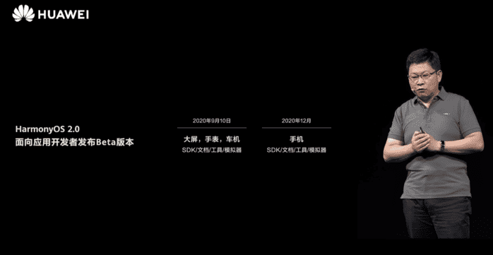

目前模拟器只有 TV 与 Wearable 两种；管他三七二十八先来体验下。。。

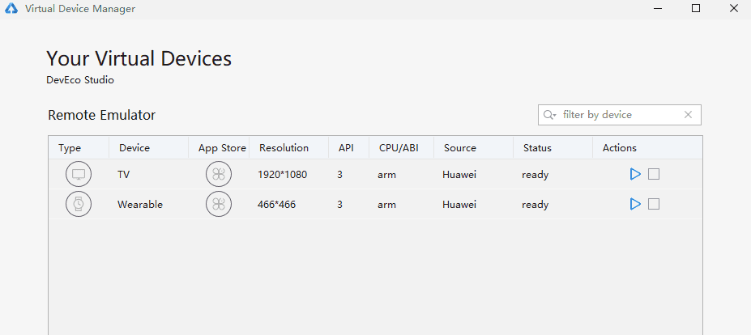

## 下载 DevEco Studio

DevEco Studio是面向华为终端全场景多设备的一站式分布式应用开发平台，支持分布式多端开发、分布式多端调测、多端模拟仿真。
下载地址：
[https://developer.harmonyos.com/cn/develop/deveco-studio#download](https://developer.harmonyos.com/cn/develop/deveco-studio#download)
安装就不演示了有手应该都会 ~ .~

## 新建js项目

安装好之后 新建项目 ；新建一个TV应用的js空项目，Next

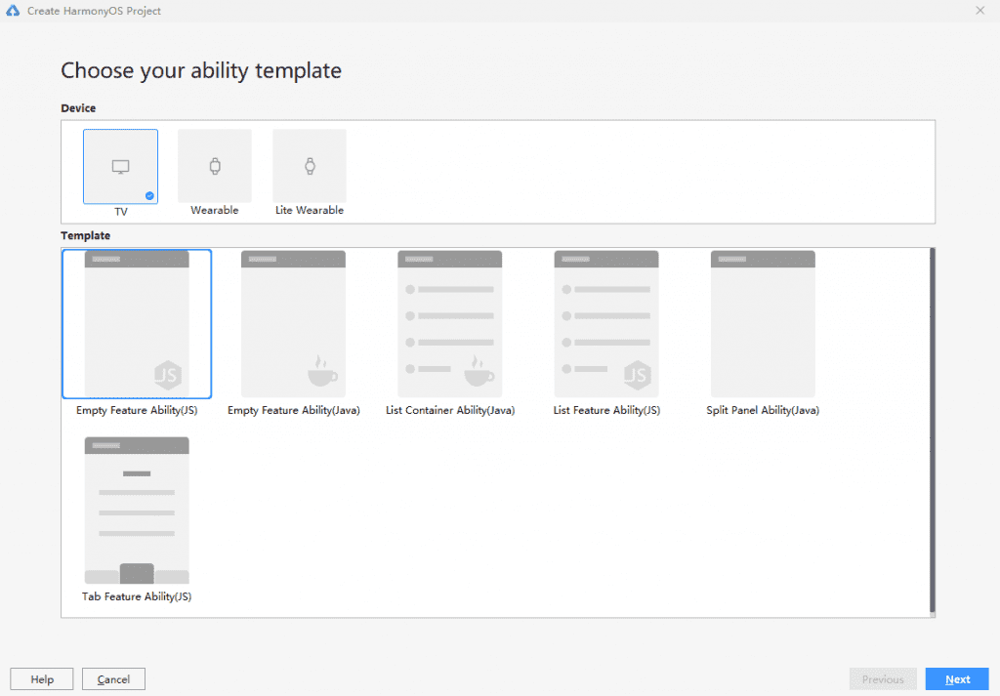

填写项目信息 完成

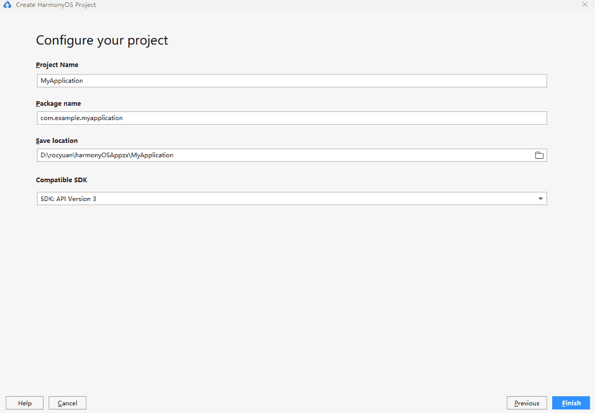

## 项目结构目录

很明显能看到，就是常规的前端MVVM框架
在工程目录中：common文件夹主要存放公共资源，如图片、视频等；i18n下存放多语言的json文件；pages文件夹下存放多个页面，每个页面由hml、css和js文件组成（前端三板斧）。 hml组件较少，后期也期待有大佬开发出ui组件库。文章末尾有官方开发文档传送门。

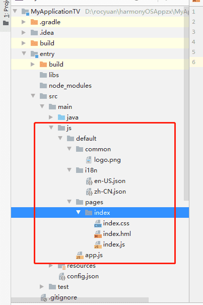

## Hello World
美好的开端，Hello World，咱们更换下（Hello HarmonyOS App）。

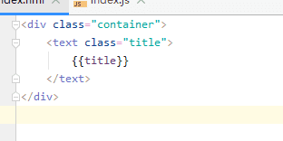

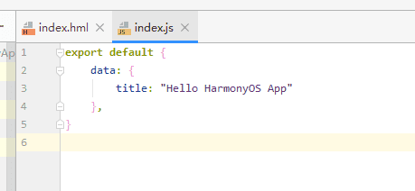

## 运行应用

要运行应用我们需要安装模拟器

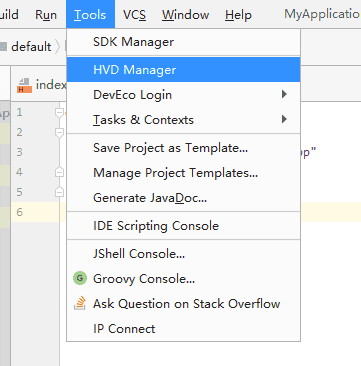

这时它会弹出网页让你登录华为开发者账号（没有的小伙伴自行申请认证），登录之后它会让你进行账号访问授权，允许后会登录DevEco Studio客户端；然后会下载模拟器（ TV 与 Wearable ）

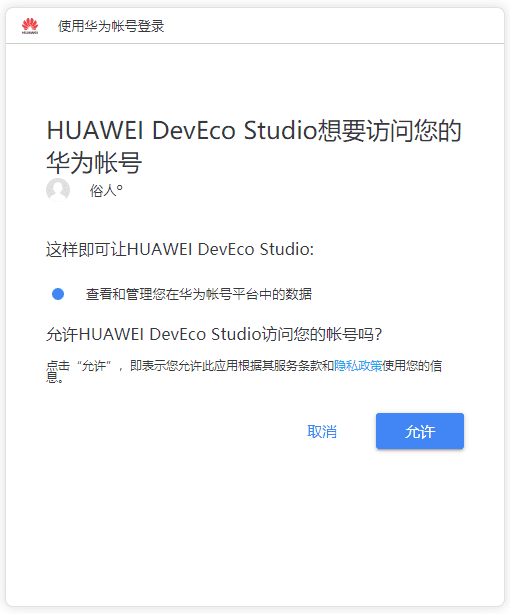

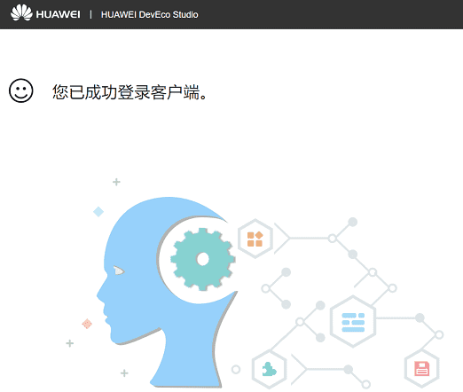

看到这个界面说明下载成功，启动一个创建项目时所选择的设备（我选择TV）

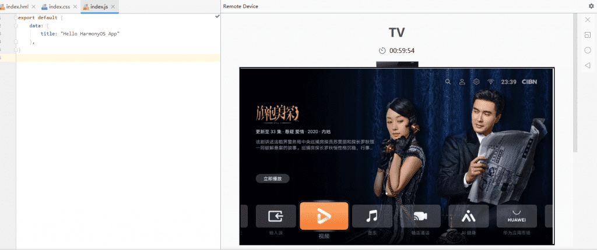

然后点击运行，选择启动的模拟器

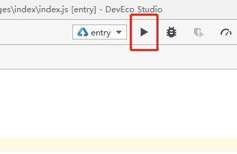

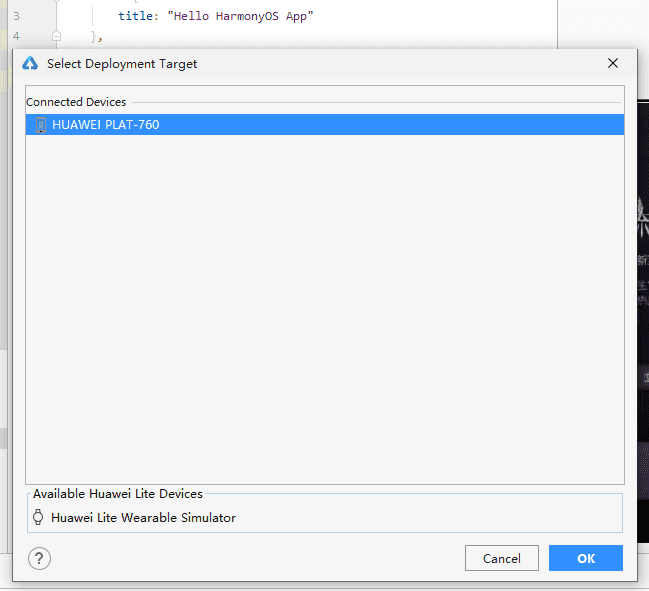

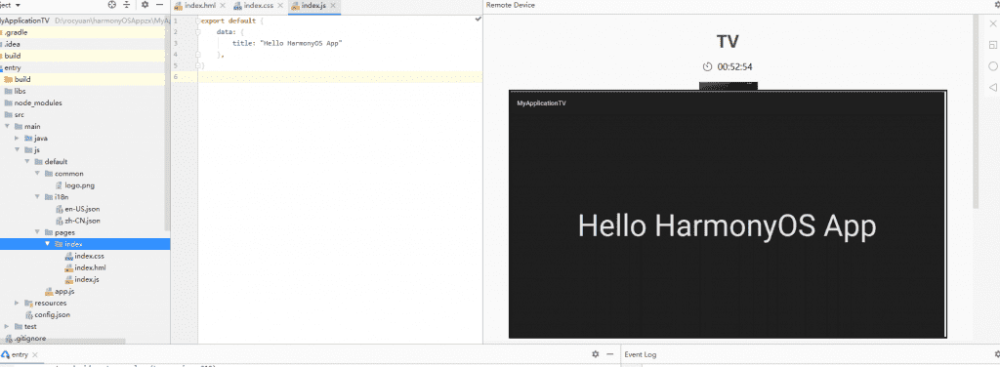

即可看到运行结果

下面是 Wearable 演示

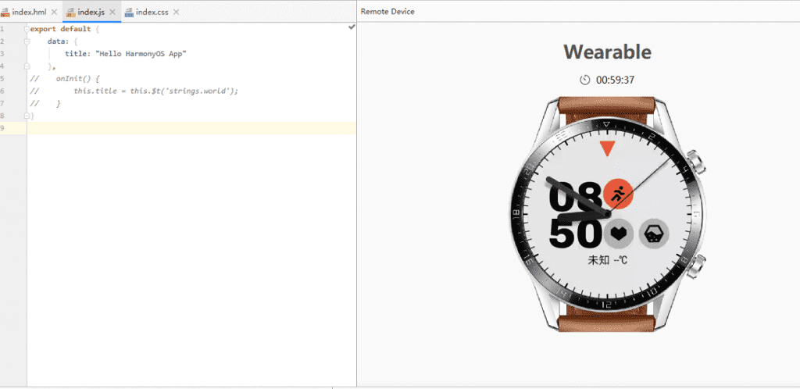

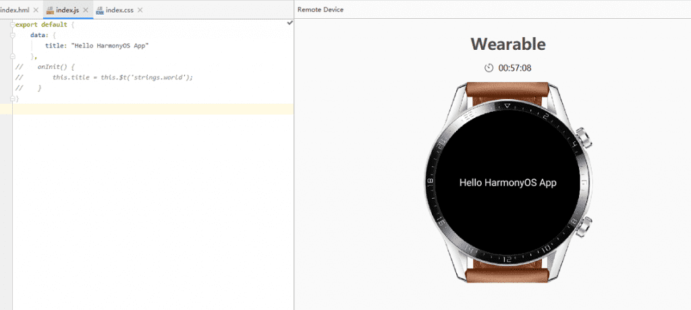

官方js开发文档

[https://developer.harmonyos.com/cn/docs/documentation/doc-guides/ui-js-overview-0000000000500376](https://developer.harmonyos.com/cn/docs/documentation/doc-guides/ui-js-overview-0000000000500376)
