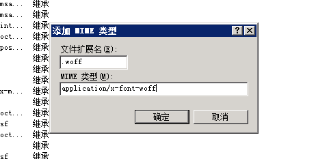

遇到一个很奇怪的问题，在IIS7中，一些文件存在，地址没错，但总是404！！！看图（有图有真相！）

可以看到 fa-solid-900.woff、fa-solid-900.woff2，俩文件地址都没有错，但就是404！找了半天，终于解决了，原来问题出现在这： ↓ ↓ ↓

图上可能看不太清下面：
↓ ↓ ↓
使用**“**添加 MIME 类型**”**和**“**编辑 MIME 类型**”**对话框可以创建和编辑多用途 Internet 邮件扩展 (MIME) 类型。**MIME 类型将帮助客户端适当地处理新的文件扩展名。如果 IIS 无法识别客户端请求的文件扩展名，则 IIS 会以默认的 MIME 类型（即应用程序）形式发送内容。此 MIME 类型表示文件包含应用程序数据，这通常意味着客户端无法处理该文件。**

| **元素名称** | **描述** |
| --- | --- |
| 扩展名 | 键入文件扩展名。这是静态文件扩展名，例如 .chm。 |
| MIME类型 | 键入 MIME 类型，例如，application/octet-stream。 |

↑↑↑ 仔细看加粗部分
原因出在MIME类型设置上！！！

**MIME类型**

MIME类型列表

点击右上角添加 或者 鼠标右击空白区域-添加

度娘：**MIME类型参考手册**
搞定！资源正常加载

