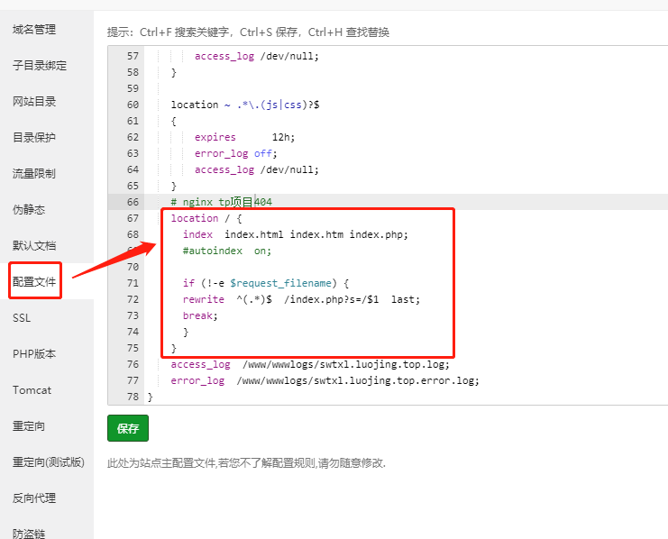

tp5项目在Apache中运行一切正常，但部署在nginx环境中，页面打不开提示404报错。


解决方案：
宝塔网站 -> 设置 -> 配置文件



```javascript
# nginx tp项目404
location / {
  index index.html index.htm index.php;
  #autoindex on;
  if (!-e $request_filename) {
    rewrite ^(.*)$ /index.php?s=/$1 last;
    break;
  }
}
```
