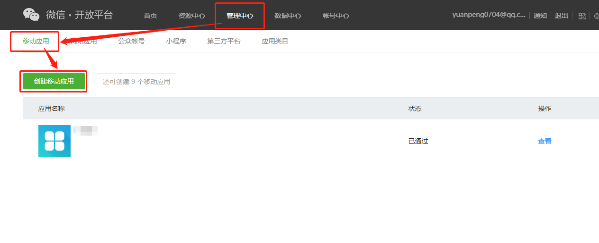
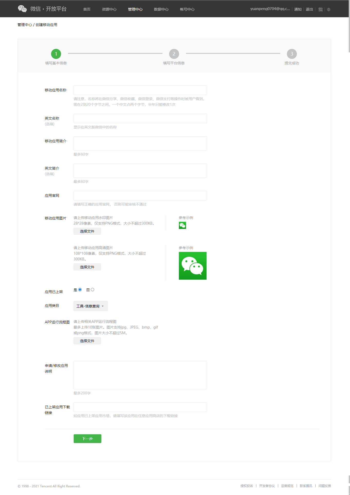
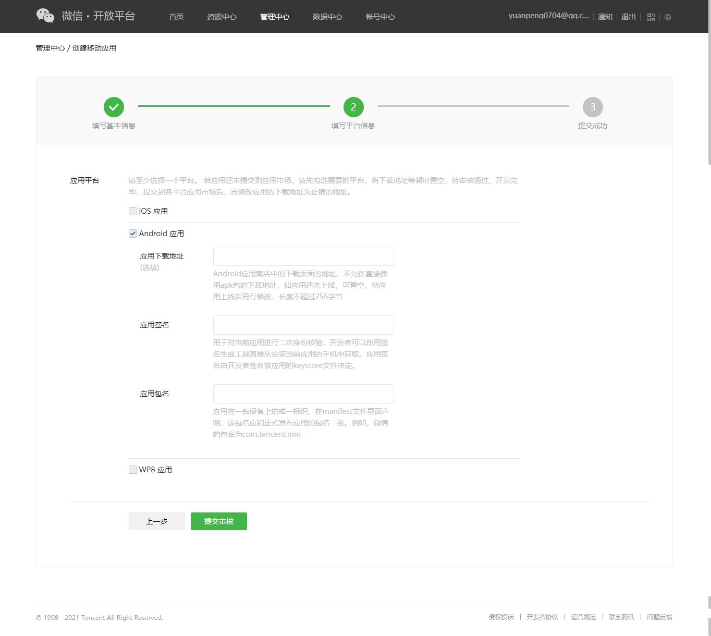
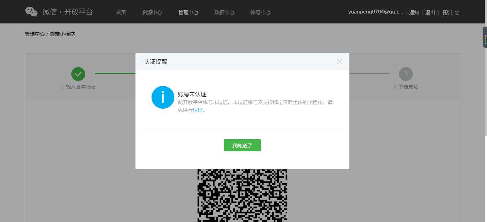

## 微信开放平台账号注册：

微信开放平台：[https://open.weixin.qq.com/](https://open.weixin.qq.com/)

注册成功后（开发者资质并未认证，认证与未认证区别在本文下方的“转跳规则”），在管理中心 - 移动应用 - 创建移动应用

## 创建移动应用：

### 第一步：

### 第二步：

## 转跳功能介绍

考虑到部分场景下 APP 需要通过小程序来承载服务，为此 OpenSDK 提供了移动应用（APP）拉起小程序功能。移动应用（APP）接入此功能后，用户可以在 APP 中跳转至微信某一小程序的指定页面，完成服务后再跳回至原 APP 。移动应用拉起小程序功能已向全体开发者开放，开发者在微信开放平台帐号下申请移动应用并**通过审核**后，即可获得移动应用拉起小程序功能权限。

## 跳转规则

1. 对于已通过认证的开放平台账号，其移动应用可以跳转至任何合法的小程序，且不限制跳转的小程序数量。
2. 对于未通过认证的开放平台账号，其移动应用仅可以跳转至同一开放平台账号下小程序。

注意：若移动应用未上架，则最多只能跳转小程序100次/天，用于满足调试需求。
（摘自微信开放文档）

[https://developers.weixin.qq.com/doc/oplatform/Mobile_App/Launching_a_Mini_Program/Launching_a_Mini_Program.html](https://developers.weixin.qq.com/doc/oplatform/Mobile_App/Launching_a_Mini_Program/Launching_a_Mini_Program.html)

## 账号未认证绑定非本主体的小程序示例：

## 参考文献：

### APP拉起小程序的新规则，不再需要开放平台关联小程序，也不做限制

[https://developers.weixin.qq.com/community/develop/article/doc/0002aec12ccf18c57e4a798e25b013](https://developers.weixin.qq.com/community/develop/article/doc/0002aec12ccf18c57e4a798e25b013)
